# CSE 210 — Database System Lab Manual

**Department of Computer Science and Engineering**  
**Faculty of Science and Engineering**  
**Green University of Bangladesh (GUB)**

*Prepared for Academic Laboratory Activities — Department of Computer Science and Engineering, GUB.*

> **Conversion note:** This Markdown is transcribed from the uploaded 80-page PDF. SQL statements, explanations, questions, and lab tasks follow the original manual. Embedded figures have been cropped from their PDF pages rather than replaced with screenshots of full pages. Minor PDF line-wrap hyphens and typography have been normalized. Source mistakes or inconsistent SQL examples have not been silently corrected.

## Contents

- [Lab I: Introduction to Database, MySQL, and Managing MySQL Databases](#lab-i)
- [Lab II: Implementation of Integrity Constraints in MySQL](#lab-ii)
- [Lab III: Modifying MySQL databases and Updating Data in MySQL Table](#lab-iii)
- [Lab IV: Querying and Filtering data in MySQL Table](#lab-iv)
- [Lab V: Querying and Filtering data in MySQL Table (Extended)](#lab-v)
- [Lab VI: Implementation of MySQL Aggregate Function](#lab-vi)
- [Lab VII: Implementation of Relational Databases (Join Function)](#lab-vii)
- [Lab VIII: Implementation of Databases Triggers](#lab-viii)
- [Lab IX: Implementation of Database Transactions and Multiuser Usage](#lab-ix)
- [Lab X: Implementation of Functions and Stored Procedures in MySQL](#lab-x)


---

<a id="lab-i"></a>

## Lab Manual I — Introduction to Database, MySQL, and Managing MySQL Databases

*Source PDF pages 7–14 (printed pages 1–8).*

### 1.1 Objective(s)

- To install MySQL Database Server.

- To introduce Data Types used in Database System.

- To Create Database and Table using SQL commands.

- To Insert Data in Table.

- To Drop Database and Table.

### 1.2 Problem Analysis

Database is a key course of computer science. At the beginner level, most of the students are not familiar with how to use database in computer system. This section helps you get started with a very common database system named MySQL. We will start by installing MySQL and creating a database in the MySQL server for practicing.


*Figure I.1: Logo of MySQL*

After installation of proper tools, users have to create databases in the system and use them according to demand. We will create databases and tables using both the phpMyAdmin panel and SQL commands. We will also insert data into the tables and finally drop the tables and the database. The workflow of the overall lab is described in Figure I.2.

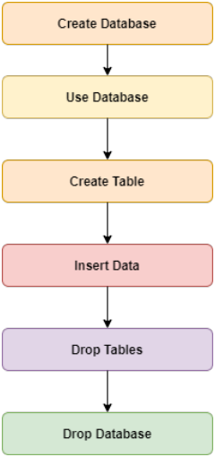

*Figure I.2: Workflow Diagram of the Lab*

### 1.3 Procedure

If you want to install MySQL on Windows environment, using MySQL installer is the easiest way. MySQL installer provides you with an easy-to-use wizard that helps you to install MySQL with the following components:

- MySQL Server

- All Available Connectors

- MySQL Workbench with Sample Data Models

- MySQL Notifier

- Tools for Excel and Microsoft Visual Studio

- MySQL Sample Databases

To download MySQL installer, use the following link:

https://www.apachefriends.org/download.html

Required tools are available for all operating systems in the above link.

After installation of the downloaded XAMPP, you have to run the XAMPP control panel system. It will look like Figure I.3. To start the service, press the Start button of the Apache and MySQL module. Now, the system is ready to work with.

### 1.4 Practicing With XAMPP

To start the practice session, press the Admin button of the MySQL module or use the following link in your web browser: http://localhost/phpmyadmin/

You will get a web page like Figure I.4 in your tab.

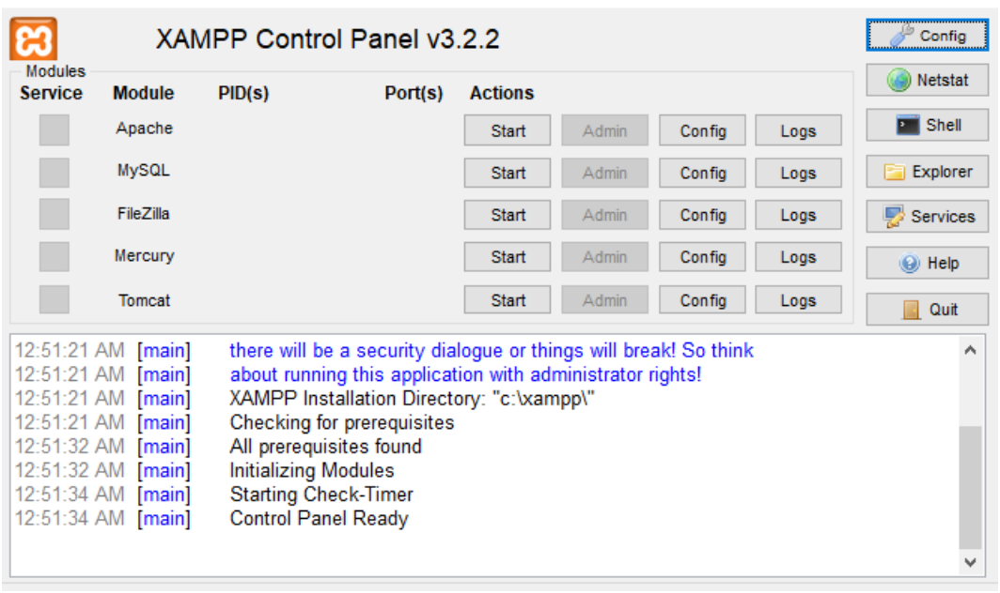

*Figure I.3: XAMPP Control Panel*

To create a database from the phpMyAdmin panel, select the New option (uppermost option in the left side of the web page). Input a name in the Database name field and press the Create button. After that, to input data in your required structure, create a table with a table name and the required number of columns. For this, open the SQL option and write the necessary syntax. An editor space will appear like Figure I.5 where you can write required SQL commands.

### 1.5 Implementations

#### 1.5.1 Database Creation

To create a database using SQL command, write: CREATE DATABASE [Database_Name]. For example, to create a database named lab2:

```sql
CREATE DATABASE lab2
```

A database named “lab2” is created in your local-host.

#### 1.5.2 Database Use

To use the lab2 database, write the following command in the SQL editor:

```sql
USE lab2
```

#### 1.5.3 Table Creation

To create a table using SQL command from the phpMyAdmin panel, open the SQL option and write the necessary command.

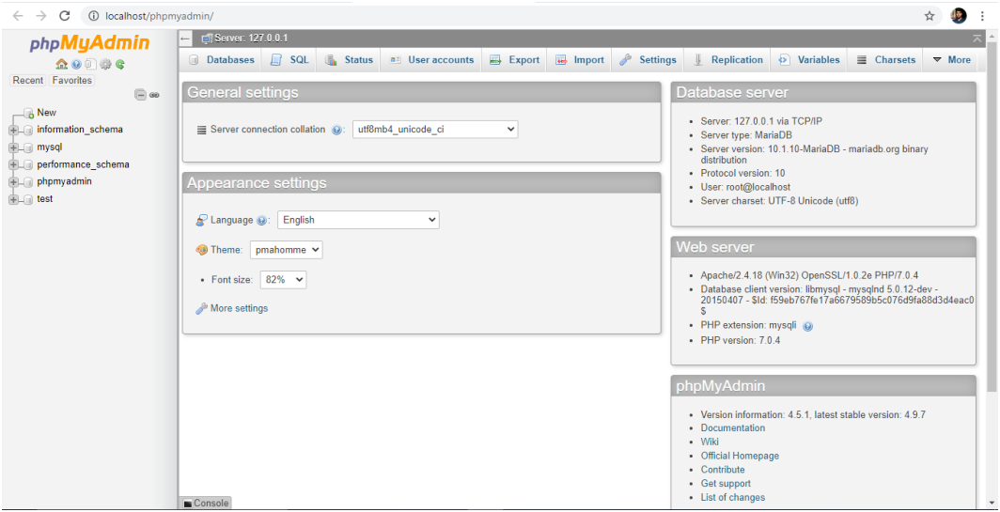

*Figure I.4: Session in Localhost*


*Figure I.5: Space for Editing SQL Commands*

For example, to create a table named Student with 4 attributes (StudentID, Name, Address, Contact):

```sql
CREATE TABLE Student( StudentID varchar(9), Name varchar(20), Address
varchar(50), Contact varchar(11));
```

The created table will look like Figure I.6. You can also create a table with different attribute types. For example, to create a table named Student in lab2 with attributes StudentID (int), LastName (varchar), FirstName (varchar), Address (varchar), City (varchar):

```sql
CREATE TABLE Student(StudentID int, LastName varchar(20), FirstName
varchar(20), Address varchar(50), City varchar(20));
```

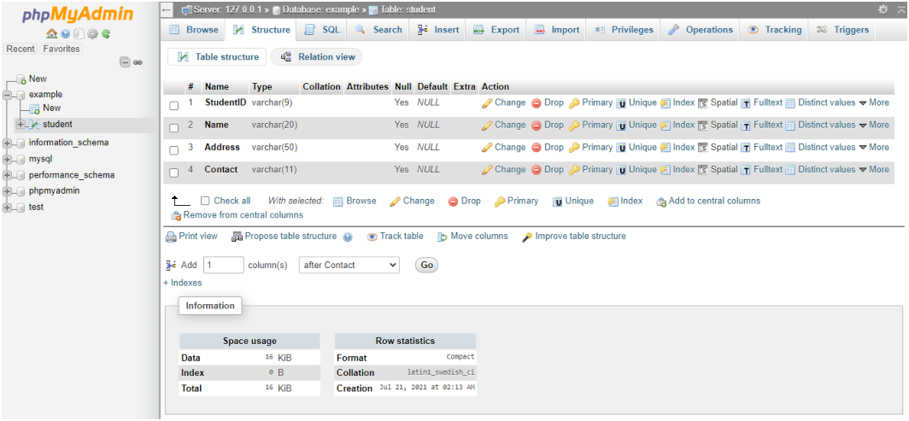

*Figure I.6: Created Table named Student*

#### 1.5.4 Table Description

To describe the structure of a table, use: DESCRIBE [Table_Name]. For example, to describe the Student table:

```sql
DESCRIBE student;
```

The result will appear like Figure I.7 on the browser tab.

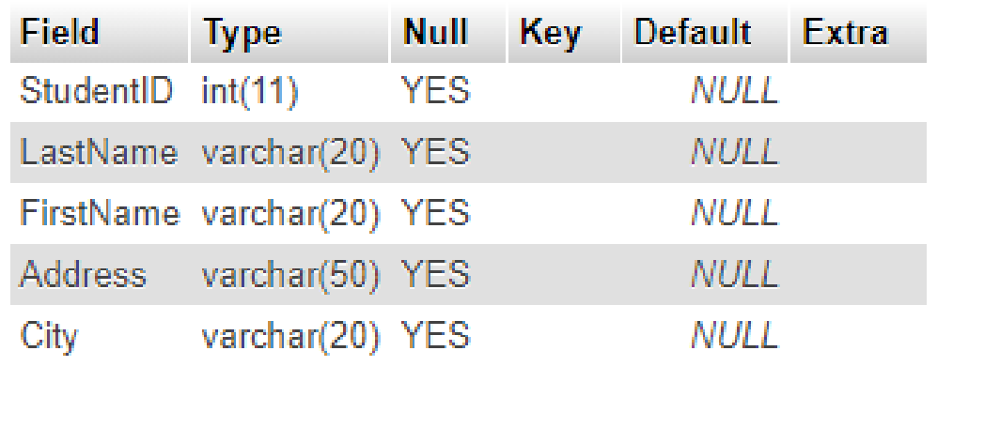

*Figure I.7: Description of Student Table*

#### 1.5.5 Data Insertion

To insert data into a table, write the proper SQL INSERT command in the SQL editor. For example, to insert student details into the Student table:

```sql
INSERT INTO `student`(`StudentID`, `LastName`, `FirstName`, `Address`, `City`)
VALUES ('1001', 'Das', 'Utsha', '704, Shamim Shoroni, West Shewrapara', 'Dhaka');
```

Another record can be inserted as:

```sql
INSERT INTO `student` (`StudentID`, `LastName`, `FirstName`, `Address`, `City`)
VALUES ('1002', 'Hasan', 'Md. Mehedi', '102, Shapla Shoroni, West Shewrapara', 'Dhaka');
```

In this way, many student records can be inserted into the Student table.

#### 1.5.6 Data Browse

To browse and view all records in the Student table:

```sql
SELECT * FROM student;
```

A table will appear on the tab like Figure I.8.

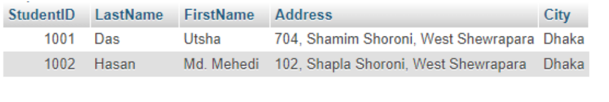

*Figure I.8: Browsing Result of Student Table*

#### 1.5.7 Dropping Table and Database

To drop a table, use the command: DROP TABLE [Table_Name]. For example, to drop the Student table:

```sql
DROP TABLE student;
```

The Student table will be removed from the lab2 database.

To drop the lab2 database itself:

```sql
DROP DATABASE lab2;
```

### 1.6 Input/Output Summary

All the SQL commands covered in this lab follow a standard input/output pattern. The user writes commands in the SQL editor space, and the results are displayed in the browser. The key commands are summarized as: CREATE DATABASE, USE, CREATE TABLE, DESCRIBE, INSERT INTO, SELECT, DROP TABLE, and DROP DATABASE.

### 1.7 Discussion & Conclusion

In this lab, we have installed MySQL via XAMPP, created databases and tables both through the phpMyAdmin panel and using SQL commands. We used varchar and int as data types for attributes — numbers indicate the length of each attribute. Besides these, there are many types of data types available in MySQL, described in Table I.1. We have also inserted data into tables, browsed the table contents, and dropped both tables and databases. That means we have achieved all the lab objectives.

**Table I.1: Basic Data Types in MySQL**

| Data Type | Description |
| --- | --- |
| CHAR(size) | Holds a fixed length string (letters, numbers, special characters). Fixed size specified in parenthesis. Can store up to 255 characters. |
| VARCHAR(size) | Holds a variable length string. Maximum size specified in parenthesis. Can store up to 255 characters. Values greater than 255 are converted to TEXT type. |
| TINYTEXT | Holds a string with a maximum length of 255 characters. |
| TEXT | Holds a string with a maximum length of 65,535 characters. |
| TINYINT(size) | -128 to 127 normal. 0 to 255 UNSIGNED*. Maximum digits may be specified in parenthesis. |
| SMALLINT(size) | -32768 to 32767 normal. 0 to 65535 UNSIGNED*. Maximum digits may be specified in parenthesis. |
| MEDIUMINT(size) | -8388608 to 8388607 normal. 0 to 16777215 UNSIGNED*. Maximum digits may be specified in parenthesis. |
| INT(size) | -2147483648 to 2147483647 normal. 0 to 4294967295 UNSIGNED*. Maximum digits may be specified in parenthesis. |
| BIGINT(size) | -9223372036854775808 to 9223372036854775807 normal. 0 to 18446744073709551615 UNSIGNED*. |
| FLOAT(size,d) | A small number with a floating decimal point. Size specifies max digits; d specifies digits to the right of decimal point. |
| DOUBLE(size,d) | A large number with a floating decimal point. Size specifies max digits; d specifies digits to the right of decimal point. |
| DECIMAL(size,d) | A DOUBLE stored as a string, allowing a fixed decimal point. Size specifies max digits; d specifies digits to the right of decimal point. |
| DATE() | A date. Format: YYYY-MM-DD. Range: ’1000-01-01’ to ’9999-12-31’. |
| DATETIME() | A date and time combination. Format: YYYY-MM-DD HH:MI:SS. Range: ’1000-01-01 00:00:00’ to ’9999-12-31 23:59:59’. |
| TIMESTAMP() | Stored as seconds since Unix epoch (’1970-01-01 00:00:00’ UTC). Format: YYYY-MM-DD HH:MI:SS. Range: ’1970-01-01 00:00:01’ to ’2038-01-09 03:14:07’ UTC. |
| TIME() | A time. Format: HH:MI:SS. Range: ’-838:59:59’ to ’838:59:59’. |
| YEAR() | A year in two or four digit format. Four-digit: 1901 to 2155. Two-digit: 70 to 69 (representing 1970 to 2069). |

### 1.8 Lab Task (Please implement yourself and show the output to the instructor)

1. Create a database named “University”.

2. Create a Table named “Teacher” with attributes named TeacherID, Name, Designation, Address, and Email.

3. Create a Table named “Student” with attributes named StudentID, Name, Address, and Phone.

4. Create a Table named “Staff” with attributes named StaffID, Name, Position, Address, and Phone.

5. Insert at least five entities in each table.

6. Drop each table of the database.

#### 1.8.1 Problem Analysis

1. You have to create a database named “University” with the help of the create option provided in the phpMyAdmin panel or using SQL command.

2. You have to create a table named “Teacher” with attributes named TeacherID, Name, Designation, Address, and Email. You must use proper data type and size.

3. You have to create a table named “Student” with attributes named StudentID, Name, Address, and Phone. You must use proper data type and size.

4. You have to create a table named “Staff” with attributes named StaffID, Name, Position, Address, and Phone. You must use proper data type and size.

5. You have to insert at least five tuples in each of the Student, Teacher, and Staff tables.

6. You have to drop all the tables from the database.

### 1.9 Lab Exercise (Submit as a report)

- Create a Database with five or six tables.

- Use all the basic data types described in Table I.1.

- Insert five to ten tuples in each table.

- Browse each table and take a snapshot.

Academic Integrity Policy

Copying from the internet, classmates, seniors, or any other unauthorized source is strictly prohibited. Full marks may be deducted if plagiarism, copied work, or academic dishonesty is detected.

Students must complete the lab task, implementation, output analysis, and lab report independently and submit authentic work for evaluation.


---

<a id="lab-ii"></a>

## Lab Manual II — Implementation of Integrity Constraints in MySQL

*Source PDF pages 15–25 (printed pages 9–19).*

### 2.1 Objective(s)

- To Declare Primary Key

- To Create Composite Key

- To Implement Unique Constraint

- To Implement Foreign Key Constraint

### 2.2 Problem analysis

In the previous lab, we have already created database, tables and used them. In this lab, we have to declare primary key, create composite key and implement unique and foreign key constraint. For these purposes, we have to create a database first. You can also use database that has already been created in the previous lab. Then, we have to create a table with a primary key. In the next, we have to create composite key and implement unique and foreign key constraint for a table. Finally, we have to insert tuples in the tables. Workflow of this lab is as in the figure II.1.

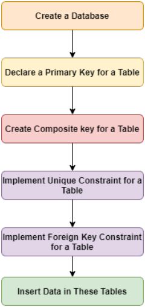

*Figure II.1: Workflow Diagram of this Lab*

### 2.3 Procedure

We have practiced with the XAMPP in the previous labs, we can assume that the system is ready to use. First, we have to launch the XAMPP. Then, we have to press the Start button

of Apache and MySQL module. After that, we have to press the Admin button of the MySQL module. As a result, a tab will be opened on your default web browser like figure II.2. Or, we can open a tab in the web browser with the link as http://localhost/phpmyadmin/. Then, we have to select the SQL option. An editor space will be opened like figure II.3 to write the required commands. Now, it is ready for implementation.

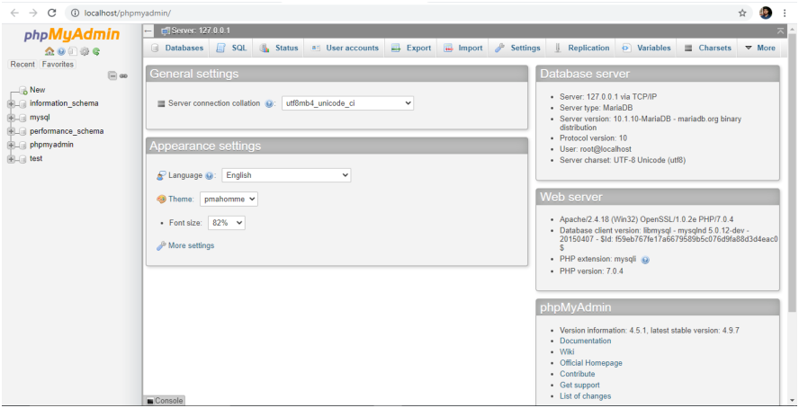

*Figure II.2: Session in Localhost*

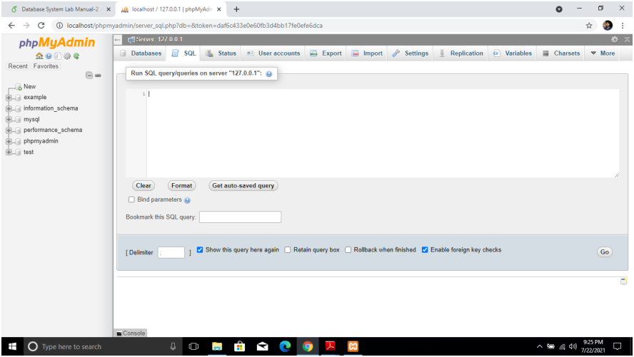

*Figure II.3: Space for Editing Commands*

### 2.4 Implementations

#### 2.4.1 Database Creation

To create a database, we have to write command like ” CREATE DATABASE [Database_Name]”. Suppose, we have to create a database named ”lab3”. We have to write the command as below:

```sql
CREATE DATABASE lab3;
```

A database named ”lab3” is created in your local-host.

#### 2.4.2 Database Use

To use the ”lab3” database, we have to write the command in SQL editor space as below:

```sql
USE lab3
```

#### 2.4.3 Declaration of Primary Key

Now, to create a table named ”Players” in database lab3 with attributes like player_no (int), player_name (varchar), league_no (char) where player_no would be the Primary key, we have to write command in SQL editor space like below:

```sql
CREATE TABLE Players(player_no INT PRIMARY KEY,
player_name varchar(50),
league_no char(6));
```

To describe the structure of Players table, we have to write command as below:

```sql
DESCRIBE players;
```

We will get table like figure II.4 on the browser tab.

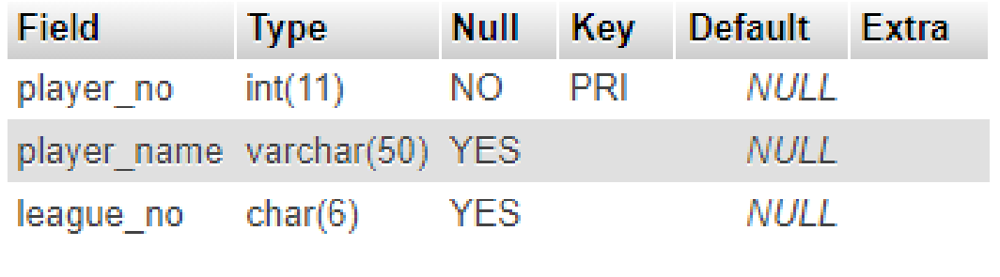

*Figure II.4: Description of Players Table*

The Student table is ready to insert data.

#### 2.4.4 NOT NULL Constraints

```sql
The NOT NULL constraint in MySQL is used to enforce that a column cannot store NULL
values. When a column is defined with NOT NULL, it becomes mandatory for every row
in the table to have a value in that column. This constraint is essential for ensuring that
critical data fields, such as identifiers, names, or contact information, are never left empty,
thereby maintaining the completeness and reliability of the database.
```

For example, when creating a table for students, one might define the student_id and name columns with the NOT NULL constraint. This guarantees that every student record

will include an ID and a name, and any attempt to insert a row without these values will result in an error.The command is as below:

```sql
CREATE TABLE students(student_id INT NOT NULL,
name varchar(50) NOT NULL,
age INT);
```

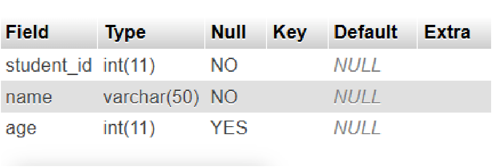

*Figure II.5: Description of Students Table*

#### 2.4.5 Create Composite Key

A composite key in MySQL is a type of primary key made from two or more columns in a table. It is used when a single column is not enough to uniquely identify each row, but a combination of columns can do it.

For example, imagine a table that keeps track of which students are enrolled in which courses. A student can take many courses, and each course can have many students. In this case, neither student_id nor course_id alone can uniquely identify a record. But if we use both together as a composite key, each enrollment becomes unique.The command is as below:

```sql
CREATE TABLE Enrolment(student_id INT NOT NULL,
course_id INT NOT NULL,
grade char(2) NOT NULL,
PRIMARY KEY(student_id, course_id));
```

Description of diplomas table is like the figure II.5

#### 2.4.6 Implementation of Unique

The UNIQUE constraint in MySQL is used to make sure that all values in a column are different from each other. It does not allow duplicate values in that column. This helps keep the data correct and prevents repeated information in the table.

For example, in a teams table, the player_no of each player should be different. If two records have the same player_no, it can create confusion because it would look like the same player is listed more than once. By using the UNIQUE constraint, MySQL will not allow duplicate player numbers to be stored in the table.The command is as below:

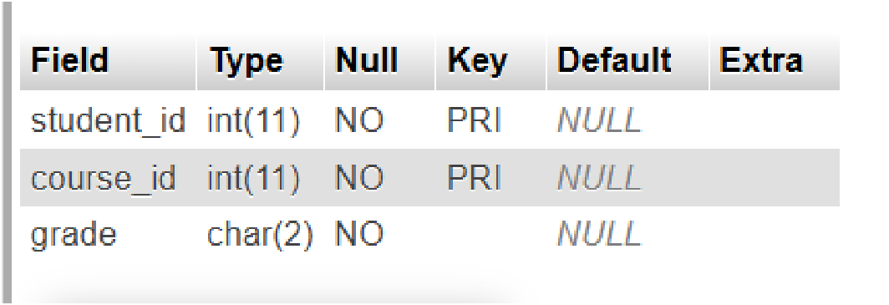

*Figure II.6: Description of diplomas Table*

```sql
CREATE TABLE teams(team_no INT NOT NULL,
player_no INT NOT NULL,
division char(15),
PRIMARY KEY(team_no),
UNIQUE(player_no));
```

Description of teams table is like figure II.7

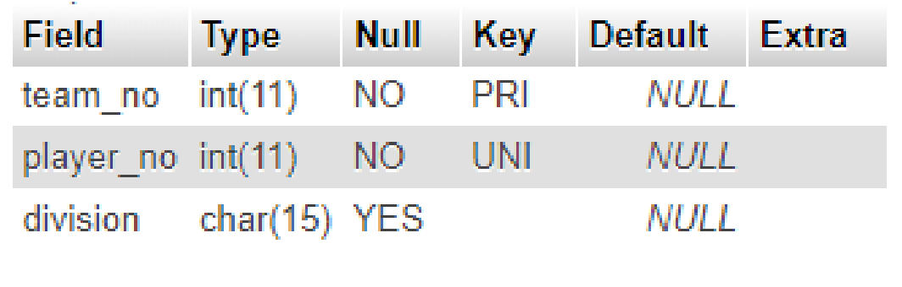

*Figure II.7: Description of teams Table*

#### 2.4.7 Implementation of Foreign Key

A foreign key in MySQL is a constraint that is used to create a relationship between two tables. It ensures that the value in one table must match a value that already exists in another table. This helps maintain data integrity and prevents invalid data from being inserted.

For example, suppose there is a teams table that stores information about teams, and another table that stores players. Each player belongs to a specific team. In this case, the team_no in the players table can be used as a foreign key that refers to the team_no in the teams table. The command is as below:

```sql
CREATE TABLE players(player_id INT NOT NULL,
player_name VARCHAR(50),
team_no INT,
PRIMARY KEY (player_id),
FOREIGN KEY (team_no) REFERENCES teams(team_no) );
```

Description of players table is like figure II.8

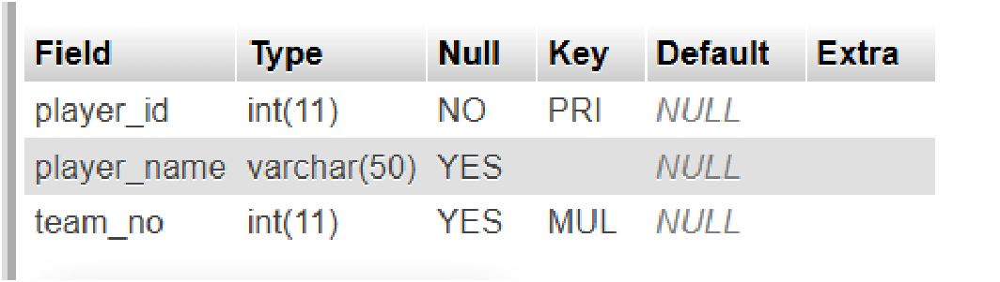

*Figure II.8: Description of players Table*

#### 2.4.8 Data Insertion

To insert data in the table, we have to write proper SQL command on the SQL editor space. Suppose, we want to insert a players details in players table like player_id: 1,player_name: Tamim Iqbal, Team_no: 1, we have to write command as below:

```sql
INSERT INTO players (player_id, player_name, team_no) VALUES
(1, 'Tamim Iqbal', 1),
(2, 'Mushfiqur Rahim', 2),
(3, 'Mahmudullah', 3),
(4, 'Mustafizur Rahman', 4),
(5, 'Litton Das', 5);
```

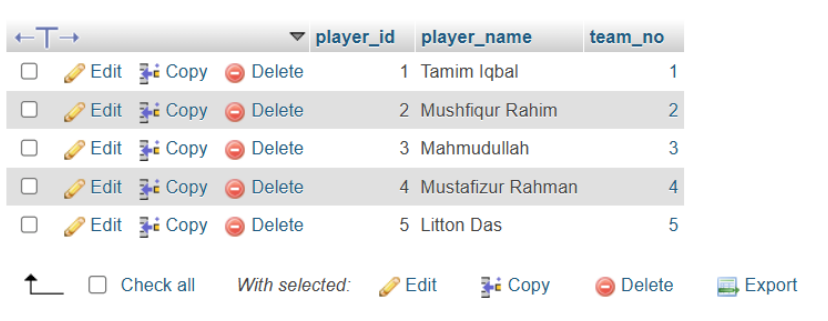

*Figure II.9: Players Table*

While inserting tuple, we must take care of NOT NULL field. If we don’t input in this filed, we will get warning message.

#### 2.4.9 Implementation of CASECADE

A cascade (CASCADE) in MySQL is used with a foreign key to automatically update or delete related rows in another table. It helps maintain the relationship between tables without manually changing the data in both tables.

When the ON DELETE CASCADE option is used, if a row is deleted from the parent table, all related rows in the child table are also automatically deleted. Similarly, ON UPDATE CASCADE means that if the primary key value in the parent table is updated, the corresponding foreign key values in the child table are also updated automatically. For example, suppose there are two tables: teams and players.The players table has a foreign key that refers to the team_no in the teams table.The command is as below:

```sql
CREATE TABLE teams(
team_no INT PRIMARY KEY,
division CHAR(15) );
CREATE TABLE players(
player_id INT PRIMARY KEY,
player_name VARCHAR(50),
team_no INT,
FOREIGN KEY (team_no) REFERENCES teams(team_no)
ON DELETE CASCADE
ON UPDATE CASCADE );
```

In this example, if a team is removed from the teams table, all players belonging to that team will automatically be removed from the players table because of ON DELETE CASCADE. If the team_no in the teams table is changed, the team_no in the players table will also be updated automatically because of ON UPDATE CASCADE.

#### 2.4.10 Implementation of SET NULL

SET NULL is an option used with a foreign key constraint in MySQL. It is used to set the foreign key value to NULL automatically when the referenced row in the parent table is deleted or updated. This helps maintain the relationship between tables without deleting the entire record from the child table.

For example, suppose there are two tables: departments and employees. The employees table has a foreign key dept_id that refers to dept_id in the departmets table.The command is as below:

```sql
CREATE TABLE departments (
dept_id INT PRIMARY KEY,
dept_name VARCHAR(100)
);
```

```sql
CREATE TABLE employees (
emp_id INT PRIMARY KEY,
emp_name VARCHAR(100),
dept_id INT,
FOREIGN KEY (dept_id) REFERENCES departments(dept_id)
ON DELETE SET NULL
ON UPDATE SET NULL );
```

In this example, the employees table has a foreign key dept_id that refers to dept_id in the departments table. If a department is deleted, the dept_id in the employees table will automatically become NULL because of ON DELETE SET NULL. The employee will stay in the table but will not belong to any department. If the dept_id in the departments table is updated, the dept_id in the employees table will also become NULL because of ON UPDATE SET NULL.

#### 2.4.11 Implementation of RESTRICT

The RESTRICT option in MySQL is used with a foreign key to prevent deletion or update of a row in the parent table if it is being used in the child table. For example, in the departments and employees tables, if an employee is linked to a department, you cannot delete or update that department’s dept_id if RESTRICT is applied.

```sql
CREATE TABLE employees (
emp_id INT PRIMARY KEY,
emp_name VARCHAR(100),
dept_id INT,
FOREIGN KEY (dept_id) REFERENCES departments(dept_id)
ON DELETE RESTRICT
ON UPDATE RESTRICT );
```

If you try to delete a department that is already assigned to employees, MySQL will not allow it and will show an error. The same happens if you try to update the dept_id.

#### 2.4.12 Implementation of SET DEFAULT

The SET DEFAULT option in MySQL is used with a foreign key to set the column in the child table to a default value when the referenced row in the parent table is deleted or updated. For example, in the departments and employees tables, if a department is removed or its ID is changed, the dept_id in the employees table will be set to a predefined default value instead of becoming NULL or causing an error.

```sql
CREATE TABLE employees (
emp_id INT PRIMARY KEY,
emp_name VARCHAR(100),
dept_id INT,
FOREIGN KEY (dept_id) REFERENCES departments(dept_id)
ON DELETE SET DEFAULT
ON UPDATE SET DEFAULT );
```

In this case, if a department is deleted or updated, the dept_id of related employees will automatically become 0 (the default value). The employee record stays in the table but is assigned to a default or “unknown” department. Note: In MySQL, SET DEFAULT is not fully supported, so in real practice, SET NULL or application logic is usually used instead.

#### 2.4.13 Implementation of AUTO_INCREMENT

```sql
The AUTO_INCREMENT feature in MySQL is used to automatically generate a unique
number for a column whenever a new row is inserted. It is usually applied to a primary
key so that each record gets a unique ID without manually entering it.
For example, in the employees table, you can use AUTO_INCREMENT for the emp_id col-
umn:
CREATE TABLE students (
stud_id INT AUTO_INCREMENT,
stud_name VARCHAR(100),
dept_name VARCHAR(100),
PRIMARY KEY (stud_id) );
```

In this table, you do not need to provide a value for stud_id while inserting data. MySQL will automatically assign the next number.

#### 2.4.14 MySQL CHECK Constraint

The CHECK constraint is used to limit the value range that can be placed in a column. If you define a CHECK constraint on a column it will allow only certain values for this column. If you define a CHECK constraint on a table it can limit the values in certain columns based on values in other columns in the row.

- Create a table Person:

```sql
CREATE TABLE Person(
ID int(11) NOT NULL AUTO_INCREMENT,
First_Name varchar(255) NOT NULL,
Last_Name varchar(255) ,
Address varchar(255) NOT NULL,
Age INT NOT NULL,
CHECK(Age>=18),
PRIMARY KEY(ID)
);
```

- To allow naming of a CHECK constraint, and for defining a CHECK constraint on multiple columns, use the following SQL syntax:

```sql
CREATE TABLE Person(
ID int(11) NOT NULL AUTO_INCREMENT,
First_Name varchar(255) NOT NULL,
Last_Name varchar(255) ,
Address varchar(255) NOT NULL,
Age INT NOT NULL,
Salary INT NOT NULL,
CHECK(Age>=18 AND Salary>=20000) ,
PRIMARY KEY(ID)
);
```

#### 2.4.15 Implementation of DEFAULT

The DEFAULT constraint in MySQL is used to assign a value automatically to a column if no value is provided during data insertion. It helps ensure that a column always has a value, even when the user does not specify one. For example, in an employees table, you can set a default department ID:

```sql
CREATE TABLE employees (
emp_id INT AUTO_INCREMENT PRIMARY KEY,
emp_name VARCHAR(100),
dept_id INT DEFAULT 1 );
```

In this table, if no value is given for dept_id, MySQL will automatically use 1 as the default value.

#### 2.4.16 MySQL CASE Examples

The CASE statement goes through conditions and returns a value when the first condition is met (like an if-then-else statement). So, once a condition is true, it will stop reading and return the result. If no conditions are true, it returns the value in the ELSE clause.

```sql
SELECT ID, Last_Name,
CASE WHEN Age > 18 THEN 'He or She is eligible for voting'
WHEN Age = 18 THEN 'He or She has applied for NID'
ELSE 'He or She is not eligible for voting'
END AS Feedback
FROM Person;
```

If there is no ELSE part and no conditions are true, it returns NULL.

### 2.5 Discussion & Conclusion

In this lab, we have created a database with four tables. We have created primary key in different tables, created composite key for diplomas table, implemented unique for

teams table and foreign key for teams table. Finally, we have inserted data for Players table. That’s meant, we have achieved our lab objectives.

### 2.6 Lab Task (Please implement yourself and show the output to the instructor)

1. Insert at least five tuples in each table.

2. Try to violate the NOT NULL constraint

3. Try to violate the Unique constraint

#### 2.6.1 Problem analysis

1. You have to insert at least five tuples for each table created in this lab.

2. You have to input NULL values for the NOT NULL field and try to explain the warning.

3. You have to input duplicate values for the Unique field and try to explain the warning.

### 2.7 Lab Exercise (Submit as a report)

- Create a Database with three tables.

- Assign primary key for each table.

- Assign a unique in at least two tables.

- Implement foreign key and CHECK constraint in at least one table.

- Insert Data in each table.

- Browse data for each table.

Academic Integrity Policy

Copying from the internet, classmates, seniors, or any other unauthorized source is strictly prohibited. Full marks may be deducted if plagiarism, copied work, or academic dishonesty is detected.

Students must complete the lab task, implementation, output analysis, and lab report independently and submit authentic work for evaluation.


---

<a id="lab-iii"></a>

## Lab Manual III — Modifying MySQL databases and Updating Data in MySQL Table

*Source PDF pages 26–36 (printed pages 20–30).*

### 3.1 Objective(s)

- To gain the advance knowledge for modifying and updating MySQL databases.

- To implement different types of modifying statements using ADD, DROP, CHANGE and UPDATE. .

### 3.2 Problem analysis

The modify command is used when we have to modify a column in the existing table, like add a new one, modify the datatype for a column, and drop an existing column. By using this command we have to apply some changes to the result set field. The UPDATE statement updates data in a table. It allows you to change the values in one or more columns of a single row or multiple rows.

#### 3.2.1 Table modification using alter table

The ALTER TABLE statement is used to add, delete, or modify columns in an existing table. It is also used to add and drop various constraints on an existing table.

- To add a column in a table, use the following syntax:

```sql
ALTER TABLE Customers ADD column_name datatype;
```

- To delete a column in a table, use the following syntax:

```sql
ALTER TABLE table_name DROP COLUMN column_name;
```

- To change the data type of a column in a table, use the following syntax:

```sql
ALTER TABLE table_name ALTER COLUMN column_name datatype;
```

- The UPDATE statement is used to modify the existing records in a table.

```sql
UPDATE table_name
SET column1 = value1, column2 = value2,...
WHERE condition;
```

### 3.3 Procedure (Implementation in MySQL)

1. Create a table and Automatic increment values:

```sql
CREATE TABLE Employee
(
id INT NOT NULL AUTO_INCREMENT,
```

```sql
First_name varchar(200) NOT NULL,
Last_name varchar(200),
salary INT,
Gender ENUM('M','f')
PRIMARY KEY(ID)
);
```


*Figure III.1: employee table structure*

2. Mysql Add Column Examples:

```sql
ALTER TABLE employees
ADD email VARCHAR (100);
```


*Figure III.2: After adding email*

3. DROP an attributes/column from table persons:

```sql
ALTER TABLE employees
DROP email;
```


*Figure III.3: After deleting email attribute*

4. Add an attributes/column to table employees in any position of column:

```sql
ALTER TABLE employees
ADD email VARCHAR (100) AFTER Last_name;
```


*Figure III.4: Adding email attribute after last name*

5. Add an attributes/column to table employees in the first column:

```sql
ALTER TABLE employees
ADD COLUMN Gender Char(1) FIRST;
```


*Figure III.5: Added Gender attribute in the first column*

6. Add multiple attributes/column to table employees in single command:

```sql
ALTER TABLE employees
ADD COLUMN Bank_account INT,
ADD COLUMN Entry_Date DATE;
```


*Figure III.6: Added multiple column to the employees table*

7. DROP multiple attributes/column from table employees:

```sql
ALTER TABLE employees
DROP COLUMN Gender,
DROP COLUMN Email;
```


*Figure III.7: Deleted email and Gender attributes from employees table*

8. Changing columns constraints using MySQL ALTER TABLE statement:

```sql
ALTER TABLE employees
CHANGE salary salary varchar(50) NOT NULL;
```


*Figure III.8: changed the constraint of salary column*

9. Changing columns name using MySQL ALTER TABLE statement:

**-Syntax:**

```sql
ALTER TABLE table_name
CHANGE Old_Column_Name New_Column_Name Datatype If any Constraint;
ALTER TABLE employees
CHANGE First_name F_name varchar(100) NOT NULL;
```


*Figure III.9: changed First_name to f_name*

10. Adding Constraints in a column using ALTER

```sql
ALTER TABLE employees
ADD CONSTRAINTS Unique_salary UNIQUE(salary);
```


*Figure III.10: Added unique constraint in salary column*

11. Droping a constraint from a column

```sql
ALTER TABLE employees
DROP INDEX Unique_salary;
```

12. Modify Data-type using ALTER

```sql
ALTER TABLE employees
MODIFY salary BIGINT;
```


*Figure III.11: Dropped the constraint*


*Figure III.12: Modified the data-type of salary attribute*

13. Foreign key using ALTER

```sql
Create a departments table:
CREATE TABLE departments(
dept_id iNT PRIMARY KEY,
dept_name varchar(100) );
ALTER TABLE employees
ADD dept_id INT;
ALTER TABLE employees
ADD CONSTRAINT fk_dept
FOREIGN KEY (dept_id) REFERENCES departments(dept_id);
```


*Figure III.13: employees table*


*Figure III.14: departments table*

14. Add Primary key using ALTER

```sql
ALTER TABLE employees
ADD PRIMARY KEY(id);
```


*Figure III.15: Before adding Primary key*


*Figure III.16: After adding Primary Key*

15. Command for showing all constraints of a table

```sql
SELECT CONSTRAINT_NAME, CONSTRAINT_TYPE
FROM information_schema.TABLE_CONSTRAINTS
WHERE TABLE_NAME = 'employees';
```

or,

```sql
SHOW CREATE TABLE employees;
```

16. Inserting data into tables using MySQL INSERT statement:(Table showing in Fig 13 and Fig 14

First insert into the departments table of fig-14


*Figure III.17: All Constraints of employees table*

```sql
INSERT INTO department (dept_id, dept_name) VALUES
(1, 'Human Resources'),
(2, 'Finance'),
(3, 'Engineering'),
(4, 'Marketing'),
(5, 'Sales');
```

Now insert into the employees table of fig-13

```sql
INSERT INTO employees (id, F_name, Last_name, salary, Bank_account,
Entry_Date, dept_id) VALUES
(1, 'John',
'Smith',
55000, 123456789, '2022-01-15', 1),
(2, 'Jane',
'Doe',
72000, 987654321, '2021-06-20', 2),
(3, 'Alice',
'Johnson', 90000, 112233445, '2020-03-10', 3),
(4, 'Bob',
'Williams', 48000, 556677889, '2023-07-01', 4),
(5, 'Charlie', 'Brown',
61000, 334455667, '2019-11-25', 5),
(6, 'Diana',
'Prince',
85000, 778899001, '2022-09-14', 3),
(7, 'Ethan',
'Hunt',
53000, 223344556, '2023-02-28', 2);
```


*Figure III.18: departments table*


*Figure III.19: employees table*

17. Find all records from employees:

```sql
SELECT * FROM employees;
```


*Figure III.20: employees table*

18. MySQL copy table examples:

```sql
CREATE TABLE IF NOT EXISTS employees_info_Backup
SELECT * FROM employees;
```


*Figure III.21: employees_backup_info table*

19. Updating data using MySQL UPDATE statement o UPDATE a column single value:

```sql
UPDATE employees
SET salary=300000
WHERE id=1;
```

- UPDATE a multiple columns single value:

```sql
UPDATE employees
SET F_Name= 'Barry', Last_Name='Alen'
WHERE id=2;
```


*Figure III.22: updated employees table*

### 3.4 Discussion & Conclusion

Based on the focused objective(s) to understand about the knowledge of ALTER, ADD, DROP,CHANGE and UPDATE commands a real life object. And the lab exercise made students more confident towards the fulfilment of the objectives(s).

### 3.5 Lab Task (Please implement yourself and show the output to the instructor)

1. employee (e_name, street, city) company (company_name, branch, city) works (w_name, e_name, company_name, salary)

Consider the employee database, give an expression in SQL for each of the following queries.

a. Create this database and Insert information into employee, company and works (at least 2).

b. Add emp_id and entry_date columns in employee relation.

c. Modify column name city(employee)=address.

d. Add column email in table employee. Update email and address columns information.

e. Create a backup relation for works and employee table.

f. Add key constraint (FOREIGN KEY) in company_name field to the works table.

### 3.6 Lab Exercise (Submit as a report)

1. Create This following Bank Database. branch (branch_name, branch_city, assets) customer (customer_id,customer_name, customer_city) account (account_number, branch_name, balance) loan (loan_number, branch_name, amount) depositor (customer_name, account_number) borrower (customer_name, loan_number)

- Tables are placed according to parent and child relationship

- Create above table considering PRIMARY KEY and FOREIGN KEY.

- Data type for amount and balance are INTEGER otherwise VARCHAR(13).

- Insert records into your table.

- Add column Email in customer relation and Set the value.

- Change the name of column name customer_city and modify the data type of column assets

Academic Integrity Policy

Copying from the internet, classmates, seniors, or any other unauthorized source is strictly prohibited. Full marks may be deducted if plagiarism, copied work, or academic dishonesty is detected.

Students must complete the lab task, implementation, output analysis, and lab report independently and submit authentic work for evaluation.


---

<a id="lab-iv"></a>

## Lab Manual IV — Querying and Filtering data in MySQL Table

*Source PDF pages 37–40 (printed pages 31–34).*

### 4.1 Objective(s)

- To gather knowledge about Querying and filtering data in MySQL table.

- To implement distinct and filtering data commands in MySQL table.

### 4.2 Problem analysis

The SQL DISTINCT keyword is used with the SELECT statement to eliminate all the duplicate records and fetching only unique records.There may be a situation when you have multiple duplicate records in a table. While fetching such records, it makes more sense to fetch only those unique records instead of fetching duplicate records. The SQL WHERE clause is used to specify a condition while fetching the data from a single table or by joining with multiple tables. If the given condition is satisfied, then only it returns a specific value from the table.

#### 4.2.1 Filtering and Fetching Data in MySql Table

The SQL SELECT statement returns a result set of records, from one or more tables. A SE- LECT statement retrieves zero or more rows from one or more database tables or database views The SELECT DISTINCT statement is used to return only distinct values. Inside a table, a column often contains many duplicate values; and sometimes you only want to list the different (distinct) values.

- SELECT Syntax:

```sql
SELECT column1, column2, ... FROM table_name;
```

- SELECT DISTINCT Syntax:

```sql
SELECT DISTINCT column1, column2, ... FROM table_name;
```

- The SQL WHERE Clause syntax:

```sql
SELECT column1, column2, ... FROM table_name WHERE condition;
```

### 4.3 Procedure (Implementation in MySQL)

1. Using MySQL SELECT statement to query data(Create a employees table):

```sql
CREATE TABLE employees(
Emp_id int(11) NOT NULL,
First_Name varchar(255) NOT NULL,
Last_name varchar(55) NOT NULL,
DOB date NOT NULL,
Gender enum('Male','Female') DEFAULT NULL,
Salary int NOT NULL,
Entry_date datetime NOT NULL DEFAULT current_timestamp(),
PRIMARY KEY(Emp_id)
);
```

2. Insert Multiple VALUES at a time:

```sql
INSERT INTO employees (Emp_id, First_Name, Last_name,DOB, Gender, Salary)
VALUES (1, 'Sabbir', 'Rahman','1998-08-02', 'Male', 30000),
(2, 'Sakib', 'Hasan','1998-08-02', 'Male', 20000),
(3, 'Ananna', 'Rahman','1998-08-02', 'Female', 40000),
(4, 'Jannat', 'Hasan','1998-08-02', 'Female', 45000),
(5, 'Sabbir ', 'Hossain','1998-07-02', 'Male', 25000);
```

3. View data from table employees: SELECT * FROM employees;


*Figure IV.1: Employees Table Information*

4. Eliminating duplicate rows with DISTINCT Operator:

```sql
SELECT DISTINCT First_Name, Last_name FROM employees;
```

5. Filtering rows using MySQL WHERE:

**- MySQL WHERE Clause for INETEGER type value :**

```sql
SELECT First_Name, Last_name, Salary FROM employees WHERE Emp_id=2 ;
```

**- MySQL WHERE Clause for String type value:**

```sql
SELECT Emp_id, Last_name, DOB, Salary,Entry_date
FROM employees
WHERE First_Name='Sabbir';
```

6. Using comparison operators (<,>, <=,>=, <>):

Example:1

```sql
SELECT Emp_id, First_Name, Last_name
FROM employees
WHERE Salary>=40000;
```

**Example 2:**

```sql
SELECT Emp_id, First_Name, Last_name
FROM employees
WHERE Salary <> 30000; (<> Means Not Equal to);
```

### 4.4 Discussion & Conclusion

Based on the focused objective(s) to understand about the knowledge of SELECT,WHERE and DISTINCT commands. The additional lab exercise made me more confident towards the fulfilment of the objectives(s)

### 4.5 Lab Task (Please implement yourself and show the output to the instructor)

1. Insert multiple values at a time for your existing database table (Do it for all table).

2. Remove duplicate values from all table.

3. View the data from any two tables.

4. Implement WHERE clause and search the specific information from existing tables.

5. Implement comparison operators using WHERE clause.

### 4.6 Lab Exercise (Submit as a report)

1. Input multiple data in any existing database table from previous lab report.

2. Query with primary key, query with condition, query with comparison operation.

(Note: Implement All Query which have completed in this experiment)

3. Attach with query codes and with output screenshots in the report.

Academic Integrity Policy

Copying from the internet, classmates, seniors, or any other unauthorized source is strictly prohibited. Full marks may be deducted if plagiarism, copied work, or academic dishonesty is detected.

Students must complete the lab task, implementation, output analysis, and lab report independently and submit authentic work for evaluation.


---

<a id="lab-v"></a>

## Lab Manual V — Querying and Filtering data in MySQL Table (Extended)

*Source PDF pages 41–46 (printed pages 35–40).*

### 5.1 Objective(s)

- To gather knowledge about Querying and filtering data with logic gates like AND OR as well as using limits.

- Learning about comparing tables in MySQL.

- To implement logic operations, comparisons and filtering data commands with limits in MySQL table.

### 5.2 Problem analysis

In SQL, all logical operators evaluate to TRUE , FALSE , or NULL ( UNKNOWN ). In MySQL, these are implemented as 1 ( TRUE ), 0 ( FALSE ), and NULL . ... Logical NOT. Evaluates to 1 if the operand is 0 , to 0 if the operand is nonzero, and NOT NULL returns NULL. MySQL provides a LIMIT clause that is used to specify the number of records to return. The LIMIT clause makes it easy to code multi page results or pagination with SQL, and is very useful on large tables. Returning a large number of records can impact on performance. MySQL NOT BETWEEN AND operator checks whether a value is not present between a starting and a closing expression. If expr is not greater than or equal to min and expr is not less than or equal to max, BETWEEN returns 1, otherwise, it returns 0. The LIKE operator is used in a WHERE clause to search for a specified pattern in a column.

#### 5.2.1 Logical Operators

In SQL, all logical operators evaluate to TRUE, FALSE, or NULL (UNKNOWN). In MySQL, these are implemented as 1 (TRUE), 0 (FALSE), and NULL. Most of this is common to different SQL database servers, although some servers may return any nonzero value for TRUE. MySQL evaluates any nonzero, non-NULL value to TRUE. For example, the following statements all assess to TRUE:

- NOT, ! Logical NOT, Evaluates to 1 if the operand is 0, to 0 if the operand is nonzero, and NOT NULL returns NULL.

```sql
SELECT column1, column2, ... FROM table_name NOT....
```

- AND, && Logical AND, Evaluates to 1 if all operands are nonzero and not NULL, to 0 if one or more operands are 0, otherwise NULL is returned.

```sql
SELECT column1, column2, ... FROM table_name AND....
```

#### 5.2.2 MySQL LIMIT (ORDER BY, ASC, DESC)

The LIMIT clause is used in the SELECT statement to constrain the number of rows to return. The LIMIT clause accepts one or two arguments. The values of both arguments must be zero or positive integers. The following illustrates the LIMIT clause syntax with two arguments:

```sql
SELECT select_list
FROM table_name;
LIMIT [offset,] row_count;
```

#### 5.2.3 Between, Not Between In, Not In

The SQL BETWEEN operator is used along with WHERE clause for providing a range of values. The values can be the numeric value, text value, and date.

```sql
SELECT Column(s)
FROM table_name;
WHERE column BETWEEN value1 AND value2;
```

### 5.3 Procedure (Implementation in MySQL)

1. Using logical operators (AND, OR, NOT)):

- Insert Data:

```sql
CREATE TABLE employees(
emp_no int(11) NOT NULL,
birth_date date NOT NULL,
first_name varchar(55) NOT NULL,
last_name varchar(55) NOT NULL,
gender enum('M','F') DEFAULT NULL,
salary int NOT NULL,
entry_date datetime NOT NULL, DEFAULT current_timestamp(),
PRIMARY KEY(Emp_no)
);
```

- Insert Multiple VALUES at a time:

```sql
INSERT INTO employees (emp_no, birth_date, first_name,last_name, gender,
salary)
VALUES (1015312001,'1989-08-28', 'Rina' , 'Khanam' ,'F', 45000),
(1015312002, '1988-07-19', 'Sakib' , 'Hasan' , 'M' , 67000),
(1015312003,'1991-05-23', 'Sabbir' , 'Rahman' , 'M', 32000);
```

- Insert Single Values Must have same values as attributes number:

```sql
INSERT INTO employees VALUES (1015312008, '1991-05-23', 'Sabbir', 'Rah-
man', 'M', 24000, '2017-11-11');
INSERT INTO employees VALUES (1015312009, '1991-05-23', 'Sabbir', 'Rah-
man', 'M', 25600, '2017-11-11 21:44:35');
```

- MySQL AND operator examples:

```sql
SELECT emp_no, first_name, last_name, salary, entry_date
FROM employees
WHERE first_name ='Rina' AND last_name = 'Khanam';
```

- MySQL OR operator examples:

```sql
SELECT emp_no, first_name, last_name, salary, entry_date
FROM employees
WHERE first_name ='Rina' OR last_name = 'Khan';
```

- Operator precedence MySQL evaluates the OR operators after the AND operators:

```sql
SELECT emp_no, first_name, last_name, salary, entry_date
FROM employees
WHERE first_name ='Rina' OR last_name = 'Rahman' AND salary <= 40000;
```

- To change the order of evaluation, you use the parentheses, for example:

```sql
SELECT emp_no, first_name, last_name, salary, entry_date
FROM employees
WHERE (first_name ='Rina' OR last_name = 'Rahman') AND salary <= 40000;
```

- MySQL creates result for OR:

```sql
SELECT emp_no, first_name, last_name, salary, entry_date
FROM employees
WHERE first_name ='Rina' OR last_name = 'Rahman';
```

2. Using limit (ORDER BY, ASC, DESC)

- Select the first 3 customers

```sql
SELECT emp_no, first_name, last_name, salary FROM employees LIMIT 3 ;
```

- Select all attributes

```sql
SELECT emp_no, first_name, last_name, salary FROM employees LIMIT 2,4 ;
```

- Find 4 records without first 2 records

```sql
SELECT emp_no, first_name, last_name, salary FROM employees LIMIT 3 ;
```

- Using MySQL LIMIT to get the highest 3 values

```sql
SELECT emp_no, first_name, last_name, salary
FROM employees
ORDER BY salary DESC LIMIT 3 ;
```

3. Between, Not Between In, Not In:

- MySQL IN examples Like OR operator

```sql
SELECT emp_no, first_name, last_name, salary, entry_date
FROM employees
WHERE salary IN (32000,40000);
```

- MySQL NOT IN examples

```sql
SELECT emp_no, first_name, last_name, salary, entry_date
FROM employees
WHERE salary NOT IN (32000,45000, 25600);
```

- MySQL BETWEEN examples

```sql
SELECT emp_no, first_name, last_name, salary, entry_date
FROM employees
WHERE salary BETWEEN 20000 AND 43000;
```

- MySQL BETWEEN to get exact values

```sql
SELECT emp_no, first_name, last_name, salary, entry_date
FROM employees
WHERE salary BETWEEN 25600 AND 42000;
```

- MySQL NOT BETWEEN to get exact values

```sql
SELECT emp_no, first_name, last_name, salary, entry_date
FROM employees
WHERE salary NOT BETWEEN 25600 AND 42000;
```

4. Using MySQL LIKE operator to select data based on patterns

- MySQL LIKE examples

- The percentage ( %) wildcard allows you to match any string of zero or more characters.

- The underscore ( _ ) wildcard allows you to match any single character.

- Find employees name who has first name starting with ‘m’

```sql
SELECT emp_no, first_name, last_name, salary, entry_date
FROM employees
WHERE first_name LIKE 'm%';
```

- Find employees name who has first name ending with ‘r’

```sql
SELECT emp_no, first_name, last_name, salary, entry_date
FROM employees
WHERE first_name LIKE '%r';
```

- Find employees name who has first name contains ‘bb’

```sql
SELECT emp_no, first_name, last_name, salary, entry_date
FROM employees
WHERE first_name LIKE '%bb%';
```

- Find employees name who has first name contains first letter ‘r’ and fourth letter ‘a’

```sql
SELECT emp_no, first_name, last_name, salary, entry_date
FROM employees
WHERE first_name LIKE 'r__a';
```

5. Checking NULL values

```sql
SELECT * FROM employees
WHERE gender IS NULL;
```

### 5.4 Discussion & Conclusion

Based on the focused objective(s) to understand about the knowledge of SELECT,WHERE, AND , BETWEEN, NOT BETWEEN and LIKE commands. The additional lab exercise made me more confident towards the fulfilment of the objectives(s)

### 5.5 Lab Task (Please implement yourself and show the output to the instructor)

- Task-1: branch (branch_name, branch_city, assets) customer (customer_id,customer_name, customer_city) account (account_number, branch_name, balance) loan (loan_number, branch_name, amount) depositor (customer_name, account_number) borrower (customer_name, loan_number)

1. Input multiple data existing bank database table from previous lab report.

2. Write a SQL query for searching customers who have 30000 to 50000 loan

3. Find the names of all branches located Between Dhaka and Cumilla.

4. To find all loan holders who have ‘J’ alphabets in their name or they have ‘M’ alphabets in the beginning of the names.

### 5.6 Lab Exercise (Submit as a report)

1. Input multiple data in any existing database table from previous lab report.

2. Query with primary key, query with condition, query with comparison operation.

3. Run all the queries using AND, OR, NOT, ORDER BY, ASC, DESC, Between, Not Between In, Not In, LIKE

4. Attach with query codes and with output screenshots in the report.

Academic Integrity Policy

Copying from the internet, classmates, seniors, or any other unauthorized source is strictly prohibited. Full marks may be deducted if plagiarism, copied work, or academic dishonesty is detected.

Students must complete the lab task, implementation, output analysis, and lab report independently and submit authentic work for evaluation.


---

<a id="lab-vi"></a>

## Lab Manual VI — Implementation of MySQL Aggregate Function

*Source PDF pages 47–53 (printed pages 41–47).*

### 6.1 Objective(s)

- Gather knowledge about the aggregate function.

- Implement different types of aggregate functions AVG, COUNT, SUM, MIN, MAX, UCASE, LCASE, FLOOR etc.

### 6.2 Problem analysis

We mainly use the aggregate functions in databases, spreadsheets and many other data manipulation software packages. In the context of business, different organization levels need different information such as top levels managers interested in knowing whole figures and not the individual details. These functions produce the summarised data from our database. Thus they are extensively used in economics and finance to represent the economic health or stock and sector performance.

**MySQL aggregate functions**

| Aggregate function | Description |
| --- | --- |
| AVG() | Return the average of non-NULL values. |
| BIT_AND() | Return bitwise AND. |
| BIT_OR() | Return bitwise OR. |
| BIT_XOR() | Return bitwise XOR. |
| COUNT() | Return the number of rows in a group, including rows with NULL values. |
| GROUP_CONCAT() | Return a concatenated string. |
| JSON_ARRAYAGG() | Return result set as a single JSON array. |
| JSON_OBJECTAGG() | Return result set as a single JSON object. |
| MAX() | Return the highest value (maximum) in a set of non-NULL values. |
| MIN() | Return the lowest value (minimum) in a set of non-NULL values. |
| STDEV() | Return the population standard deviation. |
| STDDEV_POP() | Return the population standard deviation. |
| STDDEV_SAMP() | Return the sample standard deviation. |
| SUM() | Return the summation of all non-NULL values a set. |
| VAR_POP() | Return the population standard variance. |
| VARP_SAM() | Return the sample variance. |
| VARIANCE() | Return the population standard variance. |

SQL functions are similar to SQL operators in that both manipulate data items and both return a result. SQL functions differ from SQL operators in the format in which they appear with their arguments. The SQL function format enables functions to operate with zero, one, or more arguments. function(argument1, argument2, ...) alias If passed an argument whose datatype differs from an expected datatype, most functions perform an implicit datatype conversion on the argument before execution. If passed a null value, most functions return a null value. SQL functions are used exclusively with SQL commands within SQL statements. There are two general types of SQL functions: single row (or scalar) functions and aggregate functions. These two types differ in the number of database rows on which they act. A single row function returns a value based on a single row in a query, whereas an aggregate function returns a value based on all the rows in a query. Single row SQL functions can appear in select lists (except in SELECT statements that contain a GROUP BY clause) and WHERE clauses. Aggregate functions are the set functions: AVG, MIN, MAX, SUM, and COUNT. You must provide them with an alias that can be used by the GROUP BY function.

#### 6.2.1 Using Mathematical Function

Relational databases store information in tables — with columns that are analogous to elements in a data structure and rows which are one instance of that data structure. The SQL language is used to interact with that database information. The SQL aggregate functions — AVG, COUNT, DISTINCT, MAX, MIN, SUM — all return a value computed or derived from one column’s values, after discarding any NULL values. The syntax of all these functions is:

- AVG() The AVG() function calculates the average value of a set of values. It ignores NULL in the calculation.

```sql
SELECT column1, column2, ... AVG (column1) FROM table_name
```

- SUM(): The SUM() function returns the sum of values in a set. The SUM() function ignores NULL. If no matching row found, the SUM() function returns NULL.

To get the total order value of each product, you can use the SUM() function in conjunction with the GROUP BY clause as follows:

```sql
SELECT column1, column2, ... SUM (column1) FROM table_name
```

- MAX(): The MAX() function returns the maximum value in a set. For example, you can use the MAX() function to get the highest buy price from the products table as shown in the following query:

```sql
SELECT column1, column2, ... MAX (column1) FROM table_name
```

- MIN(): The MIN() function returns the minimum value in a set of values. Code language: MySQL (Structured Query Language) (MySQL) For example, the following query uses the MIN() function to find the lowest price from the products table:

```sql
SELECT column1, column2, ... MIN (column1) FROM table_name
```

- Count(): MySQL count() function returns the total number of values in the expression. This function produces all rows or only some rows of the table based on a specified condition, and its return type is BIGINT. It returns zero if it does not find any matching rows. It can work with both numeric and non-numeric data types.

```sql
SELECT column1, column2, ... COUNT (column1) FROM table_name
```

#### 6.2.2 Using Text /String Functions:)

1. CHAR() : It returns a string made up of the ASCII representation of the decimal value list. Strings in numeric format are converted to a decimal value. Null values are ignored.

2. CONCAT() :It returns argument str1concatenated with argument str2

```sql
SELECT CONCAT (column1, column12) FROM table_name
```

3. LOWER()/LCASE():It returns argument str, with all letters in lowercase.

```sql
SELECT LOWER (column1, column12) FROM table_name
```

4. SUBSTR(): Check by yourself.

5. UPPER()/UCASE(): Check by yourself.

6. LTRIM(): Check by yourself.

7. RTRIM(): Check by yourself.

8. TRIM(): Check by yourself.

9. INSTR(): Check by yourself.

10. LENGTH(): Check by yourself.

11. LEFT(): Check by yourself.

12. RIGHT(): Check by yourself.

13. MID(): Check by yourself.

### 6.3 Procedure (Implementation in MySQL)

1. Create a table product_order_info

- Insert Data:

```sql
CREATE TABLE product_order_info(
product_no int(11) NOT NULL AUTO_INCREMENT,
product_name varchar(255) NOT NULL,
product_type
enum('electronics', 'stationary' , 'food' , 'beverage' ) DEFAULT
NULL,
product_price FLOAT(10,2) NOT NULL,
product_quantity SMALLINT NOT NULL,
order_date datetime NOT NULL, DEFAULT current_timestamp,
PRIMARY KEY(product_no)
);
```

- Insert Multiple VALUES at a time:

```sql
INSERT INTO product_order_info (product_no, product_name, product_type,
product_price, product_quantity)
VALUES(101,'Laptop' , 'electronics' ,67000,'1'),
(null,'Mobile','electronics' ,23500,'1'),
(null,'Watch' , 'electronics' ,8650,'2'),
(null,'Butter', 'stationary', 50, '5'),
(null,'Coca-cola','beverage' , 35, '2'),
(null,'Seven-Up', 'beverage', 55, '1');
```

- AVG function

```sql
SELECT AVG(product_price) avg_product_price FROM product_order_info;
```

OR

```sql
SELECT AVG(product_price) avg_product_price AS avg_product_price FROM
product_order_info;
```

- COUNT function returns the number of the rows in a table.

```sql
SELECT COUNT(product_no) AS total_order FROM product_order_info;
```

- COUNT function returns the number of the rows of specific items.

```sql
SELECT COUNT(*) product_type, product_name, product_price FROM prod-
uct_order_info WHERE product_type= 'electronics';
```

- To get the total sales of each product,

```sql
SELECT
product_no,
product_name,
product_price,
product_quantity,
SUM(product_price
product_quantity) AS total_per_product FROM prod-
uct_order_info GROUP BY product_no;
```

- MAX function returns the maximum value in a set of values.

```sql
SELECT MAX(product_price) max_price FROM product_order_info;
```

- MIN function returns the minimum value in a set of values.

```sql
SELECT MIN(product_price) max_price FROM product_order_info;
```

2. Using LENGTH(), UCASE/ UPPER CASE(), LCASE/ LOWER CASE(), MID(), ROUND/FLOOR/ CELLING(), CONCAT():

- MySQL LENGTH function

```sql
SELECT product_no,product_name,product_price,
LENGTH(product_price) FROM product_order_info ;
```

**Example-2:**

```sql
SELECT product_no,product_name,product_price
FROM product_order_info WHERE LENGTH(product_price)>5;
```

- UCASE function

```sql
SELECT product_no,product_name,product_price,
UCASE(product_price) FROM product_order_info ;
```

- LCASE function

```sql
SELECT product_no,product_name,product_price,
LCASE(product_price) FROM product_order_info ;
```

- FLOOR function

```sql
SELECT product_no,product_name,product_price,
FLOOR(product_price) FROM product_order_info ;
```

- CELLING function

```sql
SELECT product_no,product_name,product_price,
CEIL(product_price) FROM product_order_info ;
```

- ROUND function

```sql
SELECT product_no,product_name,product_price,
ROUND(product_price) FROM product_order_info ;
```

- MID function

```sql
SELECT product_no,product_name,product_price,
MID(product_price,1,3) FROM product_order_info ;
```

- CONCAT function

```sql
SELECT product_no,product_name,product_price,
CONCAT(product_name, ' ', product_type) FROM product_order_info ;
```

3. Sorting data using ORDER BY, GROUP BY try by yourself

### 6.4 Discussion & Conclusion

In summary, this experiment makes a brief analysis of the Aggregate Function implemented by MySQL 8.0 from the source level.Aggregate Function saves the intermediate values of corresponding calculation results without GROUP BY by defining member variables, saves the keys and aggregated values of corresponding GROUP BY by using Temp Table with GROUP BY, and introduces the optimization methods of some Aggregate Functions.Of course, there are two important types of aggregation here: ROLL UP and WIN- DOWS functions, which will be introduced separately in future chapters due to space lim-

itations.I hope this article can help readers understand the implementation of MySQL Aggregate Function.

### 6.5 Lab Task (Please implement yourself and show the output to the instructor)

- Task-1:


*Figure VI.1: Employees Table Information*

1. Input multiple data existing employees database or your existing database table.

2. Write a SQL query for searching employees average age, maximum, minimum salary.

3. Write a SQL statement to find the average purchase amount of all orders.

4. Implement UCASE, LCASE, MID, FLOOR, CELLING, LENGTH function.

5. Which department are paid most and which department are paid less Salary?

### 6.6 Lab Exercise (Submit as a report)


*Figure VI.2: Employees Table Information*

1. Write a query to list the number of jobs available in the employees table.

2. Write a query to get the minimum salary from employees table.

3. Write a query to get the maximum salary of an employee working as a Programmer.

4. Write a query to get the average salary for each job ID excluding programmer.

5. Attach with query codes and with output screenshots in the report.

Academic Integrity Policy

Copying from the internet, classmates, seniors, or any other unauthorized source is strictly prohibited. Full marks may be deducted if plagiarism, copied work, or academic dishonesty is detected.

Students must complete the lab task, implementation, output analysis, and lab report independently and submit authentic work for evaluation.


---

<a id="lab-vii"></a>

## Lab Manual VII — Implementation of Relational Databases (Join Function)

*Source PDF pages 54–60 (printed pages 48–54).*

### 7.1 Objective(s)

- We learned about the need to normalize to make it easier to maintain the data.Though this makes it easier to maintain and update the data, it makes it very inconvenient to view and report information.

- Through the use of database joins we can stitch the data back together to make it easy for a person to use and understand.

### 7.2 Problem analysis

Before we begin let’s look into why you have to combine data in the first place. SQLite and other databases such as Microsoft SQL server and MySQL are relational databases. These types of databases make it really easy to create tables of data and a facility to relate (join or combine) the data together. As requirements are cast into table designs, they are laid up against some best practices to minimize data quality issues. This process is called normalization and it helps each table achieve singular meaning and purpose. For instance, if I had a table containing all the students and their classes, then wanted to change a student’s name, I would have to change it multiple times, once for each class the student enrolled in. We can easily produce these details with the help of JOIN function.

| JOIN function | Description |
| --- | --- |
| Cross Joins | return all combinations of rows from each table. |
| Inner joins | return rows when the join condition is met. |
| Outer joins | return all the rows from one table, and if the join condition is met, columns from the other. |
| Left Outer Join | Return all rows from the “left” table, and matching rows from the “right” table. |
| Right Outer Join | Return all rows from the “right” table, and matching rows from the “left” table. |
| Full Join | Return all rows from an inner join, when no match is found, return nulls for that table. |

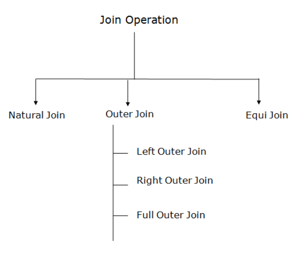

*Figure VII.1: Classification of Join Operations*

#### 7.2.1 Join Function

- Cross Joins: Cross joins return all combinations of rows from each table. So, if you’re looking to find all combinations of size and color, you would use a cross join. Join conditions are not used with cross joins.

- Inner joins: Inner joins return rows when the join condition is met. This is the most common Database join. A common scenario is to join the primary key of once table to the foreign key of another.

This is used to perform “lookup,” such are to get the employee’s name from their employeeID.

- Outer joins: Outer joins return all the rows from one table, and if the join condition is met, columns from the other. They differ from an inner join, since an inner join wouldn’t include the non-matching rows in the final result.

Consider an order entry system. There may be cases where we want to list all employees regardless of whether they placed a customer order. In this case an outer join comes in handy.

When using an outer join all employees, even those not matching orders, are included in the result.

### 7.3 Procedure (Implementation in MySQL)

1. Create a Data

- Create a table student:

```sql
CREATE TABLE student(
s_id int(11) NOT NULL AUTO_INCREMENT,
FirstName varchar(255) NOT NULL,
LastName varchar(255 ) NOT NULL,
Address varchar(255 ) NOT NULL,
dept_name enum( 'CSE', 'EEE' , ' TEX' ) DEFAULT NULL,
AdmissionDate datetime NOT NULL DEFAULT current_timestamp(),
PRIMARY KEY(S_ID)
);
```

- Insert values into student table:

```sql
INSERT INTO student (s_id, FirstName, LastName, Address, dept_name)
VALUES(142002015, 'Zeseya' , 'Sharmin' , 'Dhaka' , 'CSE'),
(142002001, 'Sakib' , 'Hasan' , 'Natore' , 'CSE'),
(162002002, 'Asef', 'Tajwar' , 'Rangpur' , 'EEE'),
(162002003, 'Maruf', 'Hasan', 'Barisal', 'EEE'),
(172082002, 'Ashek' , 'Farabi', 'Gazipur' ,'TEX'),
(173002003, 'Ismile' , 'Hasan' , 'Barisal' , 'TEX');
```

- Create a table department:

```sql
CREATE TABLE department(
dept_id int(11) NOT NULLAUTO_INCREMENT,
dept_name enum( 'CSE', 'EEE', 'TEX') DEFAULT NULL,
dept_location varchar(255 ) NOT NULL,
PRIMARY KEY(dept_id)
);
```

- Insert values into department table:

```sql
INSERT INTO department (dept_id, dept_name, dept_location)
VALUES(101, 'CSE', 'Building-2'),
(102, 'EEE', 'Building-2'),
(103, 'TEX', 'Building-1');
```

- Create another table course_registrstion:

```sql
CREATE TABLE course_registration(
reg_serial int(11) NOT NULL AUTO_INCREMENT,
course_code varchar(255) NOT NULL,
course_title varchar(255 ) NOT NULL,
dept_id int(11 ) NOT NULL,
s_id varchar(255 ) NOT NULL,
PRIMARY KEY(reg_serial)
);
```

- Insert values into course_registration table:

```sql
INSERT INTO course_registration(course_code,course_title,dept_id,s_id)
VALUES('CSE 311', 'Computer Networks',101,142002015),
('CSE 311', 'Computer Networks',101,142002001),
('EEE 301','Electrical Circuit',201,162002002),
('TEX 201', 'Aparales', 301,172002002),
('CSE 312', 'Computer Networks Lab',101,142002015),
('CSE 207', 'Algorithm',101,142002001);
```

- join_table:

```sql
SELECT s_id
FROM student
UNION
SELECT s_id
FROM course_registration;
```

- join_table:

```sql
SELECT s_id
FROM student
UNION ALL
SELECT s_id
FROM course_registration;
```

2. Join, Inner Join, Left Join, Right Join, Where, Group by:

- INNER JOIN example

```sql
SELECT student.s_id, student.FirstName, student.LastName
FROM student
INNER JOIN course_registration ON student.s_id = course_registration.s_id;
```

- INNER JOIN with WHERE clause

```sql
SELECT student.s_id, student.FirstName, student.LastName
FROM student
INNER JOIN course_registration ON student.s_id = course_registration.s_id
WHERE course_registration.s_id = 142002015;
```

- Multiple Inner Join

```sql
SELECT
student.s_id,
student.FirstName,
student.dept_name,
depart-
ment.dept_id, course_registration.course_code
FROM student
INNER JOIN department ON student.dept_name = department.dept_name
INNER
JOIN
course_registration
ON
department.dept_id
=
course_registration.dept_id;
```

- INNER JOIN using GROUP BY for eliminating duplicate records.

```sql
SELECT
student.s_id,
student.FirstName,
student.dept_name,
depart-
ment.dept_id, course_registration.course_code
FROM student
INNER JOIN department ON student.dept_name = department.dept_name
INNER
JOIN
course_registration
ON
department.dept_id
=
course_registration.dept_id
GROUP BY s_id;
```

### 7.4 Discussion & Conclusion

In the following experiment we dig into the various join types, explore Database joins involving more than one table, and further explain join conditions, especially what can be done with non-equijoin conditions.

### 7.5 Lab Task (Please implement yourself and show the output to the instructor)

- Task-1:

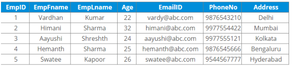

*Figure VII.2: Project Table Information*

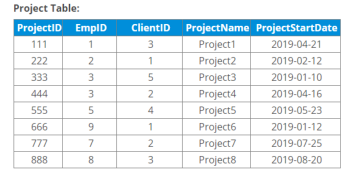

*Figure VII.3: Project Table Information*

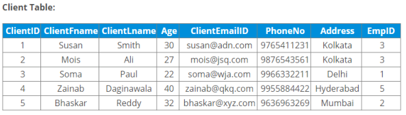

*Figure VII.4: Client Table Information*

1. Create these tables in a company database

2. Write a SQL query for all the JOIN operation

3. Location count

- Task 2:

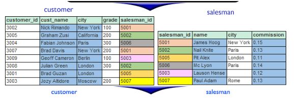

*Figure VII.5: Customer and Salesman table*

### 7.6 Lab Exercise (Submit as a report)

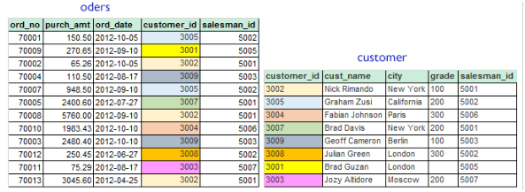

*Figure VII.6: Customer and Salesman table*

1. Write a SQL statement to find the details of a order i.e. order number, order date, amount of order, which customer gives the order and which salesman works for that customer and commission rate he gets for an order.

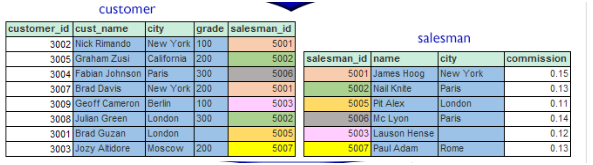

*Figure VII.7: Customer and Salesman table*

2. Write a SQL statement to make a list in ascending order for the customer who works either through a salesman or by own.

3. Attach with query codes and with output screenshots in the report.

Academic Integrity Policy

Copying from the internet, classmates, seniors, or any other unauthorized source is strictly prohibited. Full marks may be deducted if plagiarism, copied work, or academic dishonesty is detected.

Students must complete the lab task, implementation, output analysis, and lab report independently and submit authentic work for evaluation.


---

<a id="lab-viii"></a>

## Lab Manual VIII — Implementation of Databases Triggers

*Source PDF pages 61–67 (printed pages 55–61).*

### 8.1 Objective(s)

- To Explain the Structure of a Trigger

- To Create a Trigger

### 8.2 Problem analysis

#### 8.2.1 Introduction to Trigger

In this lab, we will discuss Trigger, which is one of the important topics in PL/SQL. Triggers are stored programs, which are automatically executed or fired when some events occur. Triggers are, in fact, written to be executed in response to any of the following events −

- A database manipulation (DML) statement (DELETE, INSERT, or UPDATE)

- A database definition (DDL) statement (CREATE, ALTER, or DROP).

- A database operation (SERVERERROR, LOGON, LOGOFF, STARTUP, or SHUTDOWN).

Triggers can be defined on the table, view, schema, or database with which the event is associated.

#### 8.2.2 Benefits of Trigger

- Generating some derived column values automatically

- Enforcing referential integrity

- Event logging and storing information on table access

- Auditing

- Synchronous replication of tables

- Imposing security authorizations

- Preventing invalid transactions

#### 8.2.3 Syntax of Trigger

```sql
CREATE [OR REPLACE ] TRIGGER trigger_name
BEFORE | AFTER | INSTEAD OF
INSERT [OR] | UPDATE [OR] | DELETE
```

[OF col_name] ON table_name REFERENCING OLD AS o NEW AS n

FOR EACH ROW

WHEN (condition) DECLARE Declaration-statements BEGIN Executable-statements EXCEPTION Exception-handling-statements END;

Explanation

- CREATE [OR REPLACE] TRIGGER trigger_name −Creates or replaces an existing trigger with the trigger_name.

- BEFORE | AFTER | INSTEAD OF −This specifies when the trigger will be executed. The INSTEAD OF clause is used for creating trigger on a view.

- INSERT [OR] | UPDATE [OR] | DELETE −This specifies the DML operation.

- OF col_name −This specifies the column name that will be updated.

- ON table_name −This specifies the name of the table associated with the trigger.

- REFERENCING OLD AS o NEW AS n −This allows you to refer new and old values for various DML statements, such as INSERT, UPDATE, and DELETE.

- FOR EACH ROW −This specifies a row-level trigger, i.e., the trigger will be executed for each row being affected. Otherwise the trigger will execute just once when the SQL statement is executed, which is called a table level trigger.

- WHEN (condition) −This provides a condition for rows for which the trigger would fire. This clause is valid only for row-level triggers.

### 8.3 Procedure

We have practiced with the XAMPP in the previous labs, we can assume that the system is ready to use. First, we have to launch the XAMPP. Then, we have to press the Start button of Apache and MySQL module. After that, we have to press the Admin button of the MySQL module. As a result, a tab will be opened on your default web browser like figure VIII.1. Or, we can open a tab in the web browser with the link as

http://localhost/phpmyadmin/. Then, we have to select the SQL option. An editor space will be opened like figure VIII.2 to write the required commands. Now, it is ready for implementation.


*Figure VIII.1: Session in Localhost*


*Figure VIII.2: Space for Editing Commands*

### 8.4 Implementations

#### 8.4.1 Database Creation

To create a database, we have to write command like ” CREATE DATABASE [Database_Name]”. Suppose, we have to create a database named ”lab9”. We have to write the command as below:

```sql
CREATE DATABASE lab9;
```

A database named ”lab9” is created in your local-host.

#### 8.4.2 Database Use

To use the ”lab9” database, we have to write the command in SQL editor space as below:

```sql
USE lab9
```

#### 8.4.3 Creating a Table

Now, to create a table named ”customers” in database lab9 with attributes like ID (int), NAME (varchar), AGE (int), ADDRESS (varchar), SALARY (double) where ID would be the Primary key, we have to write command in SQL editor space like below:

```sql
CREATE TABLE 'lab9'.'customers' ( 'ID' INT NOT NULL ,
'NAME' VARCHAR(30) NOT NULL ,
'AGE' INT NOT NULL ,
'ADDRESS' VARCHAR(50) NOT NULL ,
'SALARY' DOUBLE NOT NULL ,
PRIMARY KEY ('ID'))
```

Then, we have to insert data in customer table. Suppose, we have inserted data like figure VIII.3.


*Figure VIII.3: Data Items in customers Table*

#### 8.4.4 Creating Trigger

Suppose, we want to impose a constraints on customers table such that SALARY of a customer would not less than 1500.00. If it is input less 1500.00, it will be set 1500.00. The command is like VIII.4 in the Trigger option of the table. We can also implement this trigger in SQL editor and the instruction is like these:


*Figure VIII.4: Creating Trigger on Customer Table*

```sql
CREATE TRIGGER 'Salary_Constraints'
BEFORE INSERT ON 'customers'
FOR EACH ROW
BEGIN IF NEW.SALARY < 1500.00 THEN SET NEW.SALARY = 1500.00;
END IF;
END
```

#### 8.4.5 Checking Trigger

Now, we want to check the trigger whether it works or not. For this, we will try to insert an item with SALARY = 1200.00. The command is as below:

```sql
INSERT INTO 'customers' ('ID', 'NAME', 'AGE', 'ADDRESS', 'SALARY') VALUES ('1007',
'Parthib', '22', 'Barishal', '1200.0');
```

After this insertion, customers table is like figure VIII.5.

### 8.5 Discussion & Conclusion

Though,we have input SALARY =1200.0 for ID=1007, the SALARY for ID=1007 is stored 1500.00. The reason behind this phenomena is the trigger Salary_Constraints on customers table. Every time, SALARY value will be 1500, it is tried to input SALARY less than 1500.00.


*Figure VIII.5: Data Items in customers Table*

### 8.6 Lab Task (Please implement yourself and show the output to the instructor)

1. Create a Table named ’employee’ with attribute EmpID(int), EmpName(varchar), BasicSalary(double), StartDate(date), NoofPub(int).

2. Insert around 10 items.

3. Create a trigger to update the BasicSalary.

#### 8.6.1 Problem analysis

1. You have to create a table according instruction given.

2. You have to insert around ten tuples in the table.

3. You have to create a trigger to update the BasicSalary. by 20% if job duration is more than one year and NoofPub is more than four, 10% if job duration is more than one year and NoofPub is two or three , 5% if job duration is more than one year and Noof- Pub is one and 0% for no publication.

### 8.7 Lab Exercise (Submit as a report)

- Create a Database with two tables named StudentInfo (StudentID, StudentName, Address, Email), WaiverInfo (StudentID, StudentName, CGPA, WaiverPercentage).

- Insert Data in each table.

- Create a trigger to Update the WaiverPercentage according to the CGPA.[N.B. Follow the waiver policy of GUB]

### 8.8 Reference

- https://www.javatpoint.com/mysql-create-trigger

- https://www.tutorialspoint.com/plsql/plsql_triggers.htm

Academic Integrity Policy

Copying from the internet, classmates, seniors, or any other unauthorized source is strictly prohibited. Full marks may be deducted if plagiarism, copied work, or academic dishonesty is detected.

Students must complete the lab task, implementation, output analysis, and lab report independently and submit authentic work for evaluation.


---

<a id="lab-ix"></a>

## Lab Manual IX — Implementation of Database Transactions and Multiuser Usage

*Source PDF pages 68–72 (printed pages 62–66).*

### 9.1 Objective(s)

- To Implement Commit.

- To Implement Rollback.

- To Lock and Unlock a Table.

### 9.2 Problem Analysis

So far in this lab, we have assumed that you are the only user of the database. If you do the examples and exercises at home, that assumption is probably correct. But if you work with MySQL in a company setting, the odds are good that you share the database with many other users. We call this multi-user usage, as opposed to single-user usage. In a multi-user environment, you should not need to be aware that other users are accessing the database concurrently, because MySQL hides this from you as much as possible. The following question might arise: What happens if I access a row that is already in use by someone else? This section answers that question. We start with a concept that forms the basis of multi-user usage: the transaction (also called unit of work). We also discuss the concepts savepoint, lock, deadlock, and isolation level, and we consider the LOCK TABLE statement. Not all storage engines support transactions; for example, InnoDB and BDB do, but MyISAM and MEMORY do not. Therefore, this lab assumes that you created the tables with one of the storage engines that does support transactions.

### 9.3 Procedure

First, we open our database system and prepare it to execute our given instructions. Then, we create a database and a table. After that we implement commit, rollback, and locking/unlocking of a table.

### 9.4 Implementations

#### 9.4.1 Database Creation

To create a database, write the command CREATE DATABASE [Database_Name]. For example, to create a database named lab9:

```sql
CREATE DATABASE lab9;
```

A database named lab9 is created in your local host.

#### 9.4.2 Database Use

To use the lab9 database, write the following command in the SQL editor:

```sql
USE lab9;
```

#### 9.4.3 Creating a Table

To create a table named penalties in database lab9, with attributes paymentno (int), playerno (int), paymentdate (date), and amount (double), where paymentno is the Primary Key:

```sql
CREATE TABLE `lab9`.`penalties` (
```

`PAYMENTNO` INT NOT NULL, `PLAYERNO` INT NOT NULL, `PAYMENTDATE` DATE NOT NULL, `AMOUNT` DOUBLE NOT NULL, PRIMARY KEY (`PAYMENTNO`) );

Then, insert data into the penalties table. A sample populated table is shown in Figure IX.1.

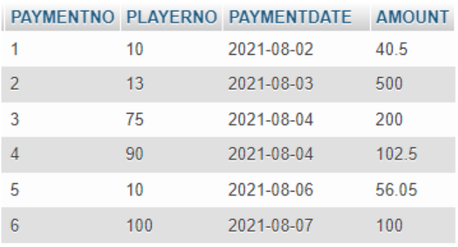

*Figure IX.1: Data items in the penalties table*

#### 9.4.4 Turning Off Auto-Commit

When a session is started in MySQL, the AUTOCOMMIT system variable is normally turned on. The following statement turns it off:

```sql
SET @@AUTOCOMMIT = 0;
```

When auto-commit must be turned on again, issue:

```sql
SET @@AUTOCOMMIT = 1;
```

After auto-commit has been turned off, a transaction can consist of multiple SQL statements, and you must explicitly indicate the end of each transaction.

#### 9.4.5 Deleting from the penalties Table

To delete rows where PLAYERNO = 10:

```sql
DELETE FROM `penalties` WHERE PLAYERNO = 10;
```

The effect becomes apparent when you issue the following SELECT statement:

```sql
SELECT * FROM `penalties`;
```

The result is shown in Figure IX.2. Two rows have been deleted from the table. However, the change is not yet permanent because auto-commit has been turned off. The user or application now has a choice: the change can be undone with ROLLBACK, or made permanent with COMMIT.

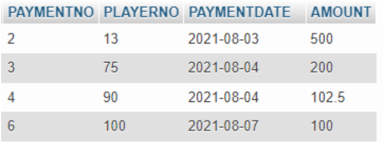

*Figure IX.2: Data items in the penalties table after deletion*

#### 9.4.6 Rollback

To undo the previous change and restore the deleted rows:

```sql
ROLLBACK WORK;
```

Repeating the SELECT statement will now return the entire PENALTIES table with all rows restored. N.B.: You must use InnoDB as the storage engine for transactions to work correctly.

#### 9.4.7 Commit

To make a change permanent, use:

```sql
COMMIT WORK;
```

This statement permanently applies all changes since the last commit. The keyword WORK is optional and does not affect processing.

#### 9.4.8 Locking

A number of mechanisms exist to keep concurrency high while still preventing conflicts. This section discusses the locking mechanism in MySQL. The syntax is:

```sql
LOCK TABLE table_name <lock_type>;
```

For example, to lock the penalties table in READ mode:

```sql
LOCK TABLE penalties READ;
```

Besides READ, MySQL supports READ LOCAL, WRITE, and LOW_PRIORITY WRITE.

#### 9.4.9 Unlock

The syntax for unlocking a table or tables is:

```sql
UNLOCK TABLES;
```

### 9.5 Discussion & Conclusion

You may find it difficult to set InnoDB as your storage engine. To solve this, select the table in phpMyAdmin, go to the Operations tab, find the Storage Engine option, and select InnoDB. You can also use any other storage engine that supports transactions.

### 9.6 Lab Task (Please implement yourself and show the output to the instructor)

Perform the following operations sequentially on a table of your choice:

1. INSERT a new record.

2. DELETE an existing record.

3. ROLLBACK WORK — verify the deleted record is restored.

4. UPDATE a record.

5. ROLLBACK WORK — verify the update is undone.

6. INSERT another record.

7. DELETE a record.

8. COMMIT WORK — verify the changes are now permanent.

9. UPDATE a record after committing.

#### 9.6.1 Problem Analysis

Students are instructed to perform the above operations sequentially on a specific table, observing how ROLLBACK and COMMIT affect the state of data at each step.

### 9.7 Lab Exercise (Case Study)

- Find out which other storage engines support transactions and multi-user systems.

- Implement a transaction using one of them and compare its behaviour with InnoDB.

### 9.8 References

- https://dev.mysql.com/doc/refman/8.0/en/lock-tables.html

- https://ebookreading.net/view/book/EB9780131497351_49.html

Academic Integrity Policy

Copying from the internet, classmates, seniors, or any other unauthorized source is strictly prohibited. Full marks may be deducted if plagiarism, copied work, or academic dishonesty is detected.

Students must complete the lab task, implementation, output analysis, and lab report independently and submit authentic work for evaluation.


---

<a id="lab-x"></a>

## Lab Manual X — Implementation of Functions and Stored Procedures in MySQL

*Source PDF pages 73–80 (printed pages 67–74).*

### 10.1 Objective(s)

- To understand the concept of Stored Procedures in MySQL.

- To understand the concept of Functions in MySQL.

- To implement a Stored Procedure using IN and OUT parameters.

- To implement a Function that returns a computed value.

- To distinguish between Functions and Stored Procedures.

### 10.2 Problem Analysis

In database systems, we often need to perform the same set of SQL operations repeatedly. Writing the same queries again and again in application code is inefficient and error-prone. MySQL provides two powerful tools to store and reuse SQL logic inside the database itself: Stored Procedures and Functions. A Stored Procedure is a named collection of SQL statements that is saved in the database and can be called (executed) whenever needed. It can accept input values, perform complex operations such as INSERT, UPDATE, or DELETE, and return output values through OUT parameters. A Function is similar to a procedure, but it must always return exactly one value and is designed to be used directly inside SQL queries, much like built-in MySQL functions such as NOW() or COUNT(). Both procedures and functions help reduce code duplication, improve maintainability, and move business logic closer to the data. In this lab, we will create a simple Employees table, then write and execute both a stored procedure and a function on it.

### 10.3 Procedure

First, we open the database system (via phpMyAdmin or the MySQL command line) and prepare it to accept our instructions. Then we create a database and a table, insert sample data, and implement a stored procedure and a function. Finally, we call each one and observe the output.

### 10.4 Implementations

#### 10.4.1 Database and Table Setup

**Database Creation**

To create a database named lab_fp, write:

```sql
CREATE DATABASE lab_fp;
```

**Database Use**

To select and use the newly created database:

```sql
USE lab_fp;
```

Table Creation

```sql
Create a table named Employees with four attributes: EmployeeID (int, primary key),
Name (varchar), Department (varchar), and Salary (decimal):
CREATE TABLE Employees (
EmployeeID INT
NOT NULL,
Name
VARCHAR(100)
NOT NULL,
Department VARCHAR(50)
NOT NULL,
Salary
DECIMAL(10,2) NOT NULL,
PRIMARY KEY (EmployeeID)
);
```

**Data Insertion**

```sql
Insert three sample employee records into the Employees table:
INSERT INTO Employees (EmployeeID, Name, Department, Salary)
VALUES (101, 'Ava',
'Finance', 6000.00),
(102, 'Rahul', 'IT',
6500.00),
(103, 'Mei',
'HR',
5500.00);
```

After insertion, the Employees table contains the following records:

| EmployeeID | Name | Department | Salary |
| --- | --- | --- | --- |
| 101 | Ava | Finance | 6000.00 |
| 102 | Rahul | IT | 6500.00 |
| 103 | Mei | HR | 5500.00 |

#### 10.4.2 Implementing a Stored Procedure

A stored procedure is created using the CREATE PROCEDURE statement. The general syntax is:

```sql
CREATE PROCEDURE procedure_name (parameter_list)
BEGIN
-- SQL statements
END;
```

Parameters can be of three kinds:

- IN — the caller passes a value into the procedure (read-only inside).

- OUT — the procedure sends a value back to the caller.

- INOUT — the parameter is both passed in and returned.

**Example: Get Employee Name by ID**

The following procedure accepts an employee ID as input and returns the corresponding employee name as output:

```sql
DELIMITER //
CREATE PROCEDURE GetEmployeeName (
IN p_emp_id INT,
OUT p_name
VARCHAR(100)
)
BEGIN
SELECT Name INTO p_name
FROM
Employees
WHERE EmployeeID = p_emp_id;
END //
DELIMITER ;
```

N.B.: The DELIMITER command is used to temporarily change the statement terminator from ; to //, so that MySQL does not treat the semicolons inside the procedure body as the end of the CREATE statement. After the procedure is defined, the delimiter is reset to;.

**Calling the Procedure**

To execute the procedure and retrieve the name of employee number 102:

```sql
CALL GetEmployeeName(102, @emp_name);
SELECT @emp_name;
```

The variable @emp_name stores the OUT result. The output will be:

@emp_name Rahul

#### 10.4.3 Implementing a Function

A function is created using the CREATE FUNCTION statement. Unlike a procedure, a function must always return a single value using the RETURN statement. The general syntax is:

```sql
CREATE FUNCTION function_name (parameter_list)
RETURNS data_type
DETERMINISTIC
BEGIN
-- SQL statements
RETURN value;
END;
```

The keyword DETERMINISTIC tells MySQL that the function always produces the same output for the same input, which helps the optimizer. Functions only allow IN parameters.

**Example 1: Calculate Annual Salary**

The following function takes an employee ID and returns that employee’s annual salary (monthly salary multiplied by 12):

```sql
DELIMITER //
CREATE FUNCTION GetAnnualSalary (emp_id INT)
RETURNS DECIMAL(12,2)
DETERMINISTIC
BEGIN
DECLARE annual DECIMAL(12,2);
SELECT Salary * 12 INTO annual
FROM
Employees
WHERE EmployeeID = emp_id;
RETURN annual;
END //
DELIMITER ;
```

**Calling the Function**

Functions are called directly inside a SQL query, just like built-in MySQL functions:

```sql
SELECT GetAnnualSalary(101) AS AnnualSalary;
```

The output will be:

**AnnualSalary**

72000.00

**Example 2: Calculate Tax on Salary**

The following function accepts a salary value directly and returns 10% of it as tax:

```sql
DELIMITER //
CREATE FUNCTION CalculateTax (salary DECIMAL(10,2))
RETURNS DECIMAL(10,2)
DETERMINISTIC
BEGIN
RETURN salary * 0.10; -- 10% tax rate
END //
DELIMITER ;
```

This function can be used directly in a SELECT query to compute tax for every employee:

```sql
SELECT Name, Salary, CalculateTax(Salary) AS Tax
FROM
Employees;
```

The output will be:

| Name | Salary | Tax |
| --- | --- | --- |
| Ava | 6000.00 | 600.00 |
| Rahul | 6500.00 | 650.00 |
| Mei | 5500.00 | 550.00 |

### 10.5 Input/Output Summary

All implementations in this lab follow the same pattern: SQL statements are written in the phpMyAdmin SQL editor or the MySQL command line, and the results are displayed immediately below. The key commands used are summarised below.

| Command | Purpose |
| --- | --- |
| CREATE PROCEDURE | Define a new stored procedure |
| CALL | Execute a stored procedure |
| CREATE FUNCTION | Define a new function |
| SELECT func(...) | Call a function inside a query |
| DROP PROCEDURE | Remove a stored procedure |
| DROP FUNCTION | Remove a function |

### 10.6 Discussion & Conclusion

In this lab, we created a Stored Procedure and two Functions in MySQL and executed them on an Employees table. A stored procedure is most suitable for performing complex operations that involve multiple SQL statements, transaction control, or returning more than one value. A function is best used when a single computed value needs to be embedded directly inside a SELECT or WHERE clause. The key differences between the two are summarised in Table X.1.

**Table X.1: Comparison of Functions and Stored Procedures**

| Feature | Function | Stored Procedure |
| --- | --- | --- |
| Return value | Must return exactly one value | Can return 0, 1, or many values via OUT parameters |
| Parameters | IN only | IN, OUT, INOUT |
| Use in queries | Can be used in SELECT, WHERE, etc. | Cannot be used directly in SQL statements |
| DML operations | Generally not allowed | Fully supported |
| Transaction control | Not allowed | Allowed |
| Primary use | Calculations and reusable expressions | Business logic and batch processing |

Through this lab we have successfully achieved all stated objectives: creating and calling a stored procedure with IN/OUT parameters, and creating and using functions both for individual lookups and for column-level computation across a result set.

### 10.7 Lab Task (Please implement yourself and show the output to the instructor)

1. Create a database named lab_task.

2. Create a table named Students with attributes: StudentID (int, primary key), Name (varchar), Marks (decimal), Grade (varchar).

3. Insert at least five records into the Students table.

4. Write a stored procedure named GetStudentGrade that accepts a StudentID as IN and returns the corresponding Grade as OUT.

5. Call the procedure for at least two different student IDs and display the results.

6. Write a function named GetPassFail that accepts a Marks value and returns the string 'Pass' if marks ≥50, otherwise returns 'Fail'.

7. Use the function in a SELECT query to display Name, Marks, and Pass/Fail status for all students.

#### 10.7.1 Problem Analysis

1. Create the lab_task database using CREATE DATABASE.

2. Create the Students table with appropriate data types and a primary key.

3. Use INSERT INTO to add at least five student records.

4. Write GetStudentGrade as a procedure with one IN and one OUT parameter. Use SELECT ... INTO to fetch the grade.

5. Call the procedure using CALL GetStudentGrade(id, @result); and then SELECT @result;.

6. Write GetPassFail as a function using an IF statement inside the function body to decide the return value.

7. Apply the function in a SELECT query: SELECT Name, Marks, GetPassFail(Marks) AS Status FROM Students;.

### 10.8 Lab Exercise (Submit as a Report)

- Create a database with a table named Products containing at least the columns ProductID, ProductName, Price, and Stock.

- Insert at least eight product records.

- Write a stored procedure GetProductPrice that takes a ProductID and returns its Price.

- Write a function ApplyDiscount that takes a price and a discount percentage, and returns the discounted price.

- Use ApplyDiscount in a SELECT query to show the original and discounted price for all products.

- Take screenshots of each step and include them in your report.

### 10.9 References

- https://dev.mysql.com/doc/refman/8.0/en/stored-programs-defining.html

- https://dev.mysql.com/doc/refman/8.0/en/create-procedure.html

- https://dev.mysql.com/doc/refman/8.0/en/create-function.html

Academic Integrity Policy

Copying from the internet, classmates, seniors, or any other unauthorized source is strictly prohibited. Full marks may be deducted if plagiarism, copied work, or academic dishonesty is detected.

Students must complete the lab task, implementation, output analysis, and lab report independently and submit authentic work for evaluation.
