# Lab 03 — Modifying MySQL Databases and Updating Data in MySQL Table

*CSE 210 Database System Lab · Source: `CSE_210_Database_System_Lab.md` (PDF pages 26–36, printed pages 20–30)*

---

## 1. Objective(s)

- To gain the advance knowledge for modifying and updating MySQL databases.
- To implement different types of modifying statements using ADD, DROP, CHANGE and UPDATE.

---

## 2. Complete Example — copy, paste, run

Covers: `ALTER TABLE` with ADD / DROP / CHANGE / MODIFY / constraints / keys, `INSERT`, `SELECT`, table copy, and `UPDATE`.

```sql
-- ============================================================
-- Lab 03 : Complete demo (ALTER TABLE ... + UPDATE)
-- ============================================================
DROP DATABASE IF EXISTS cse210_lab03;
CREATE DATABASE cse210_lab03;
USE cse210_lab03;

-- Parent table first (so the FOREIGN KEY later has something to reference)
CREATE TABLE departments (
    dept_id   INT PRIMARY KEY,
    dept_name VARCHAR(100)
);

-- Employee table (PRIMARY KEY is added later with ALTER, step "ADD PRIMARY KEY")
CREATE TABLE employees (
    id         INT NOT NULL AUTO_INCREMENT,
    First_name VARCHAR(200) NOT NULL,
    Last_name  VARCHAR(200),
    salary     INT,
    KEY (id)                      -- index so AUTO_INCREMENT works
);

-- 1) ADD one column
ALTER TABLE employees ADD email VARCHAR(100);

-- 2) ADD two columns in a single command
ALTER TABLE employees
    ADD COLUMN Bank_account INT,
    ADD COLUMN Entry_Date DATE;

-- 3) ADD a column at a specific position
ALTER TABLE employees ADD COLUMN Gender CHAR(1) FIRST;

-- 4) CHANGE = rename (and re-declare the data type / constraints)
ALTER TABLE employees CHANGE First_name F_name VARCHAR(100) NOT NULL;

-- 5) MODIFY = change the data type only (name stays the same)
ALTER TABLE employees MODIFY salary BIGINT;

-- 6) ADD a UNIQUE constraint on a column
ALTER TABLE employees ADD CONSTRAINT unique_salary UNIQUE (salary);

-- 7) DROP a column / DROP several columns
ALTER TABLE employees DROP COLUMN email;
ALTER TABLE employees
    DROP COLUMN Gender,
    DROP COLUMN Bank_account;

-- 8) DROP a constraint
ALTER TABLE employees DROP INDEX unique_salary;

-- 9) FOREIGN KEY using ALTER
ALTER TABLE employees ADD COLUMN dept_id INT;
ALTER TABLE employees
    ADD CONSTRAINT fk_dept
    FOREIGN KEY (dept_id) REFERENCES departments(dept_id);

-- 10) PRIMARY KEY using ALTER
ALTER TABLE employees ADD PRIMARY KEY (id);

-- 11) Show every constraint of the table
--     DATABASE() restricts the search to the database you are using now,
--     otherwise tables with the same name in other databases appear too.
SELECT CONSTRAINT_NAME, CONSTRAINT_TYPE
FROM information_schema.TABLE_CONSTRAINTS
WHERE TABLE_SCHEMA = DATABASE() AND TABLE_NAME = 'employees';

SHOW CREATE TABLE employees;

-- 12) Insert data (parent table first!)
INSERT INTO departments (dept_id, dept_name) VALUES
(1, 'Human Resources'),
(2, 'Finance'),
(3, 'Engineering'),
(4, 'Marketing'),
(5, 'Sales');

INSERT INTO employees (id, F_name, Last_name, salary, Entry_Date, dept_id) VALUES
(1, 'John',    'Smith',   55000, '2022-01-15', 1),
(2, 'Jane',    'Doe',     72000, '2021-06-20', 2),
(3, 'Alice',   'Johnson', 90000, '2020-03-10', 3),
(4, 'Bob',     'Williams',48000, '2023-07-01', 4),
(5, 'Charlie', 'Brown',   61000, '2019-11-25', 5),
(6, 'Diana',   'Prince',  85000, '2022-09-14', 3),
(7, 'Ethan',   'Hunt',    53000, '2023-02-28', 2);

SELECT * FROM employees;

-- 13) Copy the whole table (structure + data)
CREATE TABLE IF NOT EXISTS employees_info_Backup
SELECT * FROM employees;

SELECT * FROM employees_info_Backup;

-- 14) UPDATE one column for one row
UPDATE employees
SET salary = 300000
WHERE id = 1;

-- 15) UPDATE several columns for one row
UPDATE employees
SET F_name = 'Barry', Last_name = 'Allen'
WHERE id = 2;

SELECT * FROM employees;
```

**Expected output (final SELECT \* FROM employees)**

| id | F_name | Last_name | salary | Entry_Date | dept_id |
| --- | --- | --- | --- | --- | --- |
| 1 | John | Smith | 300000 | 2022-01-15 | 1 |
| 2 | Barry | Allen | 72000 | 2021-06-20 | 2 |
| 3 | Alice | Johnson | 90000 | 2020-03-10 | 3 |
| 4 | Bob | Williams | 48000 | 2023-07-01 | 4 |
| 5 | Charlie | Brown | 61000 | 2019-11-25 | 5 |
| 6 | Diana | Prince | 85000 | 2022-09-14 | 3 |
| 7 | Ethan | Hunt | 53000 | 2023-02-28 | 2 |

---

## 3. Quick Reference — Concepts taught in this lab

### 3.1 Concepts and one-line SQL

| # | Concept | Copy-paste SQL |
| --- | --- | --- |
| 1 | ADD a column | `ALTER TABLE employees ADD email VARCHAR(100);` |
| 2 | ADD a column at a position | `ALTER TABLE employees ADD email VARCHAR(100) AFTER Last_name;` |
| 3 | ADD a column as the first column | `ALTER TABLE employees ADD COLUMN Gender CHAR(1) FIRST;` |
| 4 | ADD several columns at once | `ALTER TABLE employees ADD COLUMN Bank_account INT, ADD COLUMN Entry_Date DATE;` |
| 5 | DROP a column | `ALTER TABLE employees DROP email;` |
| 6 | DROP several columns | `ALTER TABLE employees DROP COLUMN Gender, DROP COLUMN Email;` |
| 7 | CHANGE (rename a column) | `ALTER TABLE employees CHANGE First_name F_name VARCHAR(100) NOT NULL;` |
| 8 | CHANGE a column's constraints | `ALTER TABLE employees CHANGE salary salary VARCHAR(50) NOT NULL;` |
| 9 | MODIFY (change data type only) | `ALTER TABLE employees MODIFY salary BIGINT;` |
| 10 | ADD a UNIQUE constraint | `ALTER TABLE employees ADD CONSTRAINT unique_salary UNIQUE (salary);` |
| 11 | DROP a constraint | `ALTER TABLE employees DROP INDEX unique_salary;` |
| 12 | ADD a FOREIGN KEY | `ALTER TABLE employees ADD CONSTRAINT fk_dept FOREIGN KEY (dept_id) REFERENCES departments(dept_id);` |
| 13 | ADD a PRIMARY KEY | `ALTER TABLE employees ADD PRIMARY KEY (id);` |
| 14 | List all constraints | `SHOW CREATE TABLE employees;` |
| 15 | INSERT rows | `INSERT INTO departments (dept_id, dept_name) VALUES (1,'Human Resources'),(2,'Finance');` |
| 16 | Browse a table | `SELECT * FROM employees;` |
| 17 | Copy a table | `CREATE TABLE IF NOT EXISTS employees_info_Backup SELECT * FROM employees;` |
| 18 | UPDATE one value | `UPDATE employees SET salary=300000 WHERE id=1;` |
| 19 | UPDATE several values | `UPDATE employees SET F_name='Barry', Last_name='Allen' WHERE id=2;` |

### 3.2 General syntax (ALTER TABLE)

```sql
-- add a column
ALTER TABLE table_name ADD column_name datatype;

-- delete a column
ALTER TABLE table_name DROP COLUMN column_name;

-- change the data type of a column
ALTER TABLE table_name MODIFY column_name datatype;

-- rename / re-declare a column
ALTER TABLE table_name CHANGE old_name new_name datatype [constraint];

-- UPDATE existing records
UPDATE table_name
SET column1 = value1, column2 = value2, ...
WHERE condition;
```

> **Warning:** an `UPDATE` statement without a `WHERE` clause changes **every** row in the table. Always write the `WHERE` condition first while teaching.

### 3.3 Show all constraints of a table

```sql
SELECT CONSTRAINT_NAME, CONSTRAINT_TYPE
FROM information_schema.TABLE_CONSTRAINTS
WHERE TABLE_SCHEMA = DATABASE() AND TABLE_NAME = 'employees';
```

or:

```sql
SHOW CREATE TABLE employees;
```

---

## 4. Problem Analysis

The modify command is used when we have to modify a column in the existing table, like add a new one, modify the datatype for a column, and drop an existing column. By using this command we have to apply some changes to the result set field. The UPDATE statement updates data in a table. It allows you to change the values in one or more columns of a single row or multiple rows.

### 4.1 Table modification using alter table

The ALTER TABLE statement is used to add, delete, or modify columns in an existing table. It is also used to add and drop various constraints on an existing table.

- To add a column in a table, use the following syntax:

```sql
ALTER TABLE table_name ADD column_name datatype;
```

- To delete a column in a table, use the following syntax:

```sql
ALTER TABLE table_name DROP COLUMN column_name;
```

- To change the data type of a column in a table, use the following syntax:

```sql
ALTER TABLE table_name MODIFY column_name datatype;
```

- The UPDATE statement is used to modify the existing records in a table.

```sql
UPDATE table_name
SET column1 = value1, column2 = value2, ...
WHERE condition;
```

---

## 5. Procedure (Implementation in MySQL)

1. Create a table and automatic increment values:

```sql
-- PRIMARY KEY is intentionally left out here: it is added with ALTER in step 14.
-- The KEY (id) index is what lets AUTO_INCREMENT work.
CREATE TABLE employees (
    id         INT NOT NULL AUTO_INCREMENT,
    First_name VARCHAR(200) NOT NULL,
    Last_name  VARCHAR(200),
    salary     INT,
    Gender     ENUM('M','F'),
    KEY (id)
);
```

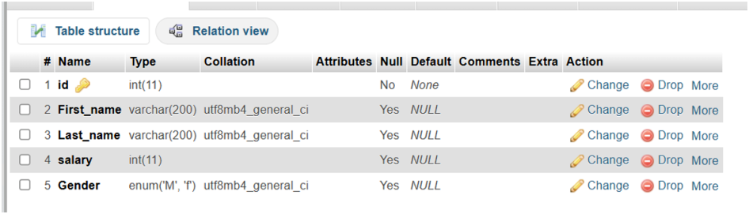

*Figure III.1: employee table structure*

2. MySQL Add Column Examples:

```sql
ALTER TABLE employees
ADD email VARCHAR(100);
```

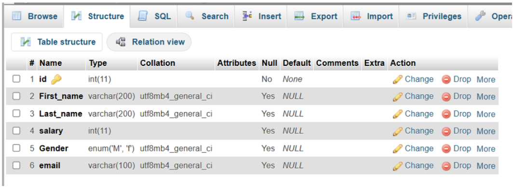

*Figure III.2: After adding email*

3. DROP an attribute/column from table employees:

```sql
ALTER TABLE employees
DROP email;
```

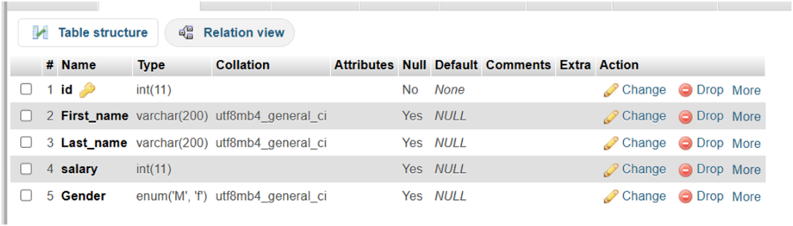

*Figure III.3: After deleting email attribute*

4. Add an attribute/column to table employees in any position of column:

```sql
ALTER TABLE employees
ADD email VARCHAR(100) AFTER Last_name;
```

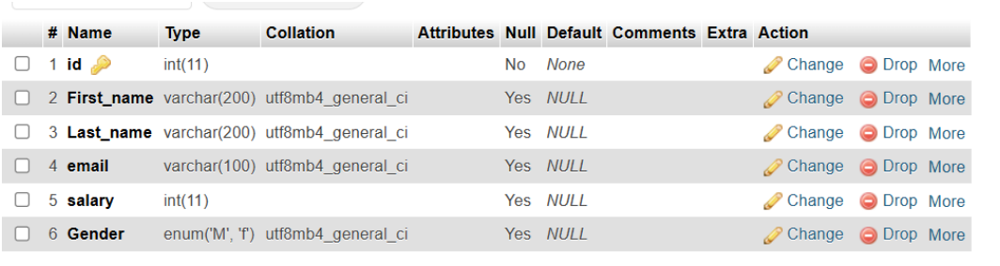

*Figure III.4: Adding email attribute after last name*

5. Add an attribute/column to table employees in the first column:

```sql
-- The Gender column already exists (step 1), so remove it first,
-- otherwise MySQL reports "Duplicate column name 'Gender'".
ALTER TABLE employees DROP COLUMN Gender;

ALTER TABLE employees
ADD COLUMN Gender CHAR(1) FIRST;
```

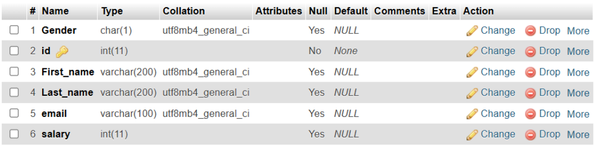

*Figure III.5: Added Gender attribute in the first column*

6. Add multiple attributes/columns to table employees in a single command:

```sql
ALTER TABLE employees
ADD COLUMN Bank_account INT,
ADD COLUMN Entry_Date DATE;
```

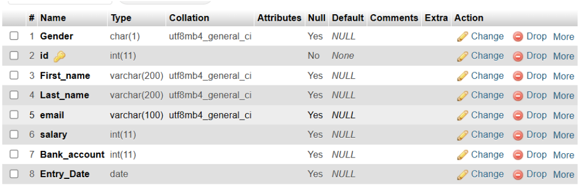

*Figure III.6: Added multiple column to the employees table*

7. DROP multiple attributes/columns from table employees:

```sql
ALTER TABLE employees
DROP COLUMN Gender,
DROP COLUMN Email;
```

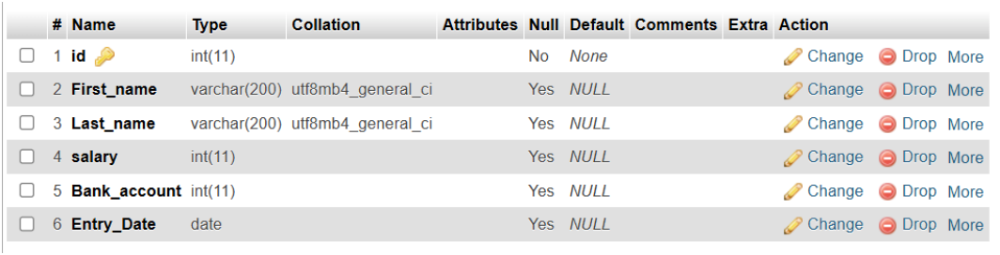

*Figure III.7: Deleted email and Gender attributes from employees table*

8. Changing columns constraints using MySQL ALTER TABLE statement:

```sql
ALTER TABLE employees
CHANGE salary salary VARCHAR(50) NOT NULL;
```

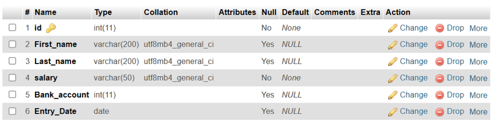

*Figure III.8: changed the constraint of salary column*

9. Changing column name using MySQL ALTER TABLE statement:

**- Syntax:**

```sql
ALTER TABLE table_name
CHANGE old_column_name new_column_name datatype [constraint];
```

```sql
ALTER TABLE employees
CHANGE First_name F_name VARCHAR(100) NOT NULL;
```

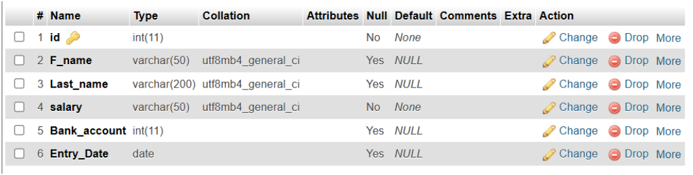

*Figure III.9: changed First_name to f_name*

10. Adding constraints in a column using ALTER:

```sql
ALTER TABLE employees
ADD CONSTRAINT unique_salary UNIQUE (salary);
```

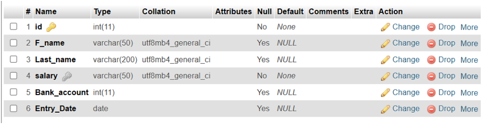

*Figure III.10: Added unique constraint in salary column*

11. Dropping a constraint from a column:

```sql
ALTER TABLE employees
DROP INDEX unique_salary;
```

12. Modify data type using ALTER:

```sql
ALTER TABLE employees
MODIFY salary BIGINT;
```


*Figure III.11: Dropped the constraint*

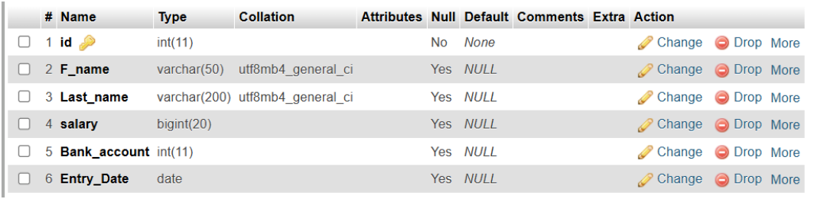

*Figure III.12: Modified the data-type of salary attribute*

13. Foreign key using ALTER:

Create a departments table:

```sql
CREATE TABLE departments (
    dept_id   INT PRIMARY KEY,
    dept_name VARCHAR(100)
);
```

```sql
ALTER TABLE employees
ADD dept_id INT;

ALTER TABLE employees
ADD CONSTRAINT fk_dept
FOREIGN KEY (dept_id) REFERENCES departments(dept_id);
```

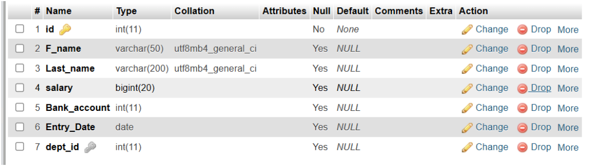

*Figure III.13: employees table*

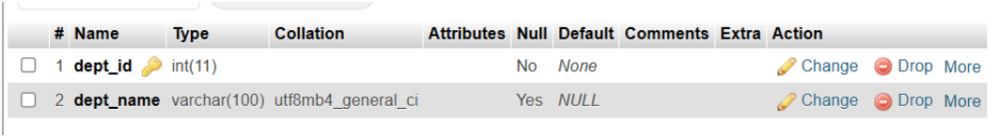

*Figure III.14: departments table*

14. Add Primary key using ALTER:

```sql
ALTER TABLE employees
ADD PRIMARY KEY (id);
```

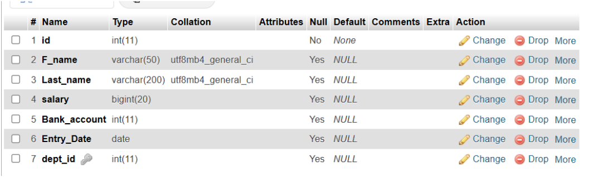

*Figure III.15: Before adding Primary key*


*Figure III.16: After adding Primary Key*

15. Command for showing all constraints of a table:

```sql
SELECT CONSTRAINT_NAME, CONSTRAINT_TYPE
FROM information_schema.TABLE_CONSTRAINTS
WHERE TABLE_SCHEMA = DATABASE() AND TABLE_NAME = 'employees';
```

or:

```sql
SHOW CREATE TABLE employees;
```

16. Inserting data into tables using MySQL INSERT statement (tables shown in Fig III.13 and Fig III.14):

First insert into the departments table of fig III.14:

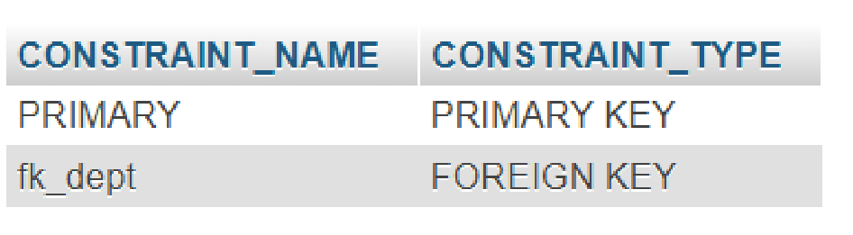

*Figure III.17: All Constraints of employees table*

```sql
INSERT INTO departments (dept_id, dept_name) VALUES
(1, 'Human Resources'),
(2, 'Finance'),
(3, 'Engineering'),
(4, 'Marketing'),
(5, 'Sales');
```

Now insert into the employees table of fig III.13:

```sql
INSERT INTO employees (id, F_name, Last_name, salary, Bank_account,
                       Entry_Date, dept_id) VALUES
(1, 'John',    'Smith',   55000, 123456789, '2022-01-15', 1),
(2, 'Jane',    'Doe',     72000, 987654321, '2021-06-20', 2),
(3, 'Alice',   'Johnson', 90000, 112233445, '2020-03-10', 3),
(4, 'Bob',     'Williams',48000, 556677889, '2023-07-01', 4),
(5, 'Charlie', 'Brown',   61000, 334455667, '2019-11-25', 5),
(6, 'Diana',   'Prince',  85000, 778899001, '2022-09-14', 3),
(7, 'Ethan',   'Hunt',    53000, 223344556, '2023-02-28', 2);
```

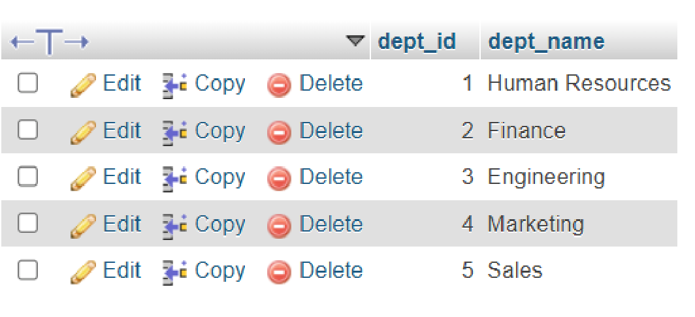

*Figure III.18: departments table*


*Figure III.19: employees table*

17. Find all records from employees:

```sql
SELECT * FROM employees;
```


*Figure III.20: employees table*

18. MySQL copy table examples:

```sql
CREATE TABLE IF NOT EXISTS employees_info_Backup
SELECT * FROM employees;
```

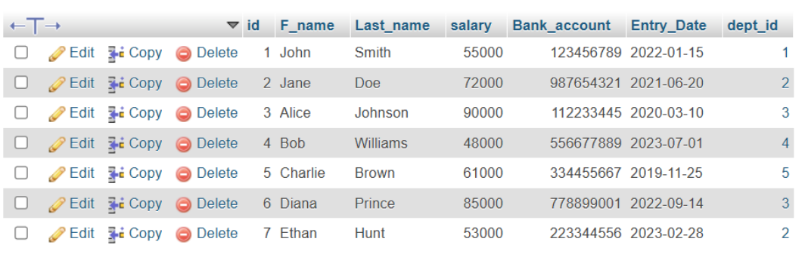

*Figure III.21: employees_backup_info table*

19. Updating data using MySQL UPDATE statement:

- UPDATE a column single value:

```sql
UPDATE employees
SET salary = 300000
WHERE id = 1;
```

- UPDATE multiple columns single row:

```sql
UPDATE employees
SET F_name = 'Barry', Last_Name = 'Allen'
WHERE id = 2;
```

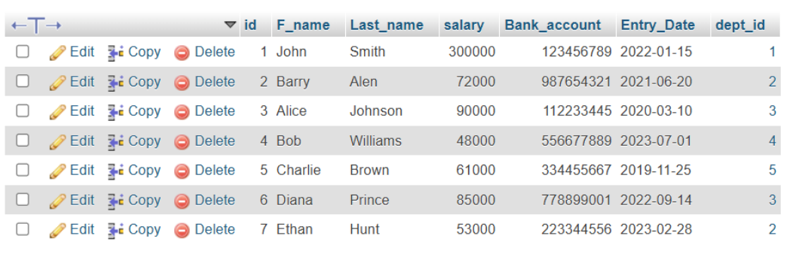

*Figure III.22: updated employees table*

---

## 6. Discussion & Conclusion

Based on the focused objective(s) to understand about the knowledge of ALTER, ADD, DROP, CHANGE and UPDATE commands a real life object. And the lab exercise made students more confident towards the fulfilment of the objectives(s).

---

## 7. Lab Task (Please implement yourself and show the output to the instructor)

1. employee (e_name, street, city) company (company_name, branch, city) works (w_name, e_name, company_name, salary)

Consider the employee database, give an expression in SQL for each of the following queries.

a. Create this database and Insert information into employee, company and works (at least 2).

b. Add emp_id and entry_date columns in employee relation.

c. Modify column name city(employee)=address.

d. Add column email in table employee. Update email and address columns information.

e. Create a backup relation for works and employee table.

f. Add key constraint (FOREIGN KEY) in company_name field to the works table.

---

## 8. Lab Exercise (Submit as a report)

1. Create this following Bank Database. branch (branch_name, branch_city, assets) customer (customer_id, customer_name, customer_city) account (account_number, branch_name, balance) loan (loan_number, branch_name, amount) depositor (customer_name, account_number) borrower (customer_name, loan_number)

- Tables are placed according to parent and child relationship
- Create above table considering PRIMARY KEY and FOREIGN KEY.
- Data type for amount and balance are INTEGER otherwise VARCHAR(13).
- Insert records into your table.
- Add column Email in customer relation and Set the value.
- Change the name of column name customer_city and modify the data type of column assets

---

## Academic Integrity Policy

Copying from the internet, classmates, seniors, or any other unauthorized source is strictly prohibited. Full marks may be deducted if plagiarism, copied work, or academic dishonesty is detected.

Students must complete the lab task, implementation, output analysis, and lab report independently and submit authentic work for evaluation.
