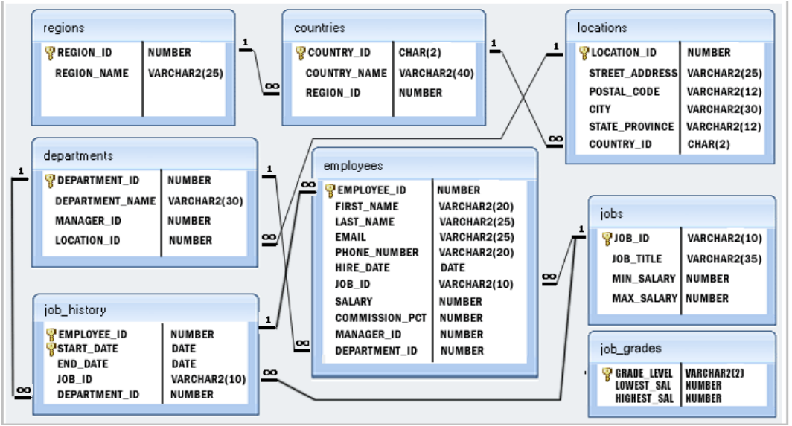
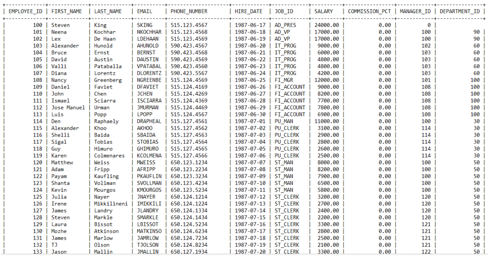

# Lab 06 — Implementation of MySQL Aggregate Functions

*CSE 210 Database System Lab · Source: `CSE_210_Database_System_Lab.md` (PDF pages 47–53, printed pages 41–47)*

---

## 1. Objective(s)

- Gather knowledge about the aggregate function.
- Implement different types of aggregate functions AVG, COUNT, SUM, MIN, MAX, UCASE, LCASE, FLOOR etc.

---

## 2. Complete Example — copy, paste, run

```sql
-- ============================================================
-- Lab 06 : Complete demo (Aggregate + numeric/string functions)
-- ============================================================
DROP DATABASE IF EXISTS cse210_lab06;
CREATE DATABASE cse210_lab06;
USE cse210_lab06;

-- 1) Create the table
CREATE TABLE product_order_info (
    product_no       INT(11) NOT NULL AUTO_INCREMENT,
    product_name     VARCHAR(255) NOT NULL,
    product_type     ENUM('electronics','stationary','food','beverage') DEFAULT NULL,
    product_price    FLOAT(10,2) NOT NULL,
    product_quantity SMALLINT NOT NULL,
    order_date       DATETIME NOT NULL DEFAULT CURRENT_TIMESTAMP(),
    PRIMARY KEY (product_no)
);

-- 2) Insert multiple rows (NULL lets AUTO_INCREMENT assign the next number)
INSERT INTO product_order_info (product_no, product_name, product_type, product_price, product_quantity) VALUES
(101, 'Laptop',    'electronics', 67000, 1),
(NULL, 'Mobile',   'electronics', 23500, 1),
(NULL, 'Watch',    'electronics',  8650, 2),
(NULL, 'Butter',   'stationary',     50, 5),
(NULL, 'Coca-cola','beverage',       35, 2),
(NULL, 'Seven-Up', 'beverage',       55, 1);

SELECT * FROM product_order_info;

-- 3) AGGREGATE FUNCTIONS -------------------------------------------------
SELECT AVG(product_price) AS avg_product_price FROM product_order_info;

SELECT COUNT(product_no) AS total_order FROM product_order_info;

SELECT COUNT(*) AS total_electronics
FROM product_order_info
WHERE product_type = 'electronics';

SELECT SUM(product_price * product_quantity) AS total_sales FROM product_order_info;

SELECT MAX(product_price) AS max_price FROM product_order_info;

SELECT MIN(product_price) AS min_price FROM product_order_info;

-- total value per product (aggregate + GROUP BY)
SELECT product_no, product_name, product_price, product_quantity,
       SUM(product_price * product_quantity) AS total_per_product
FROM product_order_info
GROUP BY product_no;

-- aggregate per product type, sorted with ORDER BY
SELECT product_type,
       COUNT(*)          AS no_of_products,
       AVG(product_price) AS avg_price
FROM product_order_info
GROUP BY product_type
ORDER BY avg_price DESC;

-- 4) NUMERIC FUNCTIONS ---------------------------------------------------
SELECT product_no, product_name, product_price,
       FLOOR(product_price) AS floor_val,
       CEIL(product_price)  AS ceil_val,
       ROUND(product_price) AS round_val
FROM product_order_info;

-- 5) STRING FUNCTIONS ----------------------------------------------------
SELECT product_no, product_name,
       UCASE(product_name) AS upper_name,
       LCASE(product_name) AS lower_name
FROM product_order_info;

SELECT product_no, product_name,
       LENGTH(product_name) AS name_length,
       MID(product_name, 1, 3) AS first_three,
       CONCAT(product_name, ' (', product_type, ')') AS product_info
FROM product_order_info;

SELECT product_no, product_name, product_price
FROM product_order_info
WHERE LENGTH(product_price) > 5;
```

**Expected output highlights**

| Query | Result |
| --- | --- |
| `AVG(product_price)` | 16539.17 (approx.) |
| `COUNT(product_no)` | 6 |
| `COUNT(*) … WHERE product_type='electronics'` | 3 |
| `SUM(product_price * product_quantity)` | 115270 |
| `MAX(product_price)` | 67000 |
| `MIN(product_price)` | 35 |
| `GROUP BY product_type` | electronics, stationary, beverage |

---

## 3. Quick Reference — Concepts taught in this lab

### 3.1 Concepts and one-line SQL

| # | Concept | Copy-paste SQL |
| --- | --- | --- |
| 1 | AVG — average of non-NULL values | `SELECT AVG(product_price) AS avg_price FROM product_order_info;` |
| 2 | COUNT(col) — counts non-NULL values | `SELECT COUNT(product_no) AS total_order FROM product_order_info;` |
| 3 | COUNT(\*) — counts rows (with condition) | `SELECT COUNT(*) AS n FROM product_order_info WHERE product_type='electronics';` |
| 4 | SUM — total of a set | `SELECT SUM(product_price * product_quantity) AS total_sales FROM product_order_info;` |
| 5 | MAX — highest value | `SELECT MAX(product_price) AS max_price FROM product_order_info;` |
| 6 | MIN — lowest value | `SELECT MIN(product_price) AS min_price FROM product_order_info;` |
| 7 | GROUP BY — aggregate per group | `SELECT product_type, COUNT(*) FROM product_order_info GROUP BY product_type;` |
| 8 | ORDER BY (ASC/DESC) | `SELECT * FROM product_order_info ORDER BY product_price DESC;` |
| 9 | LENGTH — number of characters | `SELECT LENGTH('Green University');` |
| 10 | UCASE / UPPER | `SELECT UCASE('green university');` |
| 11 | LCASE / LOWER | `SELECT LCASE('GREEN UNIVERSITY');` |
| 12 | FLOOR — round down | `SELECT FLOOR(67000.75);` |
| 13 | CEIL / CEILING — round up | `SELECT CEIL(67000.25);` |
| 14 | ROUND — round to nearest | `SELECT ROUND(67000.45);` |
| 15 | SUBSTR / MID — part of a string | `SELECT MID('Coca-cola', 1, 4);` |
| 16 | CONCAT — join strings | `SELECT CONCAT('Lab', ' ', '06');` |
| 17 | CHAR, INSTR, TRIM, LEFT, RIGHT | `SELECT LEFT('Coca-cola',4), RIGHT('Coca-cola',4), TRIM('  x  ');` |

### 3.2 MySQL aggregate functions

| Aggregate function | Description |
| --- | --- |
| AVG() | Return the average of non-NULL values. |
| BIT_AND() | Return bitwise AND. |
| BIT_OR() | Return bitwise OR. |
| BIT_XOR() | Return bitwise XOR. |
| COUNT() | Return the number of rows in a group, including rows with NULL values. |
| GROUP_CONCAT() | Return a concatenated string. |
| JSON_ARRAYAGG() | Return result set as a single JSON array. |
| JSON_OBJECTAGG() | Return result set as a single JSON object. |
| MAX() | Return the highest value (maximum) in a set of non-NULL values. |
| MIN() | Return the lowest value (minimum) in a set of non-NULL values. |
| STDEV() | Return the population standard deviation. |
| STDDEV_POP() | Return the population standard deviation. |
| STDDEV_SAMP() | Return the sample standard deviation. |
| SUM() | Return the summation of all non-NULL values a set. |
| VAR_POP() | Return the population standard variance. |
| VARP_SAM() | Return the sample variance. |
| VARIANCE() | Return the population standard variance. |

---

## 4. Problem Analysis

We mainly use the aggregate functions in databases, spreadsheets and many other data manipulation software packages. In the context of business, different organization levels need different information such as top levels managers interested in knowing whole figures and not the individual details. These functions produce the summarised data from our database. Thus they are extensively used in economics and finance to represent the economic health or stock and sector performance. (The complete list of MySQL aggregate functions is given in **section 3.2 — Quick Reference**.)

SQL functions are similar to SQL operators in that both manipulate data items and both return a result. SQL functions differ from SQL operators in the format in which they appear with their arguments. The SQL function format enables functions to operate with zero, one, or more arguments: `function(argument1, argument2, ...) alias`. If passed an argument whose datatype differs from an expected datatype, most functions perform an implicit datatype conversion on the argument before execution. If passed a null value, most functions return a null value. SQL functions are used exclusively with SQL commands within SQL statements. There are two general types of SQL functions: single row (or scalar) functions and aggregate functions. These two types differ in the number of database rows on which they act. A single row function returns a value based on a single row in a query, whereas an aggregate function returns a value based on all the rows in a query. Single row SQL functions can appear in select lists (except in SELECT statements that contain a GROUP BY clause) and WHERE clauses. Aggregate functions are the set functions: AVG, MIN, MAX, SUM, and COUNT.

### 4.1 Using Mathematical Function

The SQL aggregate functions — AVG, COUNT, DISTINCT, MAX, MIN, SUM — all return a value computed or derived from one column's values, after discarding any NULL values. The syntax of all these functions is:

- **AVG()** calculates the average value of a set of values. It ignores NULL in the calculation.

```sql
SELECT AVG(column1) FROM table_name;
```

- **SUM()** returns the sum of values in a set. The SUM() function ignores NULL. If no matching row is found, the SUM() function returns NULL.

```sql
SELECT SUM(column1) FROM table_name;
```

- **MAX()** returns the maximum value in a set.

```sql
SELECT MAX(column1) FROM table_name;
```

- **MIN()** returns the minimum value in a set of values.

```sql
SELECT MIN(column1) FROM table_name;
```

- **COUNT()** returns the total number of values in the expression. This function produces all rows or only some rows of the table based on a specified condition, and its return type is BIGINT. It returns zero if it does not find any matching rows. It can work with both numeric and non-numeric data types.

```sql
SELECT COUNT(column1) FROM table_name;
```

### 4.2 Using Text / String Functions

1. **CHAR()**: It returns a string made up of the ASCII representation of the decimal value list. Strings in numeric format are converted to a decimal value. Null values are ignored.
2. **CONCAT()**: It returns argument str1 concatenated with argument str2.

```sql
SELECT CONCAT(column1, column2) FROM table_name;
```

3. **LOWER() / LCASE()**: It returns argument str, with all letters in lowercase.

```sql
SELECT LOWER(column1) FROM table_name;
```

4. **SUBSTR()**: Check by yourself.
5. **UPPER() / UCASE()**: Check by yourself.
6. **LTRIM()**: Check by yourself.
7. **RTRIM()**: Check by yourself.
8. **TRIM()**: Check by yourself.
9. **INSTR()**: Check by yourself.
10. **LENGTH()**: Check by yourself.
11. **LEFT()**: Check by yourself.
12. **RIGHT()**: Check by yourself.
13. **MID()**: Check by yourself.

---

## 5. Procedure (Implementation in MySQL)

1. Create a table product_order_info

- Create the table:

```sql
CREATE TABLE product_order_info (
    product_no       INT(11) NOT NULL AUTO_INCREMENT,
    product_name     VARCHAR(255) NOT NULL,
    product_type     ENUM('electronics','stationary','food','beverage') DEFAULT NULL,
    product_price    FLOAT(10,2) NOT NULL,
    product_quantity SMALLINT NOT NULL,
    order_date       DATETIME NOT NULL DEFAULT CURRENT_TIMESTAMP(),
    PRIMARY KEY (product_no)
);
```

- Insert multiple VALUES at a time:

```sql
INSERT INTO product_order_info (product_no, product_name, product_type, product_price, product_quantity) VALUES
(101, 'Laptop',    'electronics', 67000, 1),
(NULL, 'Mobile',   'electronics', 23500, 1),
(NULL, 'Watch',    'electronics',  8650, 2),
(NULL, 'Butter',   'stationary',     50, 5),
(NULL, 'Coca-cola','beverage',       35, 2),
(NULL, 'Seven-Up', 'beverage',       55, 1);
```

- AVG function:

```sql
SELECT AVG(product_price) AS avg_product_price FROM product_order_info;
```

OR

```sql
SELECT AVG(product_price) AS avg_product_price FROM product_order_info;
```

- COUNT function returns the number of the rows in a table:

```sql
SELECT COUNT(product_no) AS total_order FROM product_order_info;
```

- COUNT function returns the number of the rows of specific items:

```sql
SELECT COUNT(*) AS total_electronics
FROM product_order_info
WHERE product_type = 'electronics';
```

- To get the total sales of each product:

```sql
SELECT product_no,
       product_name,
       product_price,
       product_quantity,
       SUM(product_price * product_quantity) AS total_per_product
FROM product_order_info
GROUP BY product_no;
```

- MAX function returns the maximum value in a set of values:

```sql
SELECT MAX(product_price) AS max_price FROM product_order_info;
```

- MIN function returns the minimum value in a set of values:

```sql
SELECT MIN(product_price) AS min_price FROM product_order_info;
```

2. Using LENGTH(), UCASE/UPPER CASE(), LCASE/LOWER CASE(), MID(), ROUND/FLOOR/CEILING(), CONCAT():

- MySQL LENGTH function:

```sql
SELECT product_no, product_name, product_price,
       LENGTH(product_price) AS price_length
FROM product_order_info;
```

**Example-2:**

```sql
SELECT product_no, product_name, product_price
FROM product_order_info
WHERE LENGTH(product_price) > 5;
```

- UCASE function:

```sql
SELECT product_no, product_name, product_price,
       UCASE(product_price) AS price_upper
FROM product_order_info;
```

- LCASE function:

```sql
SELECT product_no, product_name, product_price,
       LCASE(product_price) AS price_lower
FROM product_order_info;
```

- FLOOR function:

```sql
SELECT product_no, product_name, product_price,
       FLOOR(product_price) AS floor_val
FROM product_order_info;
```

- CEILING function:

```sql
SELECT product_no, product_name, product_price,
       CEIL(product_price) AS ceil_val
FROM product_order_info;
```

- ROUND function:

```sql
SELECT product_no, product_name, product_price,
       ROUND(product_price) AS round_val
FROM product_order_info;
```

- MID function:

```sql
SELECT product_no, product_name, product_price,
       MID(product_price, 1, 3) AS price_part
FROM product_order_info;
```

- CONCAT function:

```sql
SELECT product_no, product_name, product_price,
       CONCAT(product_name, ' ', product_type) AS product_info
FROM product_order_info;
```

3. Sorting data using ORDER BY, GROUP BY — try by yourself:

```sql
SELECT product_type, AVG(product_price) AS avg_price
FROM product_order_info
GROUP BY product_type
ORDER BY avg_price DESC;
```

---

## 6. Discussion & Conclusion

In summary, this experiment makes a brief analysis of the Aggregate Function implemented by MySQL 8.0 from the source level. Aggregate Function saves the intermediate values of corresponding calculation results without GROUP BY by defining member variables, saves the keys and aggregated values of corresponding GROUP BY by using Temp Table with GROUP BY, and introduces the optimization methods of some Aggregate Functions. Of course, there are two important types of aggregation here: ROLL UP and WINDOWS functions, which will be introduced separately in future chapters due to space limitations. I hope this article can help readers understand the implementation of MySQL Aggregate Function.

---

## 7. Lab Task (Please implement yourself and show the output to the instructor)

**Task 1:**



*Figure VI.1: Employees Table Information*

1. Input multiple data existing employees database or your existing database table.
2. Write a SQL query for searching employees average age, maximum, minimum salary.
3. Write a SQL statement to find the average purchase amount of all orders.
4. Implement UCASE, LCASE, MID, FLOOR, CELLING, LENGTH function.
5. Which department are paid most and which department are paid less Salary?

---

## 8. Lab Exercise (Submit as a report)



*Figure VI.2: Employees Table Information*

1. Write a query to list the number of jobs available in the employees table.
2. Write a query to get the minimum salary from employees table.
3. Write a query to get the maximum salary of an employee working as a Programmer.
4. Write a query to get the average salary for each job ID excluding programmer.
5. Attach with query codes and with output screenshots in the report.

---

## Academic Integrity Policy

Copying from the internet, classmates, seniors, or any other unauthorized source is strictly prohibited. Full marks may be deducted if plagiarism, copied work, or academic dishonesty is detected.

Students must complete the lab task, implementation, output analysis, and lab report independently and submit authentic work for evaluation.
