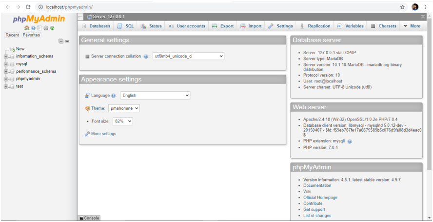
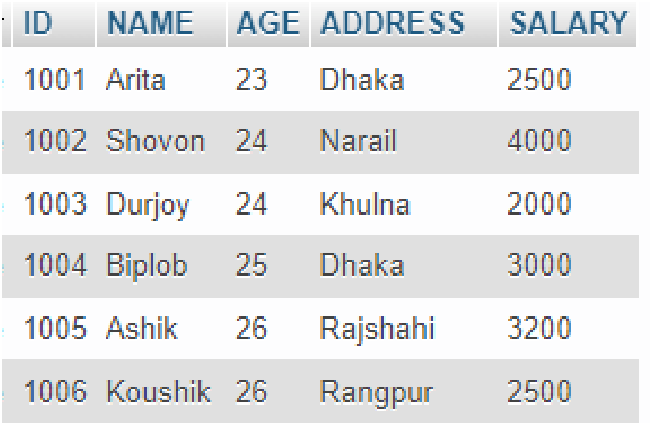
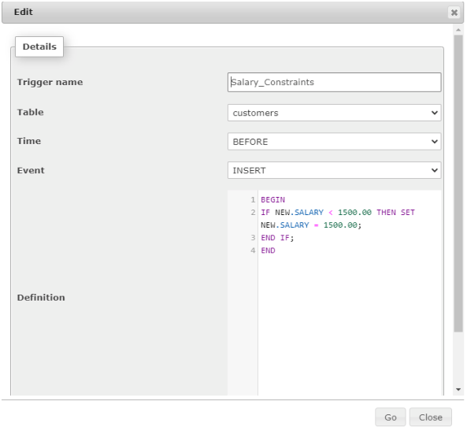
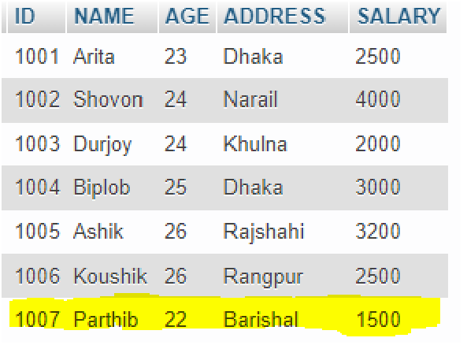

# Lab 08 — Implementation of Database Triggers

*CSE 210 Database System Lab · Source: `CSE_210_Database_System_Lab.md` (PDF pages 61–67, printed pages 55–61)*

---

## 1. Objective(s)

- To Explain the Structure of a Trigger
- To Create a Trigger

---

## 2. Complete Example — copy, paste, run

```sql
-- ============================================================
-- Lab 08 : Complete demo (BEFORE INSERT / BEFORE UPDATE triggers)
-- ============================================================
DROP DATABASE IF EXISTS cse210_lab08;
CREATE DATABASE cse210_lab08;
USE cse210_lab08;

-- 1) Create the customers table
CREATE TABLE customers (
    ID      INT NOT NULL,
    NAME    VARCHAR(30) NOT NULL,
    AGE     INT NOT NULL,
    ADDRESS VARCHAR(50) NOT NULL,
    SALARY  DOUBLE NOT NULL,
    PRIMARY KEY (ID)
);

-- 2) Insert some normal rows (no trigger exists yet)
INSERT INTO customers (ID, NAME, AGE, ADDRESS, SALARY) VALUES
(1001, 'Rahim',  25, 'Dhaka',      2500.00),
(1002, 'Karim',  30, 'Chattogram', 1800.00),
(1003, 'Sabbir', 22, 'Sylhet',     3200.00);

SELECT * FROM customers;

-- 3) Create the trigger (BEFORE INSERT)
--    phpMyAdmin / mysql client need the DELIMITER change so that the
--    semicolons inside the trigger body are not treated as statement ends.
DROP TRIGGER IF EXISTS Salary_Constraints;

DELIMITER //
CREATE TRIGGER Salary_Constraints
BEFORE INSERT ON customers
FOR EACH ROW
BEGIN
    IF NEW.SALARY < 1500.00 THEN
        SET NEW.SALARY = 1500.00;
    END IF;
END //
DELIMITER ;

-- 4) Test it: 1200.00 is below 1500, so the stored value becomes 1500.00
INSERT INTO customers (ID, NAME, AGE, ADDRESS, SALARY)
VALUES (1004, 'Parthib', 22, 'Barishal', 1200.00);

SELECT * FROM customers;

-- 5) Same rule for UPDATE (BEFORE UPDATE trigger)
DROP TRIGGER IF EXISTS Salary_Constraints_Update;

DELIMITER //
CREATE TRIGGER Salary_Constraints_Update
BEFORE UPDATE ON customers
FOR EACH ROW
BEGIN
    IF NEW.SALARY < 1500.00 THEN
        SET NEW.SALARY = 1500.00;
    END IF;
END //
DELIMITER ;

UPDATE customers SET SALARY = 900.00 WHERE ID = 1001;

SELECT * FROM customers;   -- ID 1001 still shows 1500.00, not 900.00

-- 6) Look at the triggers you created, then remove them
SHOW TRIGGERS;

DROP TRIGGER IF EXISTS Salary_Constraints;
DROP TRIGGER IF EXISTS Salary_Constraints_Update;
```

**Expected output**

| ID | NAME | AGE | ADDRESS | SALARY |
| --- | --- | --- | --- | --- |
| 1001 | Rahim | 25 | Dhaka | 1500 (after the UPDATE test) |
| 1002 | Karim | 30 | Chattogram | 1800 |
| 1003 | Sabbir | 22 | Sylhet | 3200 |
| 1004 | Parthib | 22 | Barishal | **1500** — inserted as 1200, raised by the trigger |

---

## 3. Quick Reference — Concepts taught in this lab

### 3.1 Concepts and one-line SQL

| # | Concept | Copy-paste SQL |
| --- | --- | --- |
| 1 | BEFORE INSERT trigger (auto-correct a value) | see 3.2 |
| 2 | BEFORE UPDATE trigger | see 3.3 |
| 3 | `NEW.column` / `OLD.column` | `NEW.SALARY` = value being inserted/updated, `OLD.SALARY` = value before the change |
| 4 | Trigger fires "FOR EACH ROW" | `FOR EACH ROW` in the trigger body |
| 5 | List the triggers of a database | `SHOW TRIGGERS;` |
| 6 | Delete a trigger (needed to re-run the demo) | `DROP TRIGGER IF EXISTS Salary_Constraints;` |
| 7 | Show the trigger's definition | `SHOW CREATE TRIGGER Salary_Constraints;` |

### 3.2 MySQL trigger syntax (BEFORE INSERT)

```sql
DELIMITER //
CREATE TRIGGER trigger_name
BEFORE | AFTER
INSERT | UPDATE | DELETE
ON table_name
FOR EACH ROW
BEGIN
    -- statements; NEW.column = the value going in
END //
DELIMITER ;
```

A complete worked example:

```sql
DELIMITER //
CREATE TRIGGER Salary_Constraints
BEFORE INSERT ON customers
FOR EACH ROW
BEGIN
    IF NEW.SALARY < 1500.00 THEN
        SET NEW.SALARY = 1500.00;
    END IF;
END //
DELIMITER ;
```

### 3.3 BEFORE UPDATE variant

```sql
DELIMITER //
CREATE TRIGGER Salary_Constraints_Update
BEFORE UPDATE ON customers
FOR EACH ROW
BEGIN
    IF NEW.SALARY < 1500.00 THEN
        SET NEW.SALARY = 1500.00;
    END IF;
END //
DELIMITER ;
```

### 3.4 Why DELIMITER?

`DELIMITER //` temporarily changes the statement terminator from `;` to `//`, so MySQL does not treat the semicolons **inside** the trigger (or procedure) body as the end of the statement. After the definition, the delimiter is reset with `DELIMITER ;`.

---

## 4. Problem Analysis

### 4.1 Introduction to Trigger

In this lab, we will discuss Trigger, which is one of the important topics in PL/SQL. Triggers are stored programs, which are automatically executed or fired when some events occur. Triggers are, in fact, written to be executed in response to any of the following events:

- A database manipulation (DML) statement (DELETE, INSERT, or UPDATE)
- A database definition (DDL) statement (CREATE, ALTER, or DROP).
- A database operation (SERVERERROR, LOGON, LOGOFF, STARTUP, or SHUTDOWN).

Triggers can be defined on the table, view, schema, or database with which the event is associated.

### 4.2 Benefits of Trigger

- Generating some derived column values automatically
- Enforcing referential integrity
- Event logging and storing information on table access
- Auditing
- Synchronous replication of tables
- Imposing security authorizations
- Preventing invalid transactions

### 4.3 Syntax of Trigger

As given in the manual (PL/SQL style syntax — note that MySQL uses the syntax shown in section 3.2 above):

```text
CREATE [OR REPLACE] TRIGGER trigger_name
BEFORE | AFTER | INSTEAD OF
INSERT [OR] | UPDATE [OR] | DELETE
[OF col_name] ON table_name
REFERENCING OLD AS o NEW AS n
FOR EACH ROW
WHEN (condition)
DECLARE
    Declaration-statements
BEGIN
    Executable-statements
EXCEPTION
    Exception-handling-statements
END;
```

Explanation:

- **CREATE [OR REPLACE] TRIGGER trigger_name** — Creates or replaces an existing trigger with the trigger_name.
- **BEFORE | AFTER | INSTEAD OF** — This specifies when the trigger will be executed. The INSTEAD OF clause is used for creating trigger on a view.
- **INSERT [OR] | UPDATE [OR] | DELETE** — This specifies the DML operation.
- **OF col_name** — This specifies the column name that will be updated.
- **ON table_name** — This specifies the name of the table associated with the trigger.
- **REFERENCING OLD AS o NEW AS n** — This allows you to refer new and old values for various DML statements, such as INSERT, UPDATE, and DELETE.
- **FOR EACH ROW** — This specifies a row-level trigger, i.e., the trigger will be executed for each row being affected. Otherwise the trigger will execute just once when the SQL statement is executed, which is called a table level trigger.
- **WHEN (condition)** — This provides a condition for rows for which the trigger would fire. This clause is valid only for row-level triggers.

---

## 5. Procedure

We have practiced with the XAMPP in the previous labs, we can assume that the system is ready to use. First, we have to launch the XAMPP. Then, we have to press the Start button of Apache and MySQL module. After that, we have to press the Admin button of the MySQL module. As a result, a tab will be opened on your default web browser like figure VIII.1. Or, we can open a tab in the web browser with the link as http://localhost/phpmyadmin/. Then, we have to select the SQL option. An editor space will be opened like figure VIII.2 to write the required commands. Now, it is ready for implementation.



*Figure VIII.1: Session in Localhost*


*Figure VIII.2: Space for Editing Commands*

---

## 6. Implementations

### 6.1 Database Creation

To create a database, we have to write command like `CREATE DATABASE [Database_Name]`. Suppose, we have to create a database named "lab9". We have to write the command as below:

```sql
CREATE DATABASE lab9;
```

A database named "lab9" is created in your local-host.

### 6.2 Database Use

To use the "lab9" database, we have to write the command in SQL editor space as below:

```sql
USE lab9;
```

### 6.3 Creating a Table

Now, to create a table named "customers" in database lab9 with attributes like ID (int), NAME (varchar), AGE (int), ADDRESS (varchar), SALARY (double) where ID would be the Primary key, we have to write command in SQL editor space like below:

```sql
CREATE TABLE lab9.customers (
    ID      INT NOT NULL,
    NAME    VARCHAR(30) NOT NULL,
    AGE     INT NOT NULL,
    ADDRESS VARCHAR(50) NOT NULL,
    SALARY  DOUBLE NOT NULL,
    PRIMARY KEY (ID)
);
```

Then, we have to insert data in customer table. Suppose, we have inserted data like figure VIII.3.



*Figure VIII.3: Data Items in customers Table*

```sql
INSERT INTO customers (ID, NAME, AGE, ADDRESS, SALARY) VALUES
(1001, 'Rahim',  25, 'Dhaka',      2500.00),
(1002, 'Karim',  30, 'Chattogram', 1800.00),
(1003, 'Sabbir', 22, 'Sylhet',     3200.00);
```

### 6.4 Creating Trigger

Suppose, we want to impose a constraint on the customers table such that the SALARY of a customer would not be less than 1500.00. If it is input less than 1500.00, it will be set to 1500.00. The command is like figure VIII.4 in the Trigger option of the table. We can also implement this trigger in the SQL editor, and the instruction is like this:



*Figure VIII.4: Creating Trigger on Customer Table*

```sql
DELIMITER //
CREATE TRIGGER Salary_Constraints
BEFORE INSERT ON customers
FOR EACH ROW
BEGIN
    IF NEW.SALARY < 1500.00 THEN
        SET NEW.SALARY = 1500.00;
    END IF;
END //
DELIMITER ;
```

### 6.5 Checking Trigger

Now, we want to check the trigger whether it works or not. For this, we will try to insert an item with SALARY = 1200.00. The command is as below:

```sql
INSERT INTO customers (ID, NAME, AGE, ADDRESS, SALARY)
VALUES (1007, 'Parthib', 22, 'Barishal', 1200.00);
```

After this insertion, customers table is like figure VIII.5.



*Figure VIII.5: Data Items in customers Table*

---

## 7. Discussion & Conclusion

Though we have input SALARY = 1200.0 for ID = 1007, the SALARY for ID = 1007 is stored 1500.00. The reason behind this phenomena is the trigger Salary_Constraints on customers table. Every time, SALARY value will be 1500, when it is tried to input SALARY less than 1500.00.

---

## 8. Lab Task (Please implement yourself and show the output to the instructor)

1. Create a Table named 'employee' with attribute EmpID(int), EmpName(varchar), BasicSalary(double), StartDate(date), NoofPub(int).
2. Insert around 10 items.
3. Create a trigger to update the BasicSalary.

### 8.1 Problem Analysis

1. You have to create a table according instruction given.
2. You have to insert around ten tuples in the table.
3. You have to create a trigger to update the BasicSalary by 20% if job duration is more than one year and NoofPub is more than four, 10% if job duration is more than one year and NoofPub is two or three, 5% if job duration is more than one year and NoofPub is one and 0% for no publication.

---

## 9. Lab Exercise (Submit as a report)

- Create a Database with two tables named StudentInfo (StudentID, StudentName, Address, Email), WaiverInfo (StudentID, StudentName, CGPA, WaiverPercentage).
- Insert Data in each table.
- Create a trigger to Update the WaiverPercentage according to the CGPA. [N.B. Follow the waiver policy of GUB]

---

## 10. Reference

- https://www.javatpoint.com/mysql-create-trigger
- https://www.tutorialspoint.com/plsql/plsql_triggers.htm

---

## Academic Integrity Policy

Copying from the internet, classmates, seniors, or any other unauthorized source is strictly prohibited. Full marks may be deducted if plagiarism, copied work, or academic dishonesty is detected.

Students must complete the lab task, implementation, output analysis, and lab report independently and submit authentic work for evaluation.
