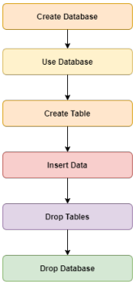
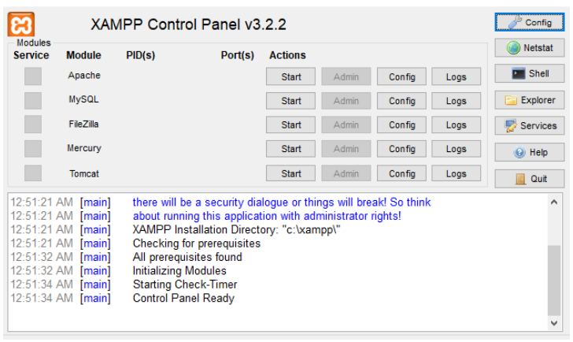
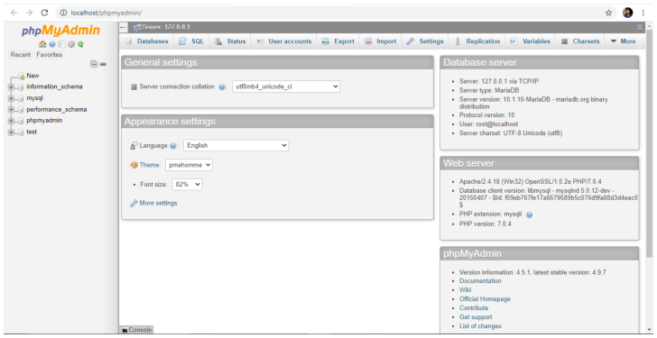
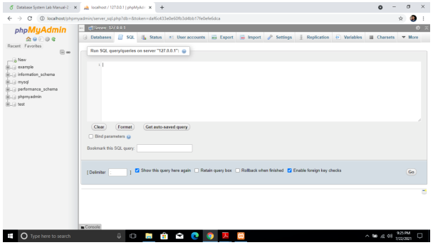
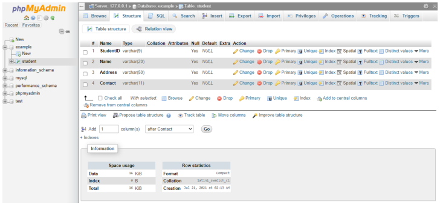
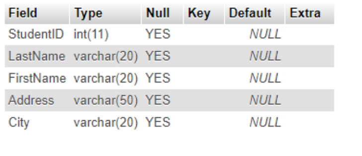
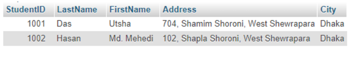
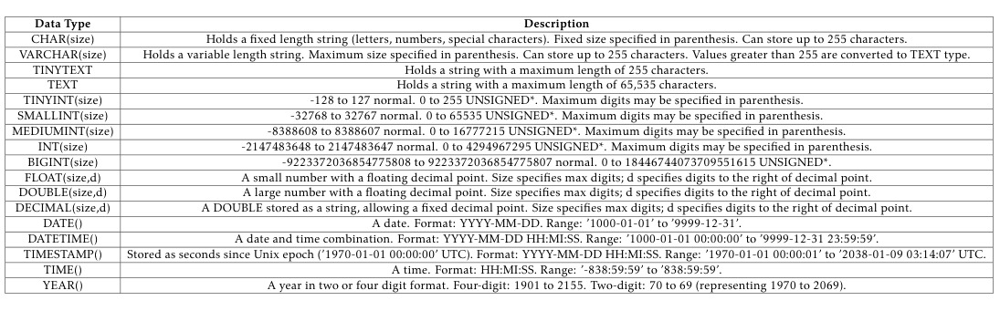

# Lab 01 — Introduction to Database, MySQL, and Managing MySQL Databases

**Source-faithful Markdown transcription:** Original PDF pages 7–14.  
**For live SQL:** [Runnable lab guide](../../labs/lab-01/README.md) · [Original complete PDF transcription](../../COMPLETE_SOURCE_MANUAL.md)

<!-- Original PDF page 7; printed lab page 1 -->

## 1.1 Objective(s)

- To install MySQL Database Server.

- To introduce Data Types used in Database System.

- To Create Database and Table using SQL commands.

- To Insert Data in Table.

- To Drop Database and Table.

## 1.2 Problem Analysis

Database is a key course of computer science. At the beginner level, most of the students are not familiar with how to use database in computer system. This section helps you get started with a very common database system named MySQL. We will start by installing MySQL and creating a database in the MySQL server for practicing.


*Figure I.1: Logo of MySQL*

After installation of proper tools, users have to create databases in the system and use them according to demand. We will create databases and tables using both the phpMyAdmin panel and SQL commands. We will also insert data into the tables and finally drop the tables and the database. The workflow of the overall lab is described in Figure I.2.

<!-- Original PDF page 8; printed lab page 2 -->



*Figure I.2: Workflow Diagram of the Lab*

## 1.3 Procedure

If you want to install MySQL on Windows environment, using MySQL installer is the easiest way. MySQL installer provides you with an easy-to-use wizard that helps you to install MySQL with the following components:

- MySQL Server

- All Available Connectors

- MySQL Workbench with Sample Data Models

- MySQL Notifier

- Tools for Excel and Microsoft Visual Studio

- MySQL Sample Databases

To download MySQL installer, use the following link:

<https://www.apachefriends.org/download.html>

Required tools are available for all operating systems in the above link.

After installation of the downloaded XAMPP, you have to run the XAMPP control panel system. It will look like Figure I.3. To start the service, press the Start button of the Apache and MySQL module. Now, the system is ready to work with.

## 1.4 Practicing With XAMPP

To start the practice session, press the Admin button of the MySQL module or use the following link in your web browser: http://localhost/phpmyadmin/

You will get a web page like Figure I.4 in your tab.

<!-- Original PDF page 9; printed lab page 3 -->



*Figure I.3: XAMPP Control Panel*

To create a database from the phpMyAdmin panel, select the New option (uppermost option in the left side of the web page). Input a name in the Database name field and press the Create button. After that, to input data in your required structure, create a table with a table name and the required number of columns. For this, open the SQL option and write the necessary syntax. An editor space will appear like Figure I.5 where you can write required SQL commands.

## 1.5 Implementations

### 1.5.1 Database Creation

To create a database using SQL command, write: CREATE DATABASE [Database_Name]. For example, to create a database named lab2:

```sql
CREATE DATABASE lab2
```

A database named “lab2” is created in your local-host.

### 1.5.2 Database Use

To use the lab2 database, write the following command in the SQL editor:

```sql
USE lab2
```

### 1.5.3 Table Creation

To create a table using SQL command from the phpMyAdmin panel, open the SQL option and write the necessary command.

<!-- Original PDF page 10; printed lab page 4 -->



*Figure I.4: Session in Localhost*



*Figure I.5: Space for Editing SQL Commands*

For example, to create a table named Student with 4 attributes (StudentID, Name, Address, Contact):

```sql
CREATE TABLE Student( StudentID varchar(9), Name varchar(20), Address
varchar(50), Contact varchar(11));
```

The created table will look like Figure I.6. You can also create a table with different attribute types. For example, to create a table named Student in lab2 with attributes StudentID (int), LastName (varchar), FirstName (varchar), Address (varchar), City (varchar):

```sql
CREATE TABLE Student(StudentID int, LastName varchar(20), FirstName
varchar(20), Address varchar(50), City varchar(20));
```

<!-- Original PDF page 11; printed lab page 5 -->



*Figure I.6: Created Table named Student*

### 1.5.4 Table Description

To describe the structure of a table, use: DESCRIBE [Table_Name]. For example, to describe the Student table:

```sql
DESCRIBE student;
```

The result will appear like Figure I.7 on the browser tab.



*Figure I.7: Description of Student Table*

### 1.5.5 Data Insertion

To insert data into a table, write the proper SQL INSERT command in the SQL editor. For example, to insert student details into the Student table:

```sql
INSERT INTO `student`(`StudentID`, `LastName`, `FirstName`, `Address`, `City`)
VALUES ('1001', 'Das', 'Utsha', '704, Shamim Shoroni, West Shewrapara', 'Dhaka');
```

<!-- Original PDF page 12; printed lab page 6 -->

Another record can be inserted as:

```sql
INSERT INTO `student` (`StudentID`, `LastName`, `FirstName`, `Address`, `City`)
VALUES ('1002', 'Hasan', 'Md. Mehedi', '102, Shapla Shoroni, West Shewrapara', 'Dhaka');
```

In this way, many student records can be inserted into the Student table.

### 1.5.6 Data Browse

To browse and view all records in the Student table:

```sql
SELECT * FROM student;
```

A table will appear on the tab like Figure I.8.



*Figure I.8: Browsing Result of Student Table*

### 1.5.7 Dropping Table and Database

To drop a table, use the command: DROP TABLE [Table_Name]. For example, to drop the Student table:

```sql
DROP TABLE student;
```

The Student table will be removed from the lab2 database.

To drop the lab2 database itself:

```sql
DROP DATABASE lab2;
```

## 1.6 Input/Output Summary

All the SQL commands covered in this lab follow a standard input/output pattern. The user writes commands in the SQL editor space, and the results are displayed in the browser. The key commands are summarized as: CREATE DATABASE, USE, CREATE TABLE, DE- SCRIBE, INSERT INTO, SELECT, DROP TABLE, and DROP DATABASE.

<!-- Original PDF page 13; printed lab page 7 -->

## 1.7 Discussion & Conclusion

In this lab, we have installed MySQL via XAMPP, created databases and tables both through the phpMyAdmin panel and using SQL commands. We used varchar and int as data types for attributes — numbers indicate the length of each attribute. Besides these, there are many types of data types available in MySQL, described in Table I.1. We have also inserted data into tables, browsed the table contents, and dropped both tables and databases. That means we have achieved all the lab objectives.

| Data Type | Description |
| --- | --- |
| CHAR(size) | Holds a fixed length string (letters, numbers, special characters). Fixed size specified in parenthesis. Can store up to 255 characters. |
| VARCHAR(size) | Holds a variable length string. Maximum size specified in parenthesis. Can store up to 255 characters. Values greater than 255 are converted to TEXT type. |
| TINYTEXT | Holds a string with a maximum length of 255 characters. |
| TEXT | Holds a string with a maximum length of 65,535 characters. |
| TINYINT(size) | -128 to 127 normal. 0 to 255 UNSIGNED*. Maximum digits may be specified in parenthesis. |
| SMALLINT(size) | -32768 to 32767 normal. 0 to 65535 UNSIGNED*. Maximum digits may be specified in parenthesis. |
| MEDIUMINT(size) | -8388608 to 8388607 normal. 0 to 16777215 UNSIGNED*. Maximum digits may be specified in parenthesis. |
| INT(size) | -2147483648 to 2147483647 normal. 0 to 4294967295 UNSIGNED*. Maximum digits may be specified in parenthesis. |
| BIGINT(size) | -9223372036854775808 to 9223372036854775807 normal. 0 to 18446744073709551615 UNSIGNED*. |
| FLOAT(size,d) | A small number with a floating decimal point. Size specifies max digits; d specifies digits to the right of decimal point. |
| DOUBLE(size,d) | A large number with a floating decimal point. Size specifies max digits; d specifies digits to the right of decimal point. |
| DECIMAL(size,d) | A DOUBLE stored as a string, allowing a fixed decimal point. Size specifies max digits; d specifies digits to the right of decimal point. |
| DATE() | A date. Format: YYYY-MM-DD. Range: ’1000-01-01’ to ’9999-12-31’. |
| DATETIME() | A date and time combination. Format: YYYY-MM-DD HH:MI:SS. Range: ’1000-01-01 00:00:00’ to ’9999-12-31 23:59:59’. |
| TIMESTAMP() | Stored as seconds since Unix epoch (’1970-01-01 00:00:00’ UTC). Format: YYYY-MM-DD HH:MI:SS. Range: ’1970-01-01 00:00:01’ to ’2038-01-09 03:14:07’ UTC. |
| TIME() | A time. Format: HH:MI:SS. Range: ’-838:59:59’ to ’838:59:59’. |
| YEAR() | A year in two or four digit format. Four-digit: 1901 to 2155. Two-digit: 70 to 69 (representing 1970 to 2069). |



```text
Data Type
Description
CHAR(size)
Holds a fixed length string (letters, numbers, special characters). Fixed size specified in parenthesis. Can store up to 255 characters.
VARCHAR(size)
Holds a variable length string. Maximum size specified in parenthesis. Can store up to 255 characters. Values greater than 255 are converted to TEXT type.
TINYTEXT
Holds a string with a maximum length of 255 characters.
TEXT
Holds a string with a maximum length of 65,535 characters.
TINYINT(size)
-128 to 127 normal. 0 to 255 UNSIGNED*. Maximum digits may be specified in parenthesis.
SMALLINT(size)
-32768 to 32767 normal. 0 to 65535 UNSIGNED*. Maximum digits may be specified in parenthesis.
MEDIUMINT(size)
-8388608 to 8388607 normal. 0 to 16777215 UNSIGNED*. Maximum digits may be specified in parenthesis.
INT(size)
-2147483648 to 2147483647 normal. 0 to 4294967295 UNSIGNED*. Maximum digits may be specified in parenthesis.
BIGINT(size)
-9223372036854775808 to 9223372036854775807 normal. 0 to 18446744073709551615 UNSIGNED*.
FLOAT(size,d)
A small number with a floating decimal point. Size specifies max digits; d specifies digits to the right of decimal point.
DOUBLE(size,d)
A large number with a floating decimal point. Size specifies max digits; d specifies digits to the right of decimal point.
DECIMAL(size,d)
A DOUBLE stored as a string, allowing a fixed decimal point. Size specifies max digits; d specifies digits to the right of decimal point.
DATE()
A date. Format: YYYY-MM-DD. Range: ’1000-01-01’ to ’9999-12-31’.
DATETIME()
A date and time combination. Format: YYYY-MM-DD HH:MI:SS. Range: ’1000-01-01 00:00:00’ to ’9999-12-31 23:59:59’.
TIMESTAMP()
Stored as seconds since Unix epoch (’1970-01-01 00:00:00’ UTC). Format: YYYY-MM-DD HH:MI:SS. Range: ’1970-01-01 00:00:01’ to ’2038-01-09 03:14:07’ UTC.
TIME()
A time. Format: HH:MI:SS. Range: ’-838:59:59’ to ’838:59:59’.
YEAR()
A year in two or four digit format. Four-digit: 1901 to 2155. Two-digit: 70 to 69 (representing 1970 to 2069).
```

## 1.8 Lab Task (Please implement yourself and show the output to the instructor)

1. Create a database named “University”.

2. Create a Table named “Teacher” with attributes named TeacherID, Name, Designation, Address, and Email.

3. Create a Table named “Student” with attributes named StudentID, Name, Address, and Phone.

4. Create a Table named “Staff” with attributes named StaffID, Name, Position, Address, and Phone.

5. Insert at least five entities in each table.

6. Drop each table of the database.

### 1.8.1 Problem Analysis

1. You have to create a database named “University” with the help of the create option provided in the phpMyAdmin panel or using SQL command.

2. You have to create a table named “Teacher” with attributes named TeacherID, Name, Designation, Address, and Email. You must use proper data type and size.

3. You have to create a table named “Student” with attributes named StudentID, Name, Address, and Phone. You must use proper data type and size.

4. You have to create a table named “Staff” with attributes named StaffID, Name, Position, Address, and Phone. You must use proper data type and size.

<!-- Original PDF page 14; printed lab page 8 -->

5. You have to insert at least five tuples in each of the Student, Teacher, and Staff tables.

6. You have to drop all the tables from the database.

## 1.9 Lab Exercise (Submit as a report)

- Create a Database with five or six tables.

- Use all the basic data types described in Table I.1.

- Insert five to ten tuples in each table.

- Browse each table and take a snapshot.

### Academic Integrity Policy

Copying from the internet, classmates, seniors, or any other unauthorized source is strictly prohibited. Full marks may be deducted if plagiarism, copied work, or academic dishonesty is detected.

Students must complete the lab task, implementation, output analysis, and lab report independently and submit authentic work for evaluation.
