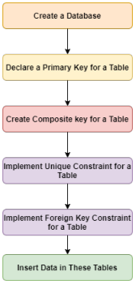
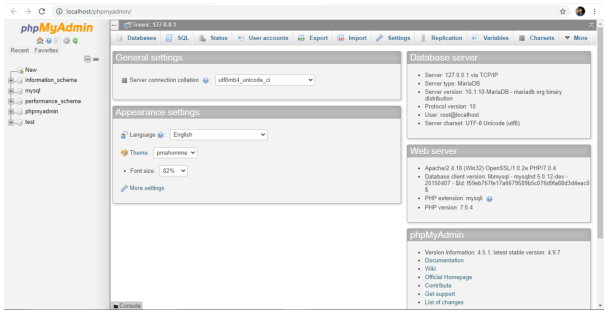
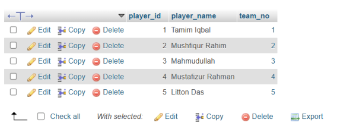

# Lab 02 — Implementation of Integrity Constraints in MySQL

**Source-faithful Markdown transcription:** Original PDF pages 15–25.  
**For live SQL:** [Runnable lab guide](../../labs/lab-02/README.md) · [Original complete PDF transcription](../../COMPLETE_SOURCE_MANUAL.md)

<!-- Original PDF page 15; printed lab page 9 -->

## 2.1 Objective(s)

- To Declare Primary Key

- To Create Composite Key

- To Implement Unique Constraint

- To Implement Foreign Key Constraint

## 2.2 Problem analysis

In the previous lab, we have already created database, tables and used them. In this lab, we have to declare primary key, create composite key and implement unique and foreign key constraint. For these purposes, we have to create a database first. You can also use database that has already been created in the previous lab. Then, we have to create a table with a primary key. In the next, we have to create composite key and implement unique and foreign key constraint for a table. Finally, we have to insert tuples in the tables. Workflow of this lab is as in the figure II.1.



*Figure II.1: Workflow Diagram of this Lab*

## 2.3 Procedure

We have practiced with the XAMPP in the previous labs, we can assume that the system is ready to use. First, we have to launch the XAMPP. Then, we have to press the Start button

<!-- Original PDF page 16; printed lab page 10 -->

of Apache and MySQL module. After that, we have to press the Admin button of the MySQL module. As a result, a tab will be opened on your default web browser like figure II.2. Or, we can open a tab in the web browser with the link as http://localhost/phpmyadmin/. Then, we have to select the SQL option. An editor space will be opened like figure II.3 to write the required commands. Now, it is ready for implementation.



*Figure II.2: Session in Localhost*


*Figure II.3: Space for Editing Commands*

## 2.4 Implementations

### 2.4.1 Database Creation

To create a database, we have to write command like ” CREATE DATABASE [Database_Name]”. Suppose, we have to create a database named ”lab3”. We have to write the command as below:

```sql
CREATE DATABASE lab3;
```

<!-- Original PDF page 17; printed lab page 11 -->

A database named ”lab3” is created in your local-host.

### 2.4.2 Database Use

To use the ”lab3” database, we have to write the command in SQL editor space as below:

USE lab3

### 2.4.3 Declaration of Primary Key

Now, to create a table named ”Players” in database lab3 with attributes like player_no (int), player_name (varchar), league_no (char) where player_no would be the Primary key, we have to write command in SQL editor space like below:

```sql
CREATE TABLE Players(player_no INT PRIMARY KEY,
player_name varchar(50),
league_no char(6));
```

To describe the structure of Players table, we have to write command as below:

```sql
DESCRIBE players;
```

We will get table like figure II.4 on the browser tab.


*Figure II.4: Description of Players Table*

The Student table is ready to insert data.

### 2.4.4 NOT NULL Constraints

The NOT NULL constraint in MySQL is used to enforce that a column cannot store NULL values. When a column is defined with NOT NULL, it becomes mandatory for every row in the table to have a value in that column. This constraint is essential for ensuring that critical data fields, such as identifiers, names, or contact information, are never left empty, thereby maintaining the completeness and reliability of the database.

For example, when creating a table for students, one might define the student_id and name columns with the NOT NULL constraint. This guarantees that every student record

<!-- Original PDF page 18; printed lab page 12 -->

will include an ID and a name, and any attempt to insert a row without these values will result in an error.The command is as below:

```sql
CREATE TABLE students(student_id INT NOT NULL,
name varchar(50) NOT NULL,
age INT);
```


*Figure II.5: Description of Students Table*

### 2.4.5 Create Composite Key

A composite key in MySQL is a type of primary key made from two or more columns in a table. It is used when a single column is not enough to uniquely identify each row, but a combination of columns can do it.

For example, imagine a table that keeps track of which students are enrolled in which courses. A student can take many courses, and each course can have many students. In this case, neither student_id nor course_id alone can uniquely identify a record. But if we use both together as a composite key, each enrollment becomes unique.The command is as below:

```sql
CREATE TABLE Enrolment(student_id INT NOT NULL,
course_id INT NOT NULL,
grade char(2) NOT NULL,
PRIMARY KEY(student_id, course_id));
```

Description of diplomas table is like the figure II.5

### 2.4.6 Implementation of Unique

The UNIQUE constraint in MySQL is used to make sure that all values in a column are different from each other. It does not allow duplicate values in that column. This helps keep the data correct and prevents repeated information in the table.

For example, in a teams table, the player_no of each player should be different. If two records have the same player_no, it can create confusion because it would look like the same player is listed more than once. By using the UNIQUE constraint, MySQL will not allow duplicate player numbers to be stored in the table.The command is as below:

<!-- Original PDF page 19; printed lab page 13 -->


*Figure II.6: Description of diplomas Table*

```sql
CREATE TABLE teams(team_no INT NOT NULL,
player_no INT NOT NULL,
division char(15),
PRIMARY KEY(team_no),
UNIQUE(player_no));
```

Description of teams table is like figure II.7


*Figure II.7: Description of teams Table*

### 2.4.7 Implementation of Foreign Key

A foreign key in MySQL is a constraint that is used to create a relationship between two tables. It ensures that the value in one table must match a value that already exists in another table. This helps maintain data integrity and prevents invalid data from being inserted.

For example, suppose there is a teams table that stores information about teams, and another table that stores players. Each player belongs to a specific team. In this case, the team_no in the players table can be used as a foreign key that refers to the team_no in the teams table. The command is as below:

<!-- Original PDF page 20; printed lab page 14 -->

```sql
CREATE TABLE players(player_id INT NOT NULL,
player_name VARCHAR(50),
team_no INT,
PRIMARY KEY (player_id),
FOREIGN KEY (team_no) REFERENCES teams(team_no) );
```

Description of players table is like figure II.8


*Figure II.8: Description of players Table*

### 2.4.8 Data Insertion

To insert data in the table, we have to write proper SQL command on the SQL editor space. Suppose, we want to insert a players details in players table like player_id: 1,player_name: Tamim Iqbal, Team_no: 1, we have to write command as below:

```sql
INSERT INTO players (player_id, player_name, team_no) VALUES
(1, 'Tamim Iqbal', 1),
(2, 'Mushfiqur Rahim', 2),
(3, 'Mahmudullah', 3),
(4, 'Mustafizur Rahman', 4),
(5, 'Litton Das', 5);
```



*Figure II.9: Players Table*

While inserting tuple, we must take care of NOT NULL field. If we don’t input in this filed, we will get warning message.

<!-- Original PDF page 21; printed lab page 15 -->

### 2.4.9 Implementation of CASECADE

A cascade (CASCADE) in MySQL is used with a foreign key to automatically update or delete related rows in another table. It helps maintain the relationship between tables without manually changing the data in both tables.

When the ON DELETE CASCADE option is used, if a row is deleted from the parent table, all related rows in the child table are also automatically deleted. Similarly, ON UPDATE CASCADE means that if the primary key value in the parent table is updated, the corresponding foreign key values in the child table are also updated automatically. For example, suppose there are two tables: teams and players.The players table has a foreign key that refers to the team_no in the teams table.The command is as below:

```sql
CREATE TABLE teams(
team_no INT PRIMARY KEY,
division CHAR(15) );

CREATE TABLE players(
player_id INT PRIMARY KEY,
player_name VARCHAR(50),
team_no INT,
FOREIGN KEY (team_no) REFERENCES teams(team_no)
ON DELETE CASCADE
ON UPDATE CASCADE );
```

In this example, if a team is removed from the teams table, all players belonging to that team will automatically be removed from the players table because of ON DELETE CAS- CADE. If the team_no in the teams table is changed, the team_no in the players table will also be updated automatically because of ON UPDATE CASCADE.

### 2.4.10 Implementation of SET NULL

```sql
SET NULL is an option used with a foreign key constraint in MySQL. It is used to set the
foreign key value to NULL automatically when the referenced row in the parent table is
deleted or updated. This helps maintain the relationship between tables without deleting
the entire record from the child table.
```

For example, suppose there are two tables: departments and employees. The employees table has a foreign key dept_id that refers to dept_id in the departmets table.The command is as below:

```sql
CREATE TABLE departments (
dept_id INT PRIMARY KEY,
dept_name VARCHAR(100)
);
```

<!-- Original PDF page 22; printed lab page 16 -->

```sql
CREATE TABLE employees (
emp_id INT PRIMARY KEY,
emp_name VARCHAR(100),
dept_id INT,
FOREIGN KEY (dept_id) REFERENCES departments(dept_id)
ON DELETE SET NULL
ON UPDATE SET NULL );
```

In this example, the employees table has a foreign key dept_id that refers to dept_id in the departments table. If a department is deleted, the dept_id in the employees table will automatically become NULL because of ON DELETE SET NULL. The employee will stay in the table but will not belong to any department. If the dept_id in the departments table is updated, the dept_id in the employees table will also become NULL because of ON UPDATE SET NULL.

### 2.4.11 Implementation of RESTRICT

The RESTRICT option in MySQL is used with a foreign key to prevent deletion or update of a row in the parent table if it is being used in the child table. For example, in the departments and employees tables, if an employee is linked to a department, you cannot delete or update that department’s dept_id if RESTRICT is applied.

```sql
CREATE TABLE employees (
emp_id INT PRIMARY KEY,
emp_name VARCHAR(100),
dept_id INT,
FOREIGN KEY (dept_id) REFERENCES departments(dept_id)
ON DELETE RESTRICT
ON UPDATE RESTRICT );
```

If you try to delete a department that is already assigned to employees, MySQL will not allow it and will show an error. The same happens if you try to update the dept_id.

### 2.4.12 Implementation of SET DEFAULT

The SET DEFAULT option in MySQL is used with a foreign key to set the column in the child table to a default value when the referenced row in the parent table is deleted or updated. For example, in the departments and employees tables, if a department is removed or its ID is changed, the dept_id in the employees table will be set to a predefined default value instead of becoming NULL or causing an error.

<!-- Original PDF page 23; printed lab page 17 -->

```sql
CREATE TABLE employees (
emp_id INT PRIMARY KEY,
emp_name VARCHAR(100),
dept_id INT,
FOREIGN KEY (dept_id) REFERENCES departments(dept_id)
ON DELETE SET DEFAULT
ON UPDATE SET DEFAULT );
```

In this case, if a department is deleted or updated, the dept_id of related employees will automatically become 0 (the default value). The employee record stays in the table but is assigned to a default or “unknown” department. Note: In MySQL, SET DEFAULT is not fully supported, so in real practice, SET NULL or application logic is usually used instead.

### 2.4.13 Implementation of AUTO_INCREMENT

The AUTO_INCREMENT feature in MySQL is used to automatically generate a unique number for a column whenever a new row is inserted. It is usually applied to a primary key so that each record gets a unique ID without manually entering it. For example, in the employees table, you can use AUTO_INCREMENT for the emp_id column:

```sql
CREATE TABLE students (
stud_id INT AUTO_INCREMENT,
stud_name VARCHAR(100),
dept_name VARCHAR(100),
PRIMARY KEY (stud_id) );
```

In this table, you do not need to provide a value for stud_id while inserting data. MySQL will automatically assign the next number.

### 2.4.14 MySQL CHECK Constraint

The CHECK constraint is used to limit the value range that can be placed in a column. If you define a CHECK constraint on a column it will allow only certain values for this column. If you define a CHECK constraint on a table it can limit the values in certain columns based on values in other columns in the row.

- Create a table Person:

```sql
CREATE TABLE Person(
ID int(11) NOT NULL AUTO_INCREMENT,
First_Name varchar(255) NOT NULL,
Last_Name varchar(255) ,
Address varchar(255) NOT NULL,
Age INT NOT NULL,
CHECK(Age>=18),
PRIMARY KEY(ID)
);
```

<!-- Original PDF page 24; printed lab page 18 -->

- To allow naming of a CHECK constraint, and for defining a CHECK constraint on multiple columns, use the following SQL syntax:

```sql
CREATE TABLE Person(
ID int(11) NOT NULL AUTO_INCREMENT,
First_Name varchar(255) NOT NULL,
Last_Name varchar(255) ,
Address varchar(255) NOT NULL,
Age INT NOT NULL,
Salary INT NOT NULL,
CHECK(Age>=18 AND Salary>=20000) ,
PRIMARY KEY(ID)
);
```

### 2.4.15 Implementation of DEFAULT

The DEFAULT constraint in MySQL is used to assign a value automatically to a column if no value is provided during data insertion. It helps ensure that a column always has a value, even when the user does not specify one. For example, in an employees table, you can set a default department ID:

```sql
CREATE TABLE employees (
emp_id INT AUTO_INCREMENT PRIMARY KEY,
emp_name VARCHAR(100),
dept_id INT DEFAULT 1 );
```

In this table, if no value is given for dept_id, MySQL will automatically use 1 as the default value.

### 2.4.16 MySQL CASE Examples

The CASE statement goes through conditions and returns a value when the first condition is met (like an if-then-else statement). So, once a condition is true, it will stop reading and return the result. If no conditions are true, it returns the value in the ELSE clause.

```sql
SELECT ID, Last_Name,
CASE WHEN Age > 18 THEN ’He or She is eligible for voting’
WHEN Age = 18 THEN ’He or She has applied for NID’
ELSE ’He or She is not eligible for voting’
END AS Feedback
FROM Person;
```

If there is no ELSE part and no conditions are true, it returns NULL.

## 2.5 Discussion & Conclusion

In this lab, we have created a database with four tables. We have created primary key in different tables, created composite key for diplomas table, implemented unique for

<!-- Original PDF page 25; printed lab page 19 -->

teams table and foreign key for teams table. Finally, we have inserted data for Players table. That’s meant, we have achieved our lab objectives.

## 2.6 Lab Task (Please implement yourself and show the output to the instructor)

1. Insert at least five tuples in each table.

2. Try to violate the NOT NULL constraint

3. Try to violate the Unique constraint

### 2.6.1 Problem analysis

1. You have to insert at least five tuples for each table created in this lab.

2. You have to input NULL values for the NOT NULL field and try to explain the warning.

3. You have to input duplicate values for the Unique field and try to explain the warning.

## 2.7 Lab Exercise (Submit as a report)

- Create a Database with three tables.

- Assign primary key for each table.

- Assign a unique in at least two tables.

- Implement foreign key and CHECK constraint in at least one table.

- Insert Data in each table.

- Browse data for each table.

### Academic Integrity Policy

Copying from the internet, classmates, seniors, or any other unauthorized source is strictly prohibited. Full marks may be deducted if plagiarism, copied work, or academic dishonesty is detected.

Students must complete the lab task, implementation, output analysis, and lab report independently and submit authentic work for evaluation.
