# Lab 03 — Modifying MySQL Databases and Updating Data in MySQL Table

**Source-faithful Markdown transcription:** Original PDF pages 26–36.  
**For live SQL:** [Runnable lab guide](../../labs/lab-03/README.md) · [Original complete PDF transcription](../../COMPLETE_SOURCE_MANUAL.md)

<!-- Original PDF page 26; printed lab page 20 -->

## 3.1 Objective(s)

- To gain the advance knowledge for modifying and updating MySQL databases.

- To implement different types of modifying statements using ADD, DROP, CHANGE and UPDATE. .

## 3.2 Problem analysis

The modify command is used when we have to modify a column in the existing table, like add a new one, modify the datatype for a column, and drop an existing column. By using this command we have to apply some changes to the result set field. The UPDATE statement updates data in a table. It allows you to change the values in one or more columns of a single row or multiple rows.

### 3.2.1 Table modification using alter table

The ALTER TABLE statement is used to add, delete, or modify columns in an existing table. It is also used to add and drop various constraints on an existing table.

- To add a column in a table, use the following syntax:

```sql
ALTER TABLE Customers ADD column_name datatype;
```

- To delete a column in a table, use the following syntax:

```sql
ALTER TABLE table_name DROP COLUMN column_name;
```

- To change the data type of a column in a table, use the following syntax:

```sql
ALTER TABLE table_name ALTER COLUMN column_name datatype;
```

- The UPDATE statement is used to modify the existing records in a table.

```sql
UPDATE table_name
SET column1 = value1, column2 = value2,...

WHERE condition;
```

## 3.3 Procedure (Implementation in MySQL)

1. Create a table and Automatic increment values:

```sql
CREATE TABLE Employee
(
id INT NOT NULL AUTO_INCREMENT,
```

<!-- Original PDF page 27; printed lab page 21 -->

First_name varchar(200) NOT NULL, Last_name varchar(200), salary INT, Gender ENUM(’M’,’f’) PRIMARY KEY(ID) );

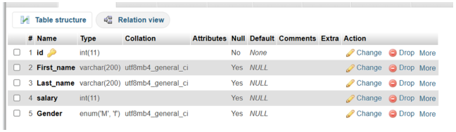

*Figure III.1: employee table structure*

2. Mysql Add Column Examples:

```sql
ALTER TABLE employees
ADD email VARCHAR (100);
```

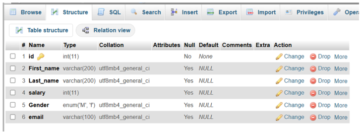

*Figure III.2: After adding email*

3. DROP an attributes/column from table persons:

```sql
ALTER TABLE employees
DROP email;
```

<!-- Original PDF page 28; printed lab page 22 -->

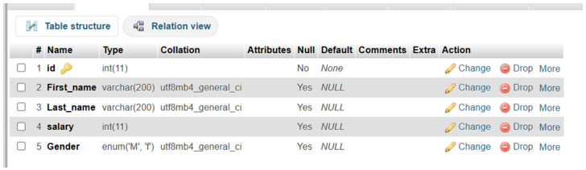

*Figure III.3: After deleting email attribute*

4. Add an attributes/column to table employees in any position of column:

```sql
ALTER TABLE employees
ADD email VARCHAR (100) AFTER Last_name;
```


*Figure III.4: Adding email attribute after last name*

5. Add an attributes/column to table employees in the first column:

```sql
ALTER TABLE employees
ADD COLUMN Gender Char(1) FIRST;
```

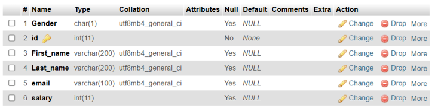

*Figure III.5: Added Gender attribute in the first column*

6. Add multiple attributes/column to table employees in single command:

<!-- Original PDF page 29; printed lab page 23 -->

```sql
ALTER TABLE employees
ADD COLUMN Bank_account INT,
ADD COLUMN Entry_Date DATE;
```

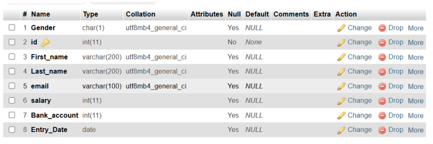

*Figure III.6: Added multiple column to the employees table*

7. DROP multiple attributes/column from table employees:

```sql
ALTER TABLE employees
DROP COLUMN Gender,
DROP COLUMN Email;
```

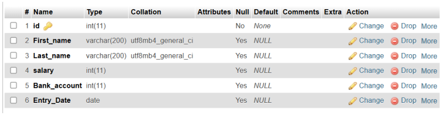

*Figure III.7: Deleted email and Gender attributes from employees table*

8. Changing columns constraints using MySQL ALTER TABLE statement:

```sql
ALTER TABLE employees
CHANGE salary salary varchar(50) NOT NULL;
```

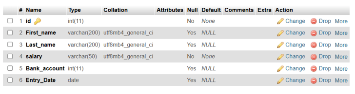

*Figure III.8: changed the constraint of salary column*

<!-- Original PDF page 30; printed lab page 24 -->

9. Changing columns name using MySQL ALTER TABLE statement:

-Syntax:

```sql
ALTER TABLE table_name
CHANGE Old_Column_Name New_Column_Name Datatype If any Constraint;

ALTER TABLE employees
CHANGE First_name F_name varchar(100) NOT NULL;
```

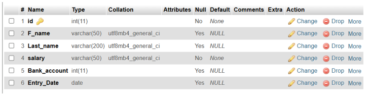

*Figure III.9: changed First_name to f_name*

10. Adding Constraints in a column using ALTER

```sql
ALTER TABLE employees
ADD CONSTRAINTS Unique_salary UNIQUE(salary);
```

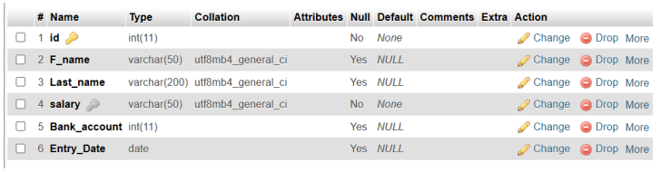

*Figure III.10: Added unique constraint in salary column*

11. Droping a constraint from a column

```sql
ALTER TABLE employees
DROP INDEX Unique_salary;
```

12. Modify Data-type using ALTER

```sql
ALTER TABLE employees
MODIFY salary BIGINT;
```

<!-- Original PDF page 31; printed lab page 25 -->


*Figure III.11: Dropped the constraint*

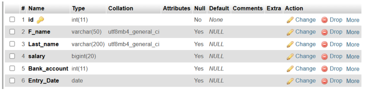

*Figure III.12: Modified the data-type of salary attribute*

13. Foreign key using ALTER

Create a departments table:

```sql
CREATE TABLE departments(
```

dept_id iNT PRIMARY KEY,

dept_name varchar(100) );

```sql
ALTER TABLE employees
ADD dept_id INT;

ALTER TABLE employees
ADD CONSTRAINT fk_dept
FOREIGN KEY (dept_id) REFERENCES departments(dept_id);
```


*Figure III.13: employees table*

<!-- Original PDF page 32; printed lab page 26 -->

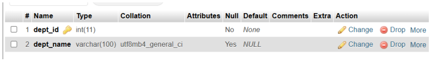

*Figure III.14: departments table*

14. Add Primary key using ALTER

```sql
ALTER TABLE employees
ADD PRIMARY KEY(id);
```

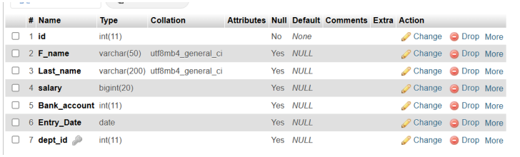

*Figure III.15: Before adding Primary key*

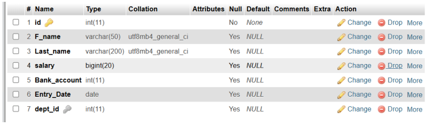

*Figure III.16: After adding Primary Key*

15. Command for showing all constraints of a table

```sql
SELECT CONSTRAINT_NAME, CONSTRAINT_TYPE
FROM information_schema.TABLE_CONSTRAINTS
WHERE TABLE_NAME = ’employees’;

or,

SHOW CREATE TABLE employees;
```

16. Inserting data into tables using MySQL INSERT statement:(Table showing in Fig 13 and Fig 14

First insert into the departments table of fig-14

<!-- Original PDF page 33; printed lab page 27 -->

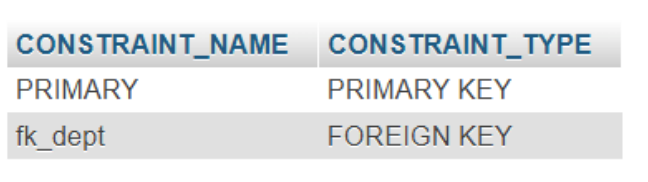

*Figure III.17: All Constraints of employees table*

```sql
INSERT INTO department (dept_id, dept_name) VALUES
(1, 'Human Resources'),
(2, 'Finance'),
(3, 'Engineering'),
(4, 'Marketing'),
(5, 'Sales');
```

Now insert into the employees table of fig-13

```sql
INSERT INTO employees (id, F_name, Last_name, salary, Bank_account,
Entry_Date, dept_id) VALUES
(1, 'John',
'Smith',
55000, 123456789, '2022-01-15', 1),
(2, 'Jane',
'Doe',
72000, 987654321, '2021-06-20', 2),
(3, 'Alice',
'Johnson', 90000, 112233445, '2020-03-10', 3),
(4, 'Bob',
'Williams', 48000, 556677889, '2023-07-01', 4),
(5, 'Charlie', 'Brown',
61000, 334455667, '2019-11-25', 5),
(6, 'Diana',
'Prince',
85000, 778899001, '2022-09-14', 3),
(7, 'Ethan',
'Hunt',
53000, 223344556, '2023-02-28', 2);
```

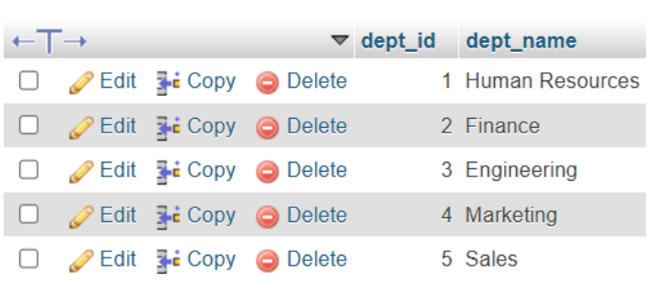

*Figure III.18: departments table*

<!-- Original PDF page 34; printed lab page 28 -->

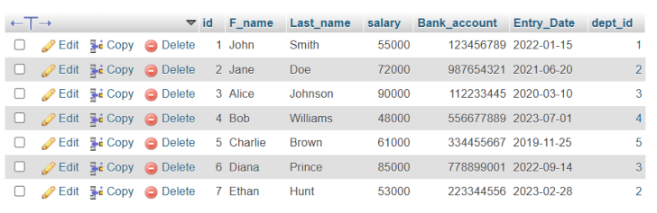

*Figure III.19: employees table*

17. Find all records from employees:

```sql
SELECT * FROM employees;
```

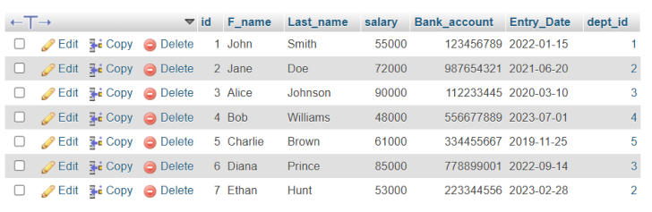

*Figure III.20: employees table*

18. MySQL copy table examples:

```sql
CREATE TABLE IF NOT EXISTS employees_info_Backup
SELECT * FROM employees;
```

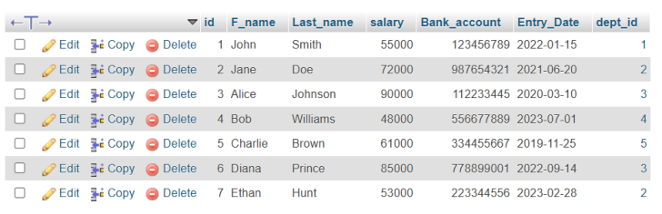

*Figure III.21: employees_backup_info table*

<!-- Original PDF page 35; printed lab page 29 -->

19. Updating data using MySQL UPDATE statement o UPDATE a column single value:

```sql
UPDATE employees
SET salary=300000
WHERE id=1;
```

o UPDATE a multiple columns single value:

```sql
UPDATE employees
SET F_Name= ’Barry’, Last_Name=’Alen’
WHERE id=2;
```

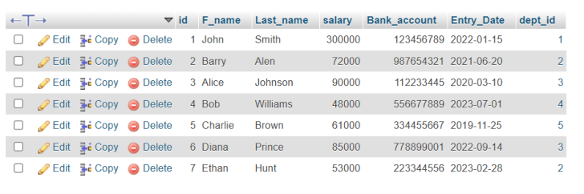

*Figure III.22: updated employees table*

## 3.4 Discussion & Conclusion

Based on the focused objective(s) to understand about the knowledge of ALTER, ADD, DROP,CHANGE and UPDATE commands a real life object. And the lab exercise made students more confident towards the fulfilment of the objectives(s).

## 3.5 Lab Task (Please implement yourself and show the output to the instructor)

1. employee (e_name, street, city) company (company_name, branch, city) works (w_name, e_name, company_name, salary)

Consider the employee database, give an expression in SQL for each of the following queries.

<!-- Original PDF page 36; printed lab page 30 -->

a. Create this database and Insert information into employee, company and works (at least 2).

b. Add emp_id and entry_date columns in employee relation.

c. Modify column name city(employee)=address.

d. Add column email in table employee. Update email and address columns information.

e. Create a backup relation for works and employee table.

f. Add key constraint (FOREIGN KEY) in company_name field to the works table.

## 3.6 Lab Exercise (Submit as a report)

1. Create This following Bank Database. branch (branch_name, branch_city, assets) customer (customer_id,customer_name, customer_city) account (account_number, branch_name, balance) loan (loan_number, branch_name, amount) depositor (customer_name, account_number) borrower (customer_name, loan_number)

- Tables are placed according to parent and child relationship

- Create above table considering PRIMARY KEY and FOREIGN KEY.

- Data type for amount and balance are INTEGER otherwise VARCHAR(13).

- Insert records into your table.

- Add column Email in customer relation and Set the value.

- Change the name of column name customer_city and modify the data type of column assets

### Academic Integrity Policy

Copying from the internet, classmates, seniors, or any other unauthorized source is strictly prohibited. Full marks may be deducted if plagiarism, copied work, or academic dishonesty is detected.

Students must complete the lab task, implementation, output analysis, and lab report independently and submit authentic work for evaluation.
