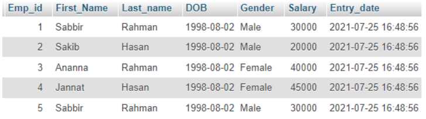

# Lab 04 — Querying and Filtering Data in MySQL Table

**Source-faithful Markdown transcription:** Original PDF pages 37–40.  
**For live SQL:** [Runnable lab guide](../../labs/lab-04/README.md) · [Original complete PDF transcription](../../COMPLETE_SOURCE_MANUAL.md)

<!-- Original PDF page 37; printed lab page 31 -->

## 4.1 Objective(s)

- To gather knowledge about Querying and filtering data in MySQL table.

- To implement distinct and filtering data commands in MySQL table.

## 4.2 Problem analysis

The SQL DISTINCT keyword is used with the SELECT statement to eliminate all the duplicate records and fetching only unique records.There may be a situation when you have multiple duplicate records in a table. While fetching such records, it makes more sense to fetch only those unique records instead of fetching duplicate records. The SQL WHERE clause is used to specify a condition while fetching the data from a single table or by joining with multiple tables. If the given condition is satisfied, then only it returns a specific value from the table.

### 4.2.1 Filtering and Fetching Data in MySql Table

The SQL SELECT statement returns a result set of records, from one or more tables. A SE- LECT statement retrieves zero or more rows from one or more database tables or database views The SELECT DISTINCT statement is used to return only distinct values. Inside a table, a column often contains many duplicate values; and sometimes you only want to list the different (distinct) values.

- SELECT Syntax:

```sql
SELECT column1, column2, ... FROM table_name;
```

- SELECT DISTINCT Syntax:

```sql
SELECT DISTINCT column1, column2, ... FROM table_name;
```

- The SQL WHERE Clause syntax:

```sql
SELECT column1, column2, ... FROM table_name WHERE condition;
```

## 4.3 Procedure (Implementation in MySQL)

1. Using MySQL SELECT statement to query data(Create a employees table):

<!-- Original PDF page 38; printed lab page 32 -->

```sql
CREATE TABLE employees(
Emp_id int(11) NOT NULL,
First_Name varchar(255) NOT NULL,
Last_name varchar(55) NOT NULL,
DOB date NOT NULL,
Gender enum(‘Male’,‘Female’) DEFAULT NULL,
Salary int NOT NULL,
Entry_date datetime NOT NULL DEFAULT current_timestamp(),
PRIMARY KEY(Emp_id)
);
```

2. Insert Multiple VALUES at a time:

```sql
INSERT INTO employees (Emp_id, First_Name, Last_name,DOB, Gender, Salary)
VALUES (1, ‘Sabbir’, ‘Rahman’,‘1998-08-02’, ‘Male’, 30000),
(2, ‘Sakib’, ‘Hasan’,‘1998-08-02’, ‘Male’, 20000),
(3, ‘Ananna’, ‘Rahman’,‘1998-08-02’, ‘Female’, 40000),
(4, ‘Jannat’, ‘Hasan’,‘1998-08-02’, ‘Female’, 45000),
(5, ‘Sabbir ’, ‘Hossain’,‘1998-07-02’, ‘Male’, 25000);
```

3. View data from table employees: SELECT * FROM employees;



*Figure IV.1: Employees Table Information*

4. Eliminating duplicate rows with DISTINCT Operator:

```sql
SELECT DISTINCT First_Name, Last_name FROM employees;
```

5. Filtering rows using MySQL WHERE:

- MySQL WHERE Clause for INETEGER type value :

```sql
SELECT First_Name, Last_name, Salary FROM employees WHERE Emp_id=2 ;
```

- MySQL WHERE Clause for String type value:

<!-- Original PDF page 39; printed lab page 33 -->

```sql
SELECT Emp_id, Last_name, DOB, Salary,Entry_date
FROM employees
WHERE First_Name=’Sabbir’;
```

6. Using comparison operators (<,>, <=,>=, <>):

Example:1

```sql
SELECT Emp_id, First_Name, Last_name
FROM employees
WHERE Salary>=40000;
```

#### Example 2:

```sql
SELECT Emp_id, First_Name, Last_name
FROM employees
WHERE Salary <> 30000; (<> Means Not Equal to);
```

## 4.4 Discussion & Conclusion

Based on the focused objective(s) to understand about the knowledge of SELECT,WHERE and DISTINCT commands. The additional lab exercise made me more confident towards the fulfilment of the objectives(s)

## 4.5 Lab Task (Please implement yourself and show the output to the instructor)

1. Insert multiple values at a time for your existing database table (Do it for all table).

2. Remove duplicate values from all table.

3. View the data from any two tables.

4. Implement WHERE clause and search the specific information from existing tables.

5. Implement comparison operators using WHERE clause.

## 4.6 Lab Exercise (Submit as a report)

1. Input multiple data in any existing database table from previous lab report.

2. Query with primary key, query with condition, query with comparison operation.

(Note: Implement All Query which have completed in this experiment)

3. Attach with query codes and with output screenshots in the report.

<!-- Original PDF page 40; printed lab page 34 -->

### Academic Integrity Policy

Copying from the internet, classmates, seniors, or any other unauthorized source is strictly prohibited. Full marks may be deducted if plagiarism, copied work, or academic dishonesty is detected.

Students must complete the lab task, implementation, output analysis, and lab report independently and submit authentic work for evaluation.
