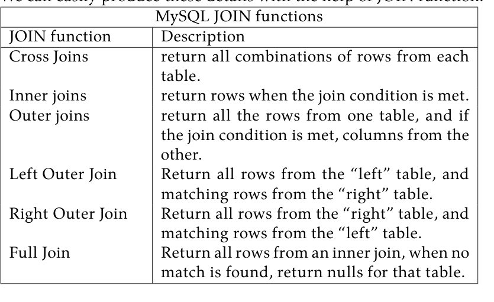
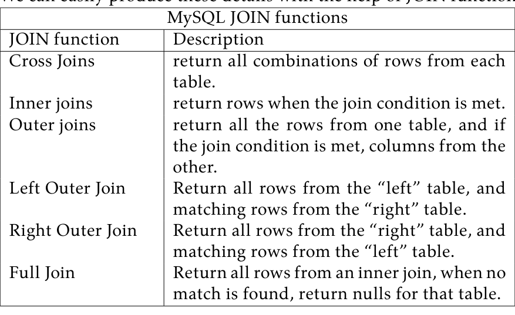
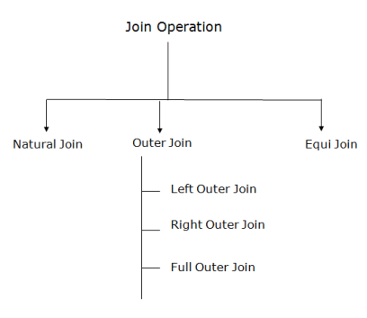
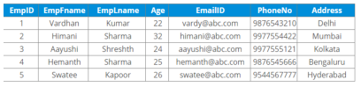
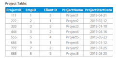
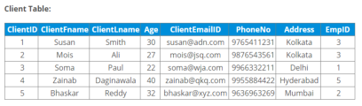
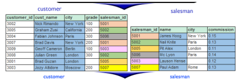
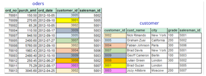
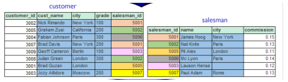

# Lab 07 — Implementation of Relational Databases (Join Function)

**Source-faithful Markdown transcription:** Original PDF pages 54–60.  
**For live SQL:** [Runnable lab guide](../../labs/lab-07/README.md) · [Original complete PDF transcription](../../COMPLETE_SOURCE_MANUAL.md)

<!-- Original PDF page 54; printed lab page 48 -->

## 7.1 Objective(s)

- We learned about the need to normalize to make it easier to maintain the data.Though this makes it easier to maintain and update the data, it makes it very inconvenient to view and report information.

- Through the use of database joins we can stitch the data back together to make it easy for a person to use and understand.

## 7.2 Problem analysis

Before we begin let’s look into why you have to combine data in the first place. SQLite and other databases such as Microsoft SQL server and MySQL are relational databases. These types of databases make it really easy to create tables of data and a facility to relate (join or combine) the data together. As requirements are cast into table designs, they are laid up against some best practices to minimize data quality issues. This process is called normalization and it helps each table achieve singular meaning and purpose. For instance, if I had a table containing all the students and their classes, then wanted to change a student’s name, I would have to change it multiple times, once for each class the student enrolled in. We can easily produce these details with the help of JOIN function.

**MySQL JOIN functions**

| JOIN function | Description |
| --- | --- |
| Cross Joins | return all combinations of rows from each table. |
| Inner joins | return rows when the join condition is met. |
| Outer joins | return all the rows from one table, and if the join condition is met, columns from the other. |
| Left Outer Join | Return all rows from the “left” table, and matching rows from the “right” table. |
| Right Outer Join | Return all rows from the “right” table, and matching rows from the “left” table. |
| Full Join | Return all rows from an inner join, when no match is found, return nulls for that table. |





<!-- Original PDF page 55; printed lab page 49 -->



*Figure VII.1: Classification of Join Operations*

### 7.2.1 Join Function

- Cross Joins: Cross joins return all combinations of rows from each table. So, if you’re looking to find all combinations of size and color, you would use a cross join. Join conditions are not used with cross joins.

- Inner joins: Inner joins return rows when the join condition is met. This is the most common Database join. A common scenario is to join the primary key of once table to the foreign key of another.

This is used to perform “lookup,” such are to get the employee’s name from their employeeID.

- Outer joins: Outer joins return all the rows from one table, and if the join condition is met, columns from the other. They differ from an inner join, since an inner join wouldn’t include the non-matching rows in the final result.

Consider an order entry system. There may be cases where we want to list all employees regardless of whether they placed a customer order. In this case an outer join comes in handy.

When using an outer join all employees, even those not matching orders, are included in the result.

## 7.3 Procedure (Implementation in MySQL)

1. Create a Data

- Create a table student:

<!-- Original PDF page 56; printed lab page 50 -->

```sql
CREATE TABLE student(
s_id int(11) NOT NULL AUTO_INCREMENT,
FirstName varchar(255) NOT NULL,
LastName varchar(255 ) NOT NULL,
Address varchar(255 ) NOT NULL,
dept_name enum( ‘CSE’, ‘EEE’ , ‘ TEX’ ) DEFAULT NULL,
AdmissionDate datetime NOT NULL DEFAULT current_timestamp(),
PRIMARY KEY(S_ID)
);
```

- Insert values into student table:

```sql
INSERT INTO student (s_id, FirstName, LastName, Address, dept_name)
VALUES(142002015, ‘Zeseya’ , ‘Sharmin’ , ‘Dhaka’ , ‘CSE’),
(142002001, ‘Sakib’ , ‘Hasan’ , ‘Natore’ , ‘CSE’),
(162002002, ‘Asef’, ‘Tajwar’ , ‘Rangpur’ , ‘EEE’),
(162002003, ‘Maruf’, ‘Hasan’, ‘Barisal’, ‘EEE’),
(172082002, ‘Ashek’ , ‘Farabi’, ‘Gazipur’ ,‘TEX’),
(173002003, ‘Ismile’ , ‘Hasan’ , ‘Barisal’ , ‘TEX’);
```

- Create a table department:

```sql
CREATE TABLE department(
dept_id int(11) NOT NULLAUTO_INCREMENT,
dept_name enum( ‘CSE’, ‘EEE’, ‘TEX’) DEFAULT NULL,
dept_location varchar(255 ) NOT NULL,
PRIMARY KEY(dept_id)
);
```

- Insert values into department table:

```sql
INSERT INTO department (dept_id, dept_name, dept_location)
VALUES(101, ‘CSE’, ‘Building-2’),
(102, ‘EEE’, ‘Building-2’),
(103, ‘TEX’, ‘Building-1’);
```

- Create another table course_registrstion:

```sql
CREATE TABLE course_registration(
reg_serial int(11) NOT NULL AUTO_INCREMENT,
course_code varchar(255) NOT NULL,
course_title varchar(255 ) NOT NULL,
dept_id int(11 ) NOT NULL,
s_id varchar(255 ) NOT NULL,
PRIMARY KEY(reg_serial)
);
```

- Insert values into course_registration table:

<!-- Original PDF page 57; printed lab page 51 -->

```sql
INSERT INTO course_registration(course_code,course_title,dept_id,s_id)
VALUES(‘CSE 311’, ‘Computer Networks’,101,142002015),
(‘CSE 311’, ‘Computer Networks’,101,142002001),
(‘EEE 301’,‘Electrical Circuit’,201,162002002),
(‘TEX 201’, ‘Aparales’, 301,172002002),
(‘CSE 312’, ‘Computer Networks Lab’,101,142002015),
(‘CSE 207’, ‘Algorithm’,101,142002001);
```

- join_table:

```sql
SELECT s_id
FROM student
UNION
SELECT s_id
FROM course_registration;
```

- join_table:

```sql
SELECT s_id
FROM student
UNION ALL
SELECT s_id
FROM course_registration;
```

2. Join, Inner Join, Left Join, Right Join, Where, Group by:

- INNER JOIN example

```sql
SELECT student.s_id, student.FirstName, student.LastName
FROM student
INNER JOIN course_registration ON student.s_id = course_registration.s_id;
```

- INNER JOIN with WHERE clause

```sql
SELECT student.s_id, student.FirstName, student.LastName
FROM student
INNER JOIN course_registration ON student.s_id = course_registration.s_id
WHERE course_registration.s_id = 142002015;
```

- Multiple Inner Join

```sql
SELECT
student.s_id,
student.FirstName,
student.dept_name,
depart-
ment.dept_id, course_registration.course_code
FROM student
INNER JOIN department ON student.dept_name = department.dept_name
INNER
JOIN
course_registration
ON
department.dept_id
=
course_registration.dept_id;
```

- INNER JOIN using GROUP BY for eliminating duplicate records.

<!-- Original PDF page 58; printed lab page 52 -->

```sql
SELECT
student.s_id,
student.FirstName,
student.dept_name,
depart-
ment.dept_id, course_registration.course_code
FROM student
INNER JOIN department ON student.dept_name = department.dept_name
INNER
JOIN
course_registration
ON
department.dept_id
=
course_registration.dept_id
GROUP BY s_id;
```

## 7.4 Discussion & Conclusion

In the following experiment we dig into the various join types, explore Database joins involving more than one table, and further explain join conditions, especially what can be done with non-equijoin conditions.

## 7.5 Lab Task (Please implement yourself and show the output to the instructor)

- Task-1:



*Figure VII.2: Project Table Information*



*Figure VII.3: Project Table Information*



*Figure VII.4: Client Table Information*

1. Create these tables in a company database

2. Write a SQL query for all the JOIN operation

<!-- Original PDF page 59; printed lab page 53 -->

3. Location count

- Task 2:



*Figure VII.5: Customer and Salesman table*

## 7.6 Lab Exercise (Submit as a report)



*Figure VII.6: Customer and Salesman table*

1. Write a SQL statement to find the details of a order i.e. order number, order date, amount of order, which customer gives the order and which salesman works for that customer and commission rate he gets for an order.



*Figure VII.7: Customer and Salesman table*

2. Write a SQL statement to make a list in ascending order for the customer who works either through a salesman or by own.

3. Attach with query codes and with output screenshots in the report.

<!-- Original PDF page 60; printed lab page 54 -->

### Academic Integrity Policy

Copying from the internet, classmates, seniors, or any other unauthorized source is strictly prohibited. Full marks may be deducted if plagiarism, copied work, or academic dishonesty is detected.

Students must complete the lab task, implementation, output analysis, and lab report independently and submit authentic work for evaluation.
