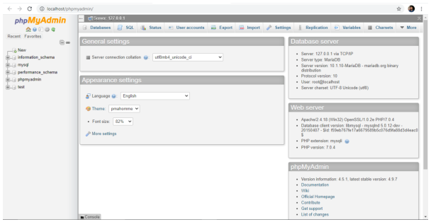
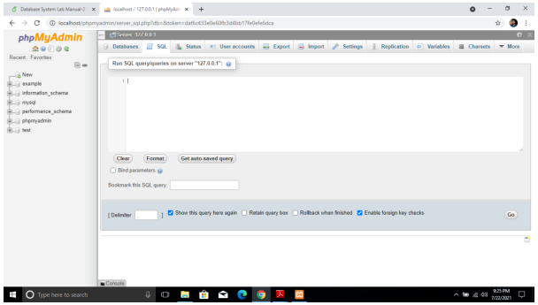
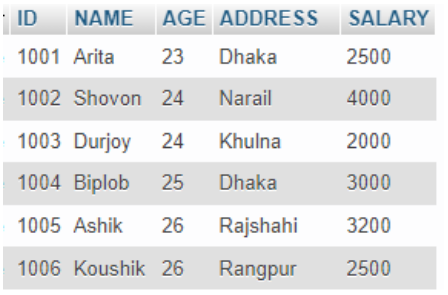
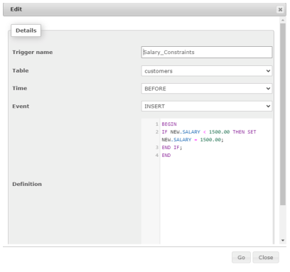
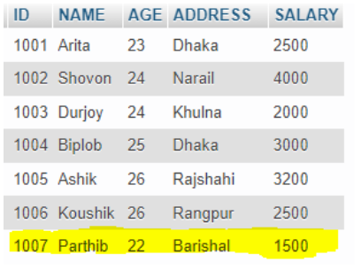

# Lab 08 — Implementation of Databases Triggers

**Source-faithful Markdown transcription:** Original PDF pages 61–67.  
**For live SQL:** [Runnable lab guide](../../labs/lab-08/README.md) · [Original complete PDF transcription](../../COMPLETE_SOURCE_MANUAL.md)

<!-- Original PDF page 61; printed lab page 55 -->

## 8.1 Objective(s)

- To Explain the Structure of a Trigger

- To Create a Trigger

## 8.2 Problem analysis

### 8.2.1 Introduction to Trigger

In this lab, we will discuss Trigger, which is one of the important topics in PL/SQL. Triggers are stored programs, which are automatically executed or fired when some events occur. Triggers are, in fact, written to be executed in response to any of the following events −

- A database manipulation (DML) statement (DELETE, INSERT, or UPDATE)

- A database definition (DDL) statement (CREATE, ALTER, or DROP).

- A database operation (SERVERERROR, LOGON, LOGOFF, STARTUP, or SHUTDOWN).

Triggers can be defined on the table, view, schema, or database with which the event is associated.

### 8.2.2 Benefits of Trigger

- Generating some derived column values automatically

- Enforcing referential integrity

- Event logging and storing information on table access

- Auditing

- Synchronous replication of tables

- Imposing security authorizations

- Preventing invalid transactions

<!-- Original PDF page 62; printed lab page 56 -->

### 8.2.3 Syntax of Trigger

```sql
CREATE [OR REPLACE ] TRIGGER trigger_name
BEFORE | AFTER | INSTEAD OF
INSERT [OR] | UPDATE [OR] | DELETE
```

[OF col_name] ON table_name REFERENCING OLD AS o NEW AS n

FOR EACH ROW

WHEN (condition) DECLARE Declaration-statements BEGIN Executable-statements EXCEPTION Exception-handling-statements END;

Explanation

- CREATE [OR REPLACE] TRIGGER trigger_name −Creates or replaces an existing trigger with the trigger_name.

- BEFORE | AFTER | INSTEAD OF −This specifies when the trigger will be executed. The INSTEAD OF clause is used for creating trigger on a view.

- INSERT [OR] | UPDATE [OR] | DELETE −This specifies the DML operation.

- OF col_name −This specifies the column name that will be updated.

- ON table_name −This specifies the name of the table associated with the trigger.

- REFERENCING OLD AS o NEW AS n −This allows you to refer new and old values for various DML statements, such as INSERT, UPDATE, and DELETE.

- FOR EACH ROW −This specifies a row-level trigger, i.e., the trigger will be executed for each row being affected. Otherwise the trigger will execute just once when the SQL statement is executed, which is called a table level trigger.

- WHEN (condition) −This provides a condition for rows for which the trigger would fire. This clause is valid only for row-level triggers.

## 8.3 Procedure

We have practiced with the XAMPP in the previous labs, we can assume that the system is ready to use. First, we have to launch the XAMPP. Then, we have to press the Start button of Apache and MySQL module. After that, we have to press the Admin button of the MySQL module. As a result, a tab will be opened on your default web browser like figure VIII.1. Or, we can open a tab in the web browser with the link as

<!-- Original PDF page 63; printed lab page 57 -->

http://localhost/phpmyadmin/. Then, we have to select the SQL option. An editor space will be opened like figure VIII.2 to write the required commands. Now, it is ready for implementation.



*Figure VIII.1: Session in Localhost*



*Figure VIII.2: Space for Editing Commands*

## 8.4 Implementations

### 8.4.1 Database Creation

To create a database, we have to write command like ” CREATE DATABASE [Database_Name]”. Suppose, we have to create a database named ”lab9”. We have to write the command as below:

```sql
CREATE DATABASE lab9;
```

A database named ”lab9” is created in your local-host.

<!-- Original PDF page 64; printed lab page 58 -->

### 8.4.2 Database Use

To use the ”lab9” database, we have to write the command in SQL editor space as below:

USE lab9

### 8.4.3 Creating a Table

Now, to create a table named ”customers” in database lab9 with attributes like ID (int), NAME (varchar), AGE (int), ADDRESS (varchar), SALARY (double) where ID would be the Primary key, we have to write command in SQL editor space like below:

```sql
CREATE TABLE ‘lab9‘.‘customers‘ ( ‘ID‘ INT NOT NULL ,
‘NAME‘ VARCHAR(30) NOT NULL ,
‘AGE‘ INT NOT NULL ,
‘ADDRESS‘ VARCHAR(50) NOT NULL ,
‘SALARY‘ DOUBLE NOT NULL ,
PRIMARY KEY (‘ID‘))
```

Then, we have to insert data in customer table. Suppose, we have inserted data like figure VIII.3.



*Figure VIII.3: Data Items in customers Table*

### 8.4.4 Creating Trigger

Suppose, we want to impose a constraints on customers table such that SALARY of a customer would not less than 1500.00. If it is input less 1500.00, it will be set 1500.00. The command is like VIII.4 in the Trigger option of the table. We can also implement this trigger in SQL editor and the instruction is like these:

<!-- Original PDF page 65; printed lab page 59 -->



*Figure VIII.4: Creating Trigger on Customer Table*

```sql
CREATE TRIGGER ‘Salary_Constraints‘
BEFORE INSERT ON ‘customers‘
FOR EACH ROW
BEGIN IF NEW.SALARY < 1500.00 THEN SET NEW.SALARY = 1500.00;
END IF;
END
```

### 8.4.5 Checking Trigger

Now, we want to check the trigger whether it works or not. For this, we will try to insert an item with SALARY = 1200.00. The command is as below:

```sql
INSERT INTO ‘customers‘ (‘ID‘, ‘NAME‘, ‘AGE‘, ‘ADDRESS‘, ‘SALARY‘) VALUES (’1007’,
’Parthib’, ’22’, ’Barishal’, ’1200.0’);
```

After this insertion, customers table is like figure VIII.5.

## 8.5 Discussion & Conclusion

Though,we have input SALARY =1200.0 for ID=1007, the SALARY for ID=1007 is stored 1500.00. The reason behind this phenomena is the trigger Salary_Constraints on customers table. Every time, SALARY value will be 1500, it is tried to input SALARY less than 1500.00.

<!-- Original PDF page 66; printed lab page 60 -->



*Figure VIII.5: Data Items in customers Table*

## 8.6 Lab Task (Please implement yourself and show the output to the instructor)

1. Create a Table named ’employee’ with attribute EmpID(int), EmpName(varchar), BasicSalary(double), StartDate(date), NoofPub(int).

2. Insert around 10 items.

3. Create a trigger to update the BasicSalary.

### 8.6.1 Problem analysis

1. You have to create a table according instruction given.

2. You have to insert around ten tuples in the table.

3. You have to create a trigger to update the BasicSalary. by 20% if job duration is more than one year and NoofPub is more than four, 10% if job duration is more than one year and NoofPub is two or three , 5% if job duration is more than one year and Noof- Pub is one and 0% for no publication.

## 8.7 Lab Exercise (Submit as a report)

- Create a Database with two tables named StudentInfo (StudentID, StudentName, Address, Email), WaiverInfo (StudentID, StudentName, CGPA, WaiverPercentage).

- Insert Data in each table.

- Create a trigger to Update the WaiverPercentage according to the CGPA.[N.B. Follow the waiver policy of GUB]

## 8.8 Reference

- https://www.javatpoint.com/mysql-create-trigger

<!-- Original PDF page 67; printed lab page 61 -->

- https://www.tutorialspoint.com/plsql/plsql_triggers.htm

### Academic Integrity Policy

Copying from the internet, classmates, seniors, or any other unauthorized source is strictly prohibited. Full marks may be deducted if plagiarism, copied work, or academic dishonesty is detected.

Students must complete the lab task, implementation, output analysis, and lab report independently and submit authentic work for evaluation.
