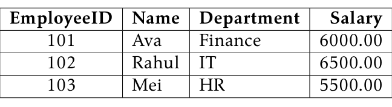
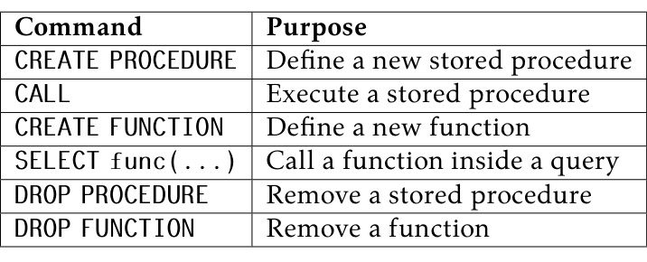
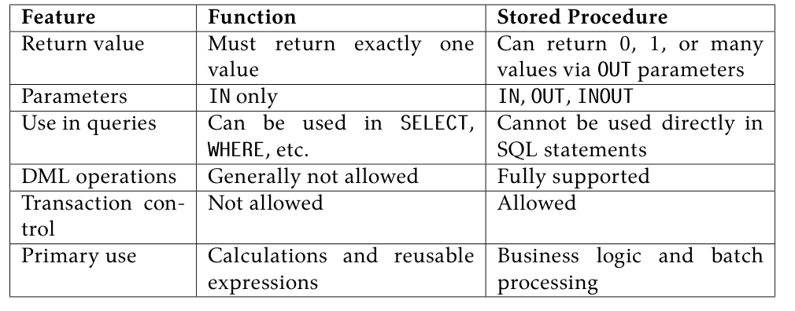

<a id="lab-10"></a>

# Lab 10 — Implementation of Functions and Stored Procedures in MySQL

> **ORIGINAL PDF TRANSCRIPTION BELOW:** The source paragraphs, original tables, exercises, code fragments and image references retain their original teaching sequence. Text labeled **Instructor-added** is new, not from the PDF.

<!-- Original PDF page 73; printed lab page 67 -->

## 10.1 Objective(s)

- To understand the concept of Stored Procedures in MySQL.

- To understand the concept of Functions in MySQL.

- To implement a Stored Procedure using IN and OUT parameters.

- To implement a Function that returns a computed value.

- To distinguish between Functions and Stored Procedures.

## 10.2 Problem Analysis

In database systems, we often need to perform the same set of SQL operations repeatedly. Writing the same queries again and again in application code is inefficient and error-prone. MySQL provides two powerful tools to store and reuse SQL logic inside the database itself: Stored Procedures and Functions. A Stored Procedure is a named collection of SQL statements that is saved in the database and can be called (executed) whenever needed. It can accept input values, perform complex operations such as INSERT, UPDATE, or DELETE, and return output values through OUT parameters. A Function is similar to a procedure, but it must always return exactly one value and is designed to be used directly inside SQL queries, much like built-in MySQL functions such as NOW() or COUNT(). Both procedures and functions help reduce code duplication, improve maintainability, and move business logic closer to the data. In this lab, we will create a simple Employees table, then write and execute both a stored procedure and a function on it.

## 10.3 Procedure

First, we open the database system (via phpMyAdmin or the MySQL command line) and prepare it to accept our instructions. Then we create a database and a table, insert sample data, and implement a stored procedure and a function. Finally, we call each one and observe the output.

## 10.4 Implementations

### 10.4.1 Database and Table Setup

<!-- Original PDF page 74; printed lab page 68 -->

#### Database Creation

To create a database named lab_fp, write:

```sql
CREATE DATABASE lab_fp;
```

#### Database Use

To select and use the newly created database:

```sql
USE lab_fp;
```

#### Table Creation

Create a table named Employees with four attributes: EmployeeID (int, primary key), Name (varchar), Department (varchar), and Salary (decimal):

```sql
CREATE TABLE Employees (

EmployeeID INT
NOT NULL,
Name
VARCHAR(100)
NOT NULL,
Department VARCHAR(50)
NOT NULL,
Salary
DECIMAL(10,2) NOT NULL,
PRIMARY KEY (EmployeeID)
);
```

#### Data Insertion

Insert three sample employee records into the Employees table:

```sql
INSERT INTO Employees (EmployeeID, Name, Department, Salary)
VALUES (101, 'Ava',
'Finance', 6000.00),
(102, 'Rahul', 'IT',
6500.00),
(103, 'Mei',
'HR',
5500.00);
```

After insertion, the Employees table contains the following records:

```text
EmployeeID
Name
Department
Salary
101
Ava
Finance
6000.00
102
Rahul
IT
6500.00
103
Mei
HR
5500.00
```



<!-- Original PDF page 75; printed lab page 69 -->


### Instructor-added live example — Create student records for routines

> **ADDED TEACHING EXAMPLE — not text from the PDF.** Copy the **entire** code block into the phpMyAdmin SQL tab and click **Go**. This demonstration sets up its own practice objects, so it does not need any previous lab. Re-running it resets only the indicated `demo_*` tables.

```sql
CREATE DATABASE IF NOT EXISTS cse210_examples_lab10;
USE cse210_examples_lab10;
DROP TABLE IF EXISTS demo_scores;
CREATE TABLE demo_scores(id INT PRIMARY KEY,name VARCHAR(40),marks DECIMAL(5,2),grade VARCHAR(2));
INSERT INTO demo_scores VALUES(1,'Asha',83,'A'),(2,'Rafi',46,'F'),(3,'Mitu',67,'B');
SELECT * FROM demo_scores ORDER BY id;
```

**Expected output / explanation:** 3 records; source chapter demonstrates a similar Employees table.

### 10.4.2 Implementing a Stored Procedure

A stored procedure is created using the CREATE PROCEDURE statement. The general syntax is:

```sql
CREATE PROCEDURE procedure_name (parameter_list)
BEGIN

-- SQL statements
END;
```

Parameters can be of three kinds:

- IN — the caller passes a value into the procedure (read-only inside).

- OUT — the procedure sends a value back to the caller.

- INOUT — the parameter is both passed in and returned.

#### Example: Get Employee Name by ID

The following procedure accepts an employee ID as input and returns the corresponding employee name as output:

```sql
DELIMITER //

CREATE PROCEDURE GetEmployeeName (

IN p_emp_id INT,
OUT p_name
VARCHAR(100)
)
BEGIN

SELECT Name INTO p_name
FROM
Employees
WHERE EmployeeID = p_emp_id;
END //

DELIMITER ;
```

N.B.: The DELIMITER command is used to temporarily change the statement terminator from ; to //, so that MySQL does not treat the semicolons inside the procedure body as the end of the CREATE statement. After the procedure is defined, the delimiter is reset to ;.

#### Calling the Procedure

To execute the procedure and retrieve the name of employee number 102:

```sql
CALL GetEmployeeName(102, @emp_name);
SELECT @emp_name;
```

<!-- Original PDF page 76; printed lab page 70 -->

The variable @emp_name stores the OUT result. The output will be:

@emp_name Rahul


### Instructor-added live example — Stored procedure with IN/OUT parameters

> **ADDED TEACHING EXAMPLE — not text from the PDF.** Copy the **entire** code block into the phpMyAdmin SQL tab and click **Go**. This demonstration sets up its own practice objects, so it does not need any previous lab. Re-running it resets only the indicated `demo_*` tables.

```sql
CREATE DATABASE IF NOT EXISTS cse210_examples_lab10;
USE cse210_examples_lab10;
DROP PROCEDURE IF EXISTS demo_get_grade;
DROP TABLE IF EXISTS demo_scores;
CREATE TABLE demo_scores(id INT PRIMARY KEY, name VARCHAR(40),grade VARCHAR(2));
INSERT INTO demo_scores VALUES (1,'Asha','A'),(2,'Rafi','B');
CREATE PROCEDURE demo_get_grade(IN p_id INT, OUT p_grade VARCHAR(2))
SELECT grade INTO p_grade FROM demo_scores WHERE id=p_id;
CALL demo_get_grade(1,@student_grade);
SELECT @student_grade AS student_grade;
```

**Expected output / explanation:** student_grade = A. One-statement procedure body requires no DELIMITER change.

### 10.4.3 Implementing a Function

A function is created using the CREATE FUNCTION statement. Unlike a procedure, a function must always return a single value using the RETURN statement. The general syntax is:

```sql
CREATE FUNCTION function_name (parameter_list)
RETURNS data_type
DETERMINISTIC
BEGIN

-- SQL statements
RETURN value;
END;
```

The keyword DETERMINISTIC tells MySQL that the function always produces the same output for the same input, which helps the optimizer. Functions only allow IN parameters.

#### Example 1: Calculate Annual Salary

The following function takes an employee ID and returns that employee’s annual salary (monthly salary multiplied by 12):

```sql
DELIMITER //

CREATE FUNCTION GetAnnualSalary (emp_id INT)
RETURNS DECIMAL(12,2)
DETERMINISTIC
BEGIN

DECLARE annual DECIMAL(12,2);
SELECT Salary * 12 INTO annual
FROM
Employees
WHERE EmployeeID = emp_id;
RETURN annual;
END //

DELIMITER ;
```

<!-- Original PDF page 77; printed lab page 71 -->

#### Calling the Function

Functions are called directly inside a SQL query, just like built-in MySQL functions:

```sql
SELECT GetAnnualSalary(101) AS AnnualSalary;
```

The output will be:

AnnualSalary

72000.00

#### Example 2: Calculate Tax on Salary

The following function accepts a salary value directly and returns 10% of it as tax:

```sql
DELIMITER //

CREATE FUNCTION CalculateTax (salary DECIMAL(10,2))
RETURNS DECIMAL(10,2)
DETERMINISTIC
BEGIN

RETURN salary * 0.10; -- 10% tax rate
END //

DELIMITER ;
```

This function can be used directly in a SELECT query to compute tax for every employee:

```sql
SELECT Name, Salary, CalculateTax(Salary) AS Tax
FROM
Employees;
```

The output will be:

Name Salary Tax Ava 6000.00 600.00 Rahul 6500.00 650.00 Mei 5500.00 550.00

<!-- Original PDF page 78; printed lab page 72 -->


### Instructor-added live example — Stored function used inside SELECT

> **ADDED TEACHING EXAMPLE — not text from the PDF.** Copy the **entire** code block into the phpMyAdmin SQL tab and click **Go**. This demonstration sets up its own practice objects, so it does not need any previous lab. Re-running it resets only the indicated `demo_*` tables.

```sql
CREATE DATABASE IF NOT EXISTS cse210_examples_lab10;
USE cse210_examples_lab10;
DROP FUNCTION IF EXISTS demo_pass_fail;
CREATE FUNCTION demo_pass_fail(p_marks DECIMAL(5,2)) RETURNS VARCHAR(4) DETERMINISTIC NO SQL
RETURN IF(p_marks>=50,'Pass','Fail');
SELECT demo_pass_fail(72) AS result_1,demo_pass_fail(38) AS result_2;
```

**Expected output / explanation:** result_1 = Pass; result_2 = Fail.

## 10.5 Input/Output Summary

All implementations in this lab follow the same pattern: SQL statements are written in the phpMyAdmin SQL editor or the MySQL command line, and the results are displayed immediately below. The key commands used are summarised below.

| Command | Purpose |
| --- | --- |
| CREATE PROCEDURE | Define a new stored procedure |
| CALL | Execute a stored procedure |
| CREATE FUNCTION | Define a new function |
| SELECT func(...) | Call a function inside a query |
| DROP PROCEDURE | Remove a stored procedure |
| DROP FUNCTION | Remove a function |



## 10.6 Discussion & Conclusion

In this lab, we created a Stored Procedure and two Functions in MySQL and executed them on an Employees table. A stored procedure is most suitable for performing complex operations that involve multiple SQL statements, transaction control, or returning more than one value. A function is best used when a single computed value needs to be embedded directly inside a SELECT or WHERE clause. The key differences between the two are summarised in Table X.1.

**Table X.1: Comparison of Functions and Stored Procedures**

| Feature | Function | Stored Procedure |
| --- | --- | --- |
| Return value | Must return exactly one value | Can return 0, 1, or many values via OUT parameters |
| Parameters | IN only | IN, OUT, INOUT |
| Use in queries | Can be used in SELECT, WHERE, etc. | Cannot be used directly in SQL statements |
| DML operations | Generally not allowed | Fully supported |
| Transaction control | Not allowed | Allowed |
| Primary use | Calculations and reusable expressions | Business logic and batch processing |



Through this lab we have successfully achieved all stated objectives: creating and calling a stored procedure with IN/OUT parameters, and creating and using functions both for individual lookups and for column-level computation across a result set.

## 10.7 Lab Task (Please implement yourself and show the output to the instructor)

1. Create a database named lab_task.

<!-- Original PDF page 79; printed lab page 73 -->

2. Create a table named Students with attributes: StudentID (int, primary key), Name (varchar), Marks (decimal), Grade (varchar).

3. Insert at least five records into the Students table.

4. Write a stored procedure named GetStudentGrade that accepts a StudentID as IN and returns the corresponding Grade as OUT.

5. Call the procedure for at least two different student IDs and display the results.

6. Write a function named GetPassFail that accepts a Marks value and returns the string 'Pass' if marks ≥50, otherwise returns 'Fail'.

7. Use the function in a SELECT query to display Name, Marks, and Pass/Fail status for all students.

### 10.7.1 Problem Analysis

1. Create the lab_task database using CREATE DATABASE.

2. Create the Students table with appropriate data types and a primary key.

3. Use INSERT INTO to add at least five student records.

4. Write GetStudentGrade as a procedure with one IN and one OUT parameter. Use SELECT ... INTO to fetch the grade.

5. Call the procedure using CALL GetStudentGrade(id, @result); and then SELECT @result;.

6. Write GetPassFail as a function using an IF statement inside the function body to decide the return value.

7. Apply the function in a SELECT query: SELECT Name, Marks, GetPassFail(Marks) AS Status FROM Students;.

## 10.8 Lab Exercise (Submit as a Report)

- Create a database with a table named Products containing at least the columns ProductID, ProductName, Price, and Stock.

- Insert at least eight product records.

- Write a stored procedure GetProductPrice that takes a ProductID and returns its Price.

- Write a function ApplyDiscount that takes a price and a discount percentage, and returns the discounted price.

- Use ApplyDiscount in a SELECT query to show the original and discounted price for all products.

- Take screenshots of each step and include them in your report.

<!-- Original PDF page 80; printed lab page 74 -->

## 10.9 References

- https://dev.mysql.com/doc/refman/8.0/en/stored-programs-defining.html

- https://dev.mysql.com/doc/refman/8.0/en/create-procedure.html

- https://dev.mysql.com/doc/refman/8.0/en/create-function.html

### Academic Integrity Policy

Copying from the internet, classmates, seniors, or any other unauthorized source is strictly prohibited. Full marks may be deducted if plagiarism, copied work, or academic dishonesty is detected.

Students must complete the lab task, implementation, output analysis, and lab report independently and submit authentic work for evaluation.


## Instructor-added full-lab live script — complete copy-paste session

> **ADDED teaching material, not original PDF text.** This complete program initializes **its own lab database** and demonstrates the chapter from start to finish. **WARNING:** It begins by dropping and re-creating the database `cse210_lab10`; save your work before executing.

```sql
-- CSE 210 | Lab 10 | Stored procedures and functions
-- Recommended execution: mysql -u root -p < labs/lab-10/lab.sql
-- DELIMITER is a mysql-client command, NOT SQL; phpMyAdmin may handle it differently.
DROP DATABASE IF EXISTS cse210_lab10;
CREATE DATABASE cse210_lab10 CHARACTER SET utf8mb4;
USE cse210_lab10;

CREATE TABLE employees (
  employee_id INT PRIMARY KEY,
  name VARCHAR(100) NOT NULL,
  department VARCHAR(50) NOT NULL,
  salary DECIMAL(10,2) NOT NULL
) ENGINE=InnoDB;
INSERT INTO employees VALUES
(101,'Ava','Finance',6000.00),
(102,'Rahul','IT',6500.00),
(103,'Mei','HR',5500.00);

DELIMITER //
-- Stored procedure: IN takes an ID, OUT returns a name.
CREATE PROCEDURE GetEmployeeName(IN p_emp_id INT,OUT p_name VARCHAR(100))
READS SQL DATA
BEGIN
  SET p_name = (SELECT name FROM employees WHERE employee_id=p_emp_id LIMIT 1);
END //

-- Table lookup: READS SQL DATA is more appropriate than DETERMINISTIC
-- because changing the table can change the result for the same ID.
CREATE FUNCTION GetAnnualSalary(p_emp_id INT)
RETURNS DECIMAL(12,2)
READS SQL DATA
BEGIN
  DECLARE annual_salary DECIMAL(12,2);
  SET annual_salary = (SELECT salary*12 FROM employees WHERE employee_id=p_emp_id LIMIT 1);
  RETURN annual_salary;
END //

-- Pure computation: same argument => same answer.
CREATE FUNCTION CalculateTax(p_salary DECIMAL(10,2))
RETURNS DECIMAL(10,2)
DETERMINISTIC
NO SQL
BEGIN
  RETURN ROUND(p_salary*0.10,2);
END //
DELIMITER ;

CALL GetEmployeeName(102,@employee_name);
SELECT @employee_name AS employee_name; -- Rahul
SELECT GetAnnualSalary(101) AS annual_salary; -- 72000.00
SELECT name,salary,CalculateTax(salary) AS tax FROM employees ORDER BY employee_id;
-- Routine metadata and existence checks.
SHOW PROCEDURE STATUS WHERE Db='cse210_lab10';
SHOW FUNCTION STATUS WHERE Db='cse210_lab10';
-- To remove routines later: DROP PROCEDURE GetEmployeeName; DROP FUNCTION CalculateTax;
```

**Tip:** For individual concepts without affecting the full-lab demonstration, use the small independent examples inserted above. These all use `cse210_examples_lab10` instead.

**Stored routine note:** The full lab script uses `DELIMITER //`, a command understood by the MySQL/MariaDB command-line client. Some phpMyAdmin versions manage delimiters differently. The small one-statement routine examples above do not need a delimiter change.

